<p align="center">
  <picture>
    <source media="(prefers-color-scheme: dark)" srcset="docs/assets/logo-light.svg">
    
  </picture>
</p>

<h1 align="center">Marble Trace</h1>

<p align="center">
  <strong>Open-source iRacing telemetry overlay — beautiful, lightweight, always on top.</strong>
</p>

[](https://discord.gg/GVaRsHbjxV) [](https://github.com/mvoof/Marble-Trace/releases) [](https://github.com/mvoof/Marble-Trace/releases) [](https://github.com/mvoof/Marble-Trace/releases) [](LICENSE) [](CONTRIBUTING.md)  

---

## Why Marble Trace?

Most iRacing overlays are either bloated desktop apps or locked behind subscriptions. **Marble Trace** is different:

- **Zero overhead** — a tiny Rust backend reads telemetry directly via the iRacing SDK; the UI is a transparent frameless window that floats above the sim.
- **Fully modular** — enable only the widgets you need. Each widget lives in its own transparent window and can be repositioned independently.
- **Open source** — MIT licensed. Extend it, theme it, submit a PR.
- **Modern stack** — Tauri v2 + React 19 + MobX + Ant Design. Fast and type-safe.

---

## Widgets

Every widget is independently positioned, resized, and styled — drag it anywhere on screen, scale it to taste, adjust opacity so it never blocks your view. Each one ships with its own set of options: toggle individual data fields, switch layouts, pick colours, set visibility rules. You only see what you actually need, exactly where you want it.

### Speed & RPM

> Your central driving HUD. A circular RPM ring fills up as you rev — it flashes red when you hit the shift point so you never miss a gear. Shows current gear, speed, and an active pit-limiter indicator. Optionally displays tire and brake temperatures per corner so you know exactly when your rubber is up to temperature or overheating.

<p>
  
  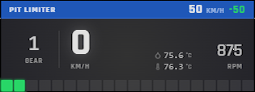
</p>

---

### Input Trace

> Watch your throttle, brake, and clutch inputs scroll in real time. The horizontal trace mode shows a rolling history so you can see exactly where you're trail-braking, blipping, or lifting early. Switch to vertical bars for a clean side-by-side view of all three pedals at once. Great for comparing your technique corner by corner.

<p>
  
  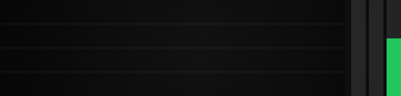
</p>

---

### Standings

> Full race standings table with multi-class support, SOF, qualify deltas, brand & tire info, and a configurable row budget. All columns visible at once or stripped to essentials.

<p>
  
</p>

---

### Relative

> Relative timing sorted by F2Time — player always centred. Closing/gap trend arrows, lap status (lapping/lapped), class stripes.

<p>
  
</p>

---

### Track Map

> SVG overhead track map with every car's position, class-coloured dots, P1 / YOU labels, class legend, and sector markers — recorded from your own lap data.

<p>
  
</p>

---

### Proximity Radar

> Circular radar centred on your car with a 10 m render range, bumper-to-bumper gap labels, sector masks, and spotter cones.

<p>
  
</p>

---

### Radar Bar

> Two slim vertical bars at the screen edges — a quick-glance indicator for side-by-side situations.

<p>
  
</p>

---

### Chassis

> Per-corner brake & tire temperatures with optional inboard suspension data and overheat warnings.

<p>
  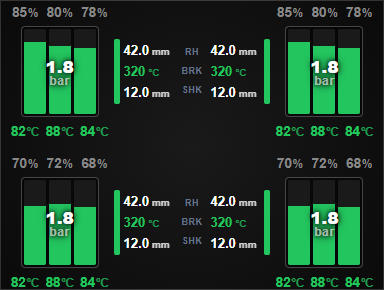
  
</p>

---

### Fuel

> Lap-by-lap consumption graph, laps remaining, add-fuel suggestion, and tank fill level. Line or bar chart mode.

<p>
  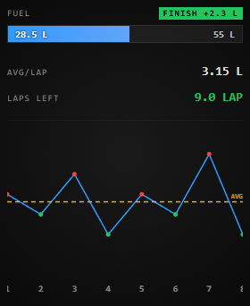
  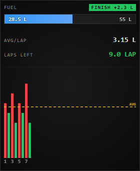
  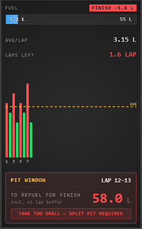
</p>

---

### Lap Delta

> Delta bar vs best / optimal lap with per-sector splits. Vertical or horizontal layout.

<p>
  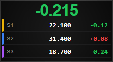
  
</p>

---

### Lap Times

> Current, last, and best lap with per-sector deltas. Vertical list or compact horizontal strip.

<p>
  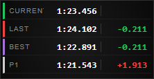
  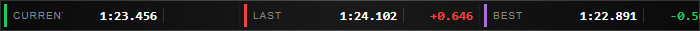
</p>

---

### Timer

> Session clock with laps-to-go, estimated total laps, and optional real-time clocks.

<p>
  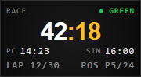
</p>

---

### Weather

> Wind direction compass, temperature, humidity, and forecast strip for dynamic weather sessions.

<p>
  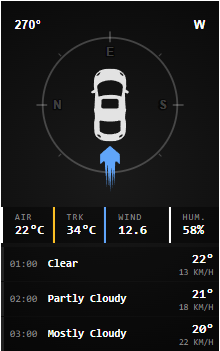
</p>

---

### Flags (LED & Flat)

> LED matrix and flat pill-style flag indicators with green, yellow, red, blue, white, checkered, and meatball flag support.

<p>
  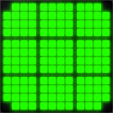
  
</p>

---

### Linear Map

> Compact 1-D track map showing relative car positions along the lap. Horizontal or vertical.

<p>
  
</p>

---

## Prerequisites

| Tool                                                                | Version                     |
| ------------------------------------------------------------------- | --------------------------- |
| [Node.js](https://nodejs.org/)                                      | 18+                         |
| [Rust](https://rustup.rs/)                                          | 1.70+                       |
| [Tauri v2 prerequisites](https://v2.tauri.app/start/prerequisites/) | —                           |
| Windows                                                             | iRacing SDK is Windows-only |

## Setup

```bash
npm install
```

## Development

```bash
npm run tauri:dev
```

## Build

```bash
npm run tauri:build:release
```

---

## Architecture overview

```
iRacing SDK
    │  (pitwall crate)
    ▼
Rust service (src-tauri/)
    │  app.emit("iracing://telemetry/*")
    ▼
MobX stores (src/store/)
    │  observer()
    ▼
Widget windows  ←──────── Main window (widget list + settings)
(transparent overlays)
```

- **Telemetry events:** `iracing://telemetry/car-dynamics`, `car-inputs`, `car-status`, `lap-timing`, `session`, `environment`, `car-idx`, plus `iracing://session-info` and `iracing://status`
- **Widget drag mode:** toggle with `F9` (configurable) — green border appears, drag to reposition, position is persisted
- **Unit system:** metric / imperial, toggle in Settings, synced across all windows

### Why pitwall?

Marble Trace uses a custom fork of the [`pitwall` crate](https://crates.io/crates/pitwall) rather than the upstream version. The iRacing SDK exposes session information (track layout, car list, driver names) as a 512 KB YAML document encoded in **Windows-1252 / Latin-1**, not UTF-8. In online races it is very common for driver names to contain accented or special characters — "José Müller", "Kimi Räikkönen", and similar. The upstream crate's internal YAML extraction decodes this buffer with a strict UTF-8 parser (`std::str::from_utf8`). When it hits a byte such as `0xE4` (the `ä` character) outside a valid UTF-8 sequence, the parser returns an error; because the error is swallowed with `.ok()`, the entire session document is silently discarded. The result: every driver with a non-ASCII character in their name causes the whole session to return `null` — no standings, no car list, no track data.

Our fork replaces the strict decoder with a lossy Windows-1252 → UTF-8 conversion so that every byte is always interpreted correctly, driver names are preserved as-is, and the session document is never lost.

---

## Contributing

Contributions, bug reports, and feature requests are very welcome!
Please read [CONTRIBUTING.md](CONTRIBUTING.md) before opening a PR.

---

## Changelog

See [CHANGELOG.md](CHANGELOG.md) for the full release history.

---

## License

Distributed under the [MIT License](LICENSE). © 2026 voof
