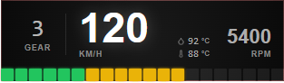
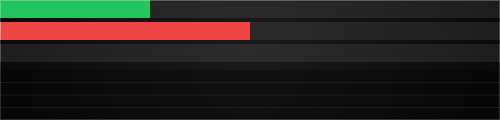
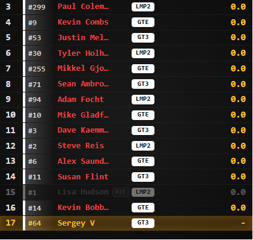
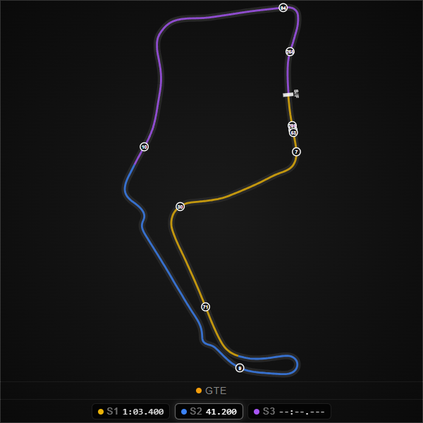
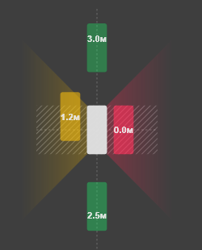
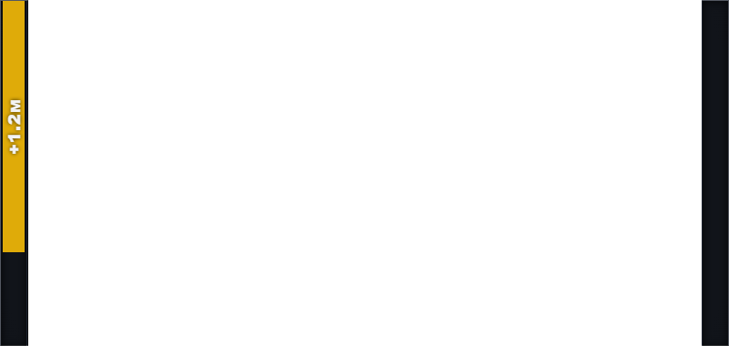

<p align="center">
  
</p>

<h1 align="center">Marble Trace</h1>

<p align="center">
  <strong>Open-source iRacing telemetry overlay — beautiful, lightweight, always on top.</strong>
</p>

<p align="center">
  <a href="https://github.com/mvoof/Marble-Trace/releases"></a>
  <a href="LICENSE"></a>
  <a href="CONTRIBUTING.md"></a>
  
  
</p>

---

## Why Marble Trace?

Most iRacing overlays are either bloated desktop apps or locked behind subscriptions. **Marble Trace** is different:

- **Zero overhead** — a tiny Rust backend reads telemetry directly via the iRacing SDK; the UI is a transparent frameless window that floats above the sim.
- **Fully modular** — enable only the widgets you need. Each widget lives in its own transparent window and can be repositioned independently.
- **Open source** — MIT licensed. Extend it, theme it, submit a PR.
- **Modern stack** — Tauri v2 + React 19 + MobX + Ant Design. Fast, type-safe, easy to hack on.

---

## Widgets

### Speed & RPM

> Live RPM ring, current gear, speed, and redline blink alert.

<!-- Screenshot placeholder: docs/assets/screenshots/speed-widget.png -->
<!--  -->

---

### Input Trace

> Throttle / brake / clutch bars with a scrolling history canvas — see your trail, spot bad habits.

<!-- Screenshot placeholder: docs/assets/screenshots/input-trace-widget.png -->
<!--  -->

---

### Standings

> Full race standings table with multi-class support, SOF, qualify deltas, brand & tire info, and a configurable row budget. Stays readable at any widget size.

<!-- Screenshot placeholder: docs/assets/screenshots/standings-widget.png -->
<!--  -->

---

### Relative

> Relative timing sorted by F2Time — player always centred. Closing/gap trend arrows, lap status (lapping/lapped), class stripes, and an optional linear track map anchored to any edge.

<!-- Screenshot placeholder: docs/assets/screenshots/relative-widget.png -->
<!--  -->

---

### Track Map

> SVG overhead track map with every car's position, class-coloured dots, P1 / YOU labels, class legend, and sector markers — recorded from your own lap data.

<!-- Screenshot placeholder: docs/assets/screenshots/track-map-widget.png -->
<!--  -->

---

### Proximity Radar

> Circular radar centred on your car with a 10 m render range, bumper-to-bumper gap labels, sector masks, and spotter cones. Supports always-on or proximity-triggered visibility with a configurable hide delay.

<!-- Screenshot placeholder: docs/assets/screenshots/proximity-radar-widget.png -->
<!--  -->

---

### Radar Bar

> Two slim vertical bars (left / right) at the screen edges — a quick-glance indicator for side-by-side situations. Pill-shaped car indicator, configurable bar spacing, and the same proximity visibility modes as the radar.

<!-- Screenshot placeholder: docs/assets/screenshots/radar-bar-widget.png -->
<!--  -->

---

## Prerequisites

| Tool                                                                | Version                     |
| ------------------------------------------------------------------- | --------------------------- |
| [Node.js](https://nodejs.org/)                                      | 18+                         |
| [Rust](https://rustup.rs/)                                          | 1.70+                       |
| [Tauri v2 prerequisites](https://v2.tauri.app/start/prerequisites/) | —                           |
| Windows                                                             | iRacing SDK is Windows-only |

## Setup

```bash
npm install
```

## Development

```bash
npm run tauri dev
```

## Build

```bash
npm run tauri:build:release
```

---

## Architecture overview

```
iRacing SDK
    │  (pitwall crate)
    ▼
Rust service (src-tauri/)
    │  app.emit("iracing://telemetry/*")
    ▼
MobX stores (src/store/)
    │  observer()
    ▼
Widget windows  ←──────── Main window (widget list + settings)
(transparent overlays)
```

- **Telemetry events:** `iracing://telemetry/car-dynamics`, `car-inputs`, `car-status`, `lap-timing`, `session`, `environment`, `car-idx`, plus `iracing://session-info` and `iracing://status`
- **Widget drag mode:** toggle with `F9` (configurable) — green border appears, drag to reposition, position is persisted
- **Unit system:** metric / imperial, toggle in Settings, synced across all windows

---

## Storybook — widget development without the game

Storybook lets you develop and test widgets in the browser using real telemetry data captured from a live iRacing session.

### Launch

```bash
npm run storybook
# → http://localhost:6006
```

### Capturing a telemetry snapshot

For stories to display real data (car positions, lap times, RPM, etc.) you need a snapshot from a live session.

1. Start iRacing and join any session
2. Launch the app: `npm run tauri dev`
3. Open **Settings → Dev Tools → Capture Snapshot**
4. A file `iracing-<timestamp>.json` will be downloaded
5. Move it to the `test-data/` folder, e.g. `test-data/gt3-race.json`

> The Capture Snapshot button is only available in dev builds (`npm run tauri dev`).

### Using a snapshot in a Story

```tsx
import type { Meta, StoryObj } from '@storybook/react-vite';
import { MyWidget } from './MyWidget';
import { withTelemetry } from '../../../storybook/telemetryDecorator';
import snapshot from '../../../../test-data/gt3-race.json';

const meta: Meta<typeof MyWidget> = {
  title: 'Widgets/MyWidget',
  component: MyWidget,
};
export default meta;

type Story = StoryObj<typeof MyWidget>;

export const Default: Story = {
  decorators: [withTelemetry(snapshot)],
};
```

The `withTelemetry` decorator populates all MobX stores (`carDynamics`, `carIdx`, `sessionInfo`, etc.) before the component renders and resets them on cleanup. No changes to the widget components are needed — they read from the same `telemetryStore` as in the live app.

### Layout

```
test-data/               ← telemetry snapshots (git-ignored)
src/storybook/
  __mocks__/             ← mocks for @tauri-apps/* APIs
  snapshot.types.ts      ← TelemetrySnapshot type
  capture-snapshot.ts    ← downloadSnapshot()
  telemetryDecorator.tsx ← withTelemetry(snapshot)
```

---

## Contributing

Contributions, bug reports, and feature requests are very welcome!
Please read [CONTRIBUTING.md](CONTRIBUTING.md) before opening a PR.

---

## License

Distributed under the [MIT License](LICENSE). © 2026 voof
