<p align="center">
  <picture>
    <source media="(prefers-color-scheme: dark)" srcset="docs/assets/logo-light.svg">
    
  </picture>
</p>

<h1 align="center">Marble Trace</h1>

<p align="center">
  <strong>Open-source iRacing telemetry overlay — beautiful, lightweight, always on top.</strong>
</p>

<div align="center">
  
[](https://github.com/mvoof/Marble-Trace/releases) [](LICENSE) [](CONTRIBUTING.md)  

</div>

<p align="center">
  Marble Trace is actively developed — new widgets, fixes, and features land regularly.<br>
  Got a bug, an idea, or just want to share your setup? Join the community on Discord.
</p>
<p align="center">
  <a href="https://discord.gg/GVaRsHbjxV">
    
  </a>
</p>

---

## Why Marble Trace?

Most iRacing overlays are either bloated desktop apps or locked behind subscriptions. **Marble Trace** is different:

- **Zero overhead** — a tiny Rust backend reads telemetry directly via [kerb](https://github.com/mvoof/kerb), our own multi-sim shared-memory telemetry library; the UI is a transparent frameless window that floats above the sim.
- **Fully modular** — enable only the widgets you need. Each widget lives in its own transparent window and can be repositioned independently.
- **Open source** — MIT licensed. Extend it, theme it, submit a PR.
- **Modern stack** — Tauri v2 + React 19 + MobX + Ant Design. Fast and type-safe.

---

## Widgets

Every widget is independently positioned, resized, and styled — drag it anywhere on screen, scale it to taste, adjust opacity so it never blocks your view. Each one ships with its own set of options: toggle individual data fields, switch layouts, pick colours, set visibility rules. You only see what you actually need, exactly where you want it.

- **Driving HUD** — [Race Dash](#race-dash) · [RPM Lights](#rpm-lights) · [Engine Panel](#engine-panel) · [Input Trace](#input-trace) · [G-Meter](#g-meter)
- **Timing & Standings** — [Standings](#standings) · [Relative](#relative) · [Relative Map](#relative-map) · [Delta HUD](#delta-hud) · [Sector Matrix](#sector-matrix) · [Lap Log](#lap-log) · [Timer](#timer)
- **Awareness** — [Track Map](#track-map) · [Proximity Radar](#proximity-radar) · [Radar Bar](#radar-bar) · [Flags (LED/Flat)](#flags-led--flat)
- **Car & Session** — [Chassis](#chassis) · [Fuel](#fuel) · [Weather](#weather)

---

## Driving HUD

### Race Dash

Cockpit cluster combining a gear ring, speed readout, lap/position/RPM stats, a live driving-coach tab, and a dedicated pit-lane mode.

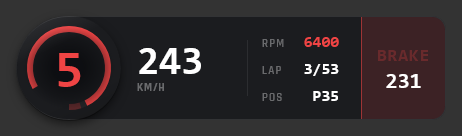
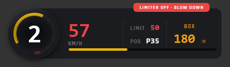

---

### RPM Lights

Standalone shift-light LED bar driven by engine RPM, with configurable colour zones and pit-limiter animations.

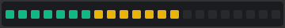

---

### Engine Panel

Liquid temperatures, oil pressure, voltage, and live system adjustments — ABS, traction control, brake bias, and engine map — in one compact strip.

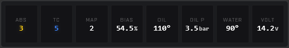

---

### Input Trace

Watch your throttle, brake, and clutch inputs scroll in real time. The horizontal trace mode shows a rolling history so you can see exactly where you're trail-braking, blipping, or lifting early. Switch to vertical bars for a clean side-by-side view of all three pedals at once.

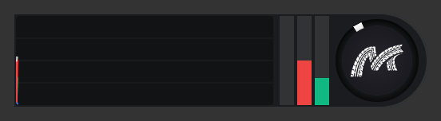

---

### G-Meter

Friction circle visualising lateral and longitudinal G-forces in real time. Three display modes — **Trail** (fading line history), **Fading** (decaying envelope), **Peak** (static max-G envelope) — with three colour modes: **Mono**, **Simple** (red brake / green accel / cyan turn), and **Advanced** (smooth gradient blending). Adjustable scale from 2 G to 5 G.

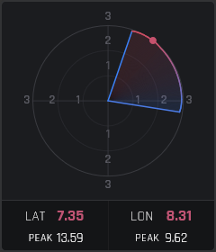

---

## Timing & Standings

### Standings

Full race standings table with multi-class support, SOF, qualify deltas, brand & tire info, and a configurable row budget. All columns visible at once or stripped to essentials. Switch between the combined leaderboard and a single-class group view with its own SOF and field size.

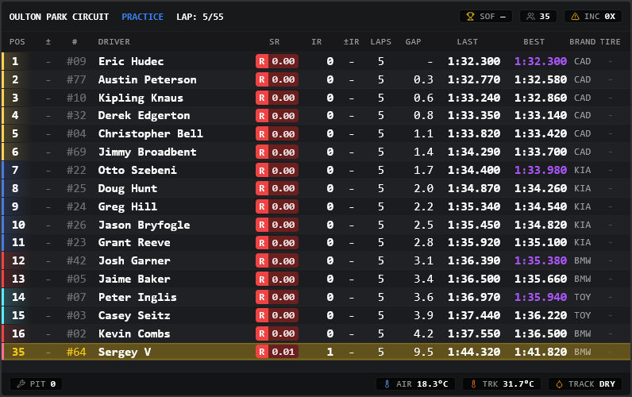

---

### Relative

Relative timing sorted by F2Time — player always centred. Closing/gap trend arrows, lap status (lapping/lapped), class stripes.

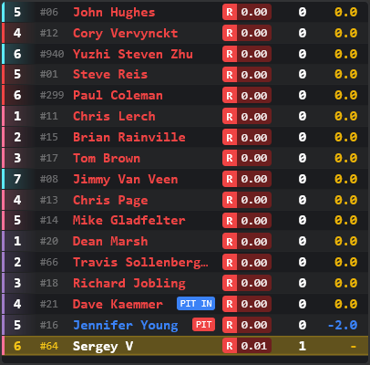

---

### Relative Map

Compact 1-D track map showing relative car positions along the lap. Horizontal or vertical.

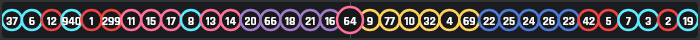

---

### Delta HUD

Live delta bar that compares your current lap against a configurable reference — your personal best (PB), your personal optimal (PO, best sectors combined), session best (SB), session optimal (SO), or the previous lap in the session (SL). The bar fills green when you are ahead and red when behind. When you cross the finish line a lap flash card appears (top, bottom, left, or right of the widget) showing the completed lap time and its delta. Card display duration is adjustable.

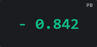
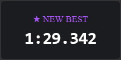

---

### Sector Matrix

Grid of sector times for the current lap with color-coded delta chips (green = faster than personal best, red = slower). Header shows live delta and predicted finish time. Reference for the live delta and predicted time is configurable; sector chips always compare vs your personal best.

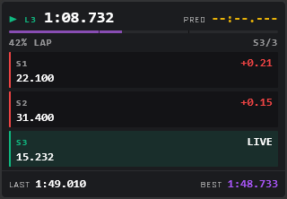

---

### Lap Log

Rolling history of your completed laps — lap number, lap time, and delta vs personal best for each row. The live row at the top shows the current lap's real-time delta using the configured reference (PB / PO / SB / SO / SL). Historical rows always compare vs personal best.

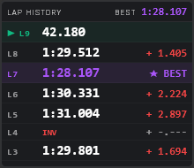

---

### Timer

Session clock with laps-to-go, estimated total laps, and optional real-time clocks.

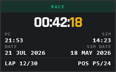

---

## Awareness

### Track Map

SVG overhead track map with every car's position, class-coloured dots, P1 / YOU labels, class legend, and sector markers — recorded from your own lap data.

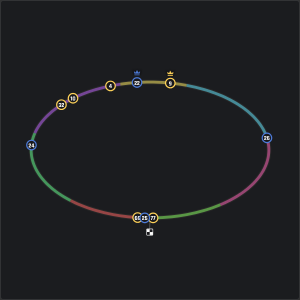
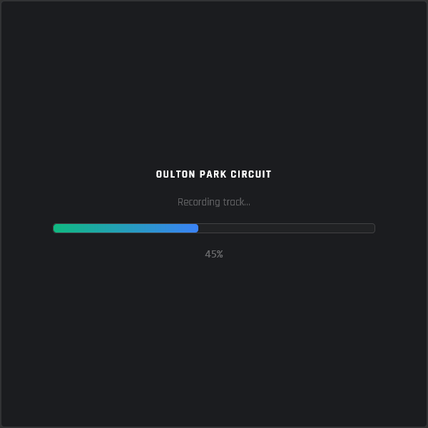

---

### Proximity Radar

Circular radar centred on your car with a configurable render range, bumper-to-bumper gap labels, sector masks, and spotter cones.

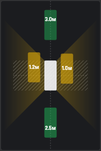

---

### Radar Bar

Full-width edge indicators for side-by-side situations — a quick-glance signal for cars in your blind spot.

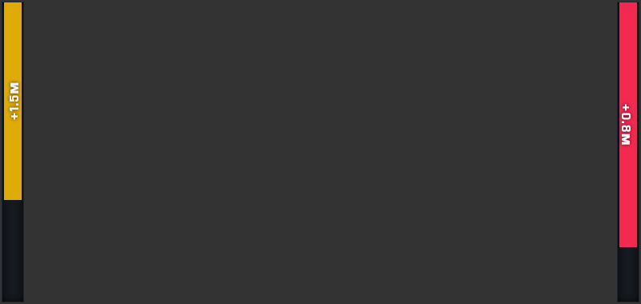

---

### Flags (LED & Flat)

LED matrix and flat banner-style flag indicators with green, yellow, red, blue, white, checkered, and meatball flag support.

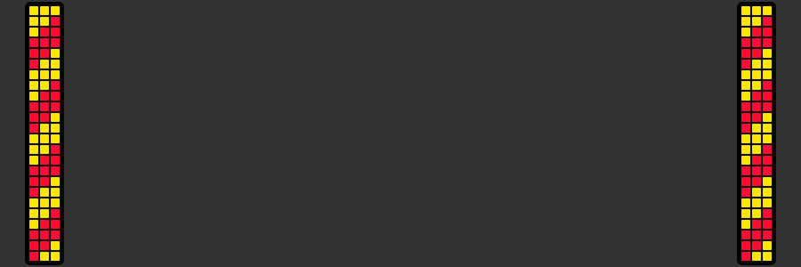
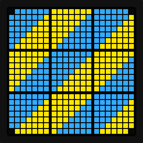
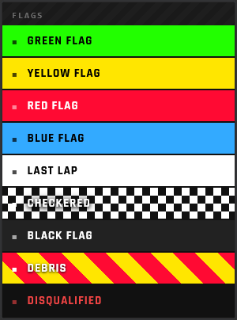

---

## Car & Session

### Chassis

Per-corner brake & tire temperatures with optional inboard suspension data and overheat warnings.

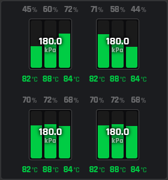

---

### Fuel

Lap-by-lap consumption graph, laps remaining, add-fuel suggestion, and tank fill level. Line or bar chart mode.

- **LAPS LEFT:** Current driving range in laps based on fuel in the tank.
- **EST. FINISH:** Projected fuel balance (surplus or deficit in liters) at the end of the race.
- **PIT WARNING:** Appears when you need to refuel, showing exactly how many liters to add (including a +1 lap buffer) to reach the finish.

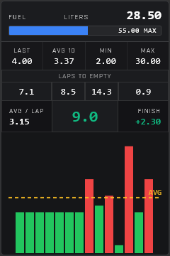
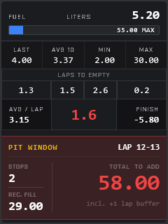

---

### Weather

Wind direction compass, temperature, humidity, and forecast strip for dynamic weather sessions.

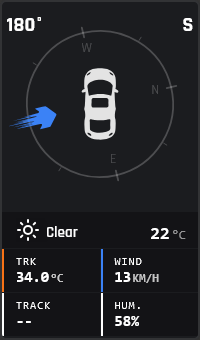

---

## Prerequisites

| Tool                                                                | Version                     |
| ------------------------------------------------------------------- | --------------------------- |
| [Node.js](https://nodejs.org/)                                      | 18+                         |
| [Rust](https://rustup.rs/)                                          | 1.70+                       |
| [Tauri v2 prerequisites](https://v2.tauri.app/start/prerequisites/) | —                           |
| Windows                                                             | iRacing SDK is Windows-only |

## Setup

```bash
npm install
```

## Development

```bash
npm run tauri:dev
```

## Build

```bash
npm run tauri:build:release
```

---

## Analytics & Privacy

Marble Trace uses [Aptabase](https://github.com/aptabase/aptabase) — an open-source, privacy-first analytics platform. No personal data is collected. The following anonymous events are tracked:

| Event         | When                                                                                       |
| ------------- | ------------------------------------------------------------------------------------------ |
| `app_started` | On every launch — includes primary monitor resolution, scale factor, system locale and DPI |

Aptabase automatically captures: OS, app version, country (from IP), and locale. No user IDs, no file paths, no telemetry data from iRacing.

---

## Contributing

Contributions, bug reports, and feature requests are very welcome!
Please read [CONTRIBUTING.md](CONTRIBUTING.md) before opening a PR.

---

## Changelog

See [CHANGELOG.md](CHANGELOG.md) for the full release history.

---

## License

Distributed under the [MIT License](LICENSE). © 2026 voof
