<p align="center">
  <picture>
    <source media="(prefers-color-scheme: dark)" srcset="docs/assets/logo-light.svg">
    
  </picture>
</p>

<h1 align="center">Marble Trace</h1>

<p align="center">
  <strong>Open-source iRacing telemetry overlay — beautiful, lightweight, always on top.</strong>
</p>

<div align="center">
  
[](https://github.com/mvoof/Marble-Trace/releases) [](LICENSE) [](CONTRIBUTING.md)  

</div>

<p align="center">
  Marble Trace is actively developed — new widgets, fixes, and features land regularly.<br>
  Got a bug, an idea, or just want to share your setup? Join the community on Discord.
</p>
<p align="center">
  <a href="https://discord.gg/tkdS9sn49b">
    
  </a>
</p>

---

## Why Marble Trace?

Most iRacing overlays are either bloated desktop apps or locked behind subscriptions. **Marble Trace** is different:

- **Zero overhead** — a tiny Rust backend reads telemetry directly via [kerb](https://github.com/mvoof/kerb), our own multi-sim shared-memory telemetry library; the UI is a transparent frameless window that floats above the sim.
- **Fully modular** — enable only the widgets you need. Every widget is positioned, scaled and styled on its own inside a single transparent overlay that spans all of your monitors.
- **Layouts for every session** — build as many layouts as you race disciplines, arrange them across your monitors in a visual editor, and switch between them by key or automatically per session type.
- **Any screen you own** — a layout can also feed a phone, a tablet or a second PC over your local network, with nothing to install on the device.
- **Open source** — MIT licensed. Extend it, theme it, submit a PR.
- **Modern stack** — Tauri v2 + React 19 + MobX + Ant Design. Fast and type-safe.

---

## Widgets

Every widget is independently positioned, resized, and styled — drag it anywhere on screen, scale it to taste, adjust opacity so it never blocks your view. Each one ships with its own set of options: toggle individual data fields, switch layouts, pick colours, set visibility rules. You only see what you actually need, exactly where you want it.

- **Driving HUD** — [Race Dash](#race-dash) · [RPM Lights](#rpm-lights) · [Engine Panel](#engine-panel) · [Input Trace](#input-trace) · [G-Meter](#g-meter) · [Coach](#coach)
- **Timing & Standings** — [Standings](#standings) · [Relative](#relative) · [Relative Map](#relative-map) · [Delta HUD](#delta-hud) · [Sector Matrix](#sector-matrix) · [Lap Log](#lap-log) · [Timer](#timer)
- **Awareness** — [Track Map](#track-map) · [Proximity Radar](#proximity-radar) · [Radar Bar](#radar-bar) · [Close Battle](#close-battle) · [Flags (LED/Flat)](#flags-led--flat)
- **Car & Session** — [Pit Service](#pit-service) · [Fuel](#fuel) · [Weather](#weather)
- **Streaming** — [Stream Chat](#stream-chat)

---

## Driving HUD

### Race Dash

Cockpit cluster combining a gear ring, speed readout, lap/position/RPM stats, a live driving-coach tab, and a dedicated pit-lane mode.

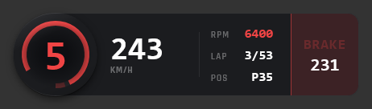
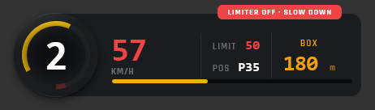

---

### RPM Lights

Standalone shift-light LED bar driven by engine RPM, with configurable colour zones and pit-limiter animations.

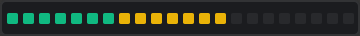

---

### Engine Panel

Liquid temperatures, oil pressure, voltage, and live system adjustments — ABS, traction control, brake bias, and engine map — in one compact strip.

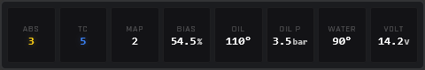

---

### Input Trace

Watch your throttle, brake, and clutch inputs scroll in real time. The horizontal trace mode shows a rolling history so you can see exactly where you're trail-braking, blipping, or lifting early. Switch to vertical bars for a clean side-by-side view of all three pedals at once.

The steering block draws either the built-in dial or one of several wheel silhouettes, with your choice of gear, speed, angle or nothing at all in the middle. Adding another wheel is a traced product photo — see [docs/steering-wheel-assets.md](docs/steering-wheel-assets.md).

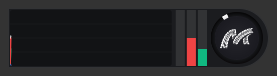

---

### G-Meter

Friction circle visualising lateral and longitudinal G-forces in real time. Three display modes — **Trail** (fading line history), **Fading** (decaying envelope), **Peak** (static max-G envelope) — with three colour modes: **Mono**, **Simple** (red brake / green accel / cyan turn), and **Advanced** (smooth gradient blending). Adjustable scale from 2 G to 5 G.

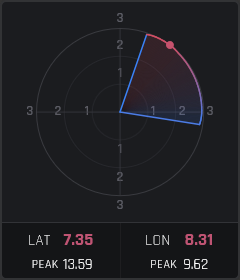

---

### Coach

Live braking and throttle coaching against your stored best lap. The call row tells you what to do right now — **BRAKE** with the distance left to the braking point, or a corner-exit **GAS** call — with an urgency bar that fills as the marker approaches. Underneath, a rolling speed trace plots your current lap against the reference lap in a configurable window (in metres), coloured green where you are gaining time and red where you are losing it. Footer shows current vs reference speed, the reference lap time and the track condition. Both rows can be switched off independently, and every colour is configurable.

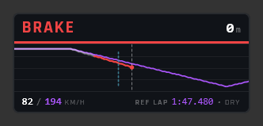

---

## Timing & Standings

### Standings

Full race standings table with multi-class support, SOF, qualify deltas, brand & tire info, and a configurable row budget. All columns visible at once or stripped to essentials. Switch between the combined leaderboard and a single-class group view with its own SOF and field size.

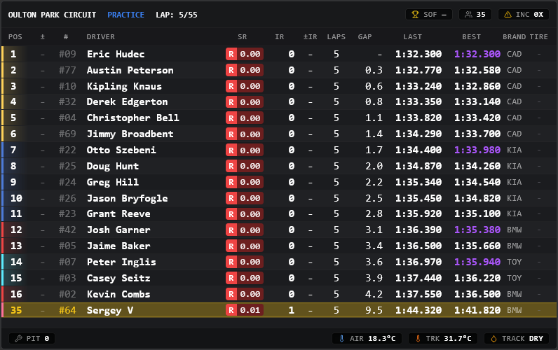

---

### Relative

Relative timing sorted by F2Time — player always centred. Closing/gap trend arrows, lap status (lapping/lapped), class stripes.

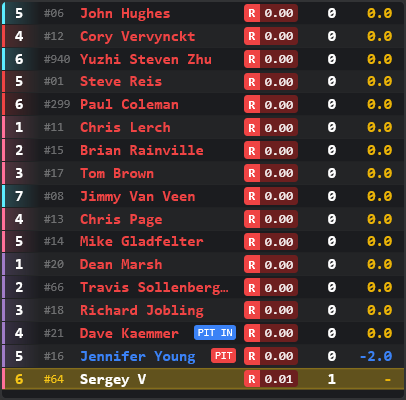

---

### Relative Map

Compact 1-D track map showing relative car positions along the lap. Horizontal or vertical.

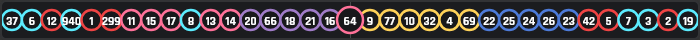

---

### Delta HUD

Live delta bar that compares your current lap against a configurable reference — your personal best (PB), your personal optimal (PO, best sectors combined), session best (SB), session optimal (SO), or the previous lap in the session (SL). The bar fills green when you are ahead and red when behind. When you cross the finish line a lap flash card appears (top, bottom, left, or right of the widget) showing the completed lap time and its delta. Card display duration is adjustable.

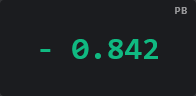
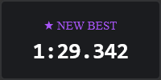

---

### Sector Matrix

Grid of sector times for the current lap with color-coded delta chips (green = faster than personal best, red = slower). Header shows live delta and predicted finish time. Reference for the live delta and predicted time is configurable; sector chips always compare vs your personal best.

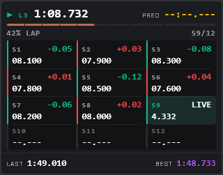

---

### Lap Log

Rolling history of your completed laps — lap number, lap time, and delta vs personal best for each row. The live row at the top shows the current lap's real-time delta using the configured reference (PB / PO / SB / SO / SL). Historical rows always compare vs personal best.

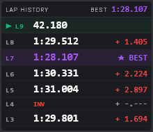

---

### Timer

Session clock with laps-to-go, estimated total laps, and optional real-time clocks.

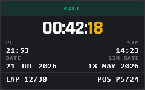

---

## Awareness

### Track Map

SVG overhead track map with every car's position, class-coloured dots, P1 / YOU labels, class legend, and sector markers — recorded from your own lap data.

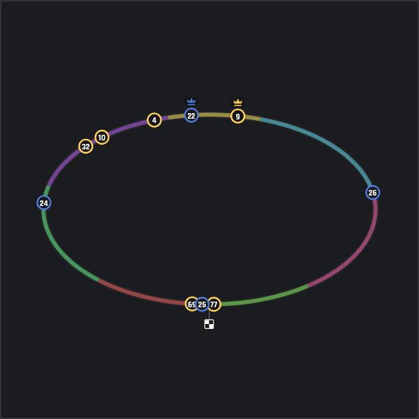
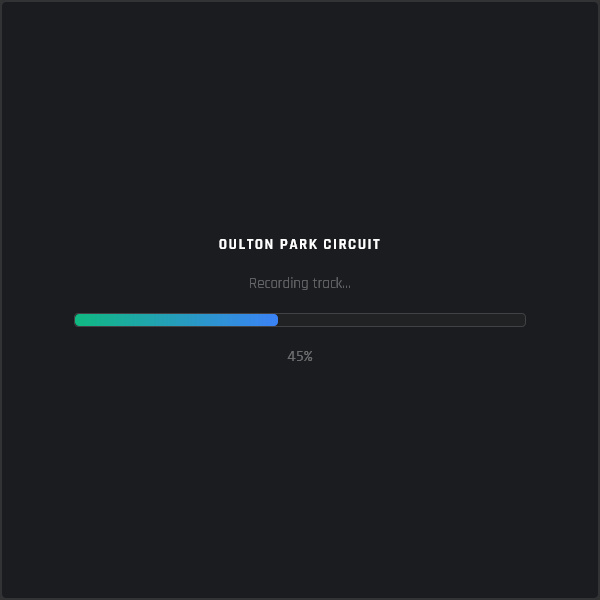

---

### Proximity Radar

Circular radar centred on your car with a configurable render range, bumper-to-bumper gap labels, sector masks, and spotter cones.

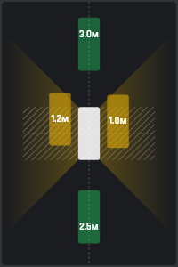

---

### Radar Bar

Full-width edge indicators for side-by-side situations — a quick-glance signal for cars in your blind spot.

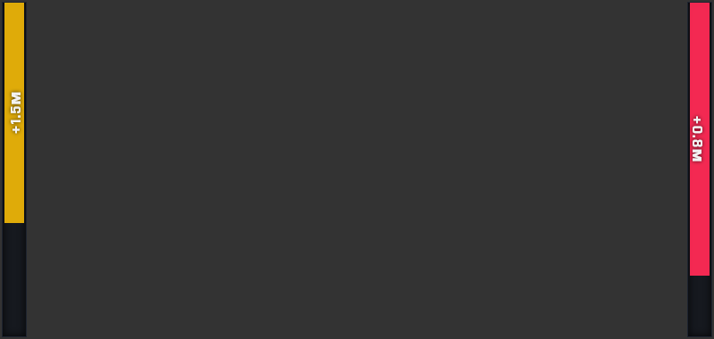

---

### Close Battle

The cars actually fighting you, drawn on a vertical distance axis instead of a list: ahead goes up, behind goes down, and the plate sits where the car is. It appears on its own — set it off by a gap in seconds or a real distance, and the axis then scales itself to that threshold, in metres or feet to match your unit setting.

Each plate carries the car number, the class on its livery panel, the driver, the distance and the gap; cars landing on the same spot share one plate that names both of them rather than shoving each other aside. Plates shrink with distance, and the road glows red behind you or blue ahead as a car closes in.

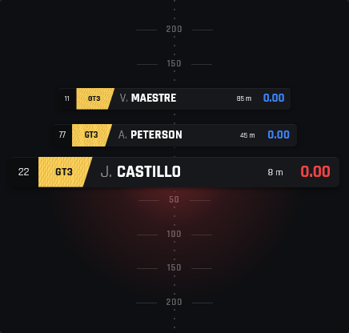

---

### Flags (LED & Flat)

LED matrix and flat banner-style flag indicators with green, yellow, red, blue, white, checkered, and meatball flag support.

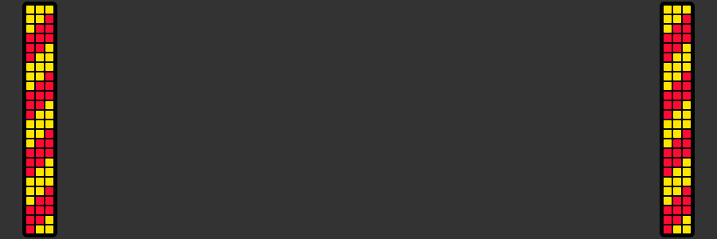
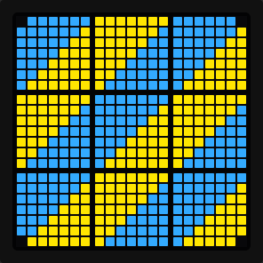
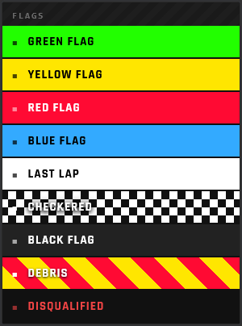

---

## Car & Session

### Pit Service

Everything about the stop in one plate: live pit-lane speed against the pit limit, the fuel you are about to add, repair times (required, optional and fast repairs left), windshield tear-offs, and a per-corner tire grid with carcass temperatures, tread temps and remaining wear — each corner marked with the tire set you will take or a **KEEP** if it stays on the car. The header shows your current position and whether you are in the box; the footer projects the position you will rejoin in.

Optional automation adds fuel for you and orders new tires once wear drops below a configurable threshold. Blocks (speed, fuel, tires, repairs, footer) are toggled individually.

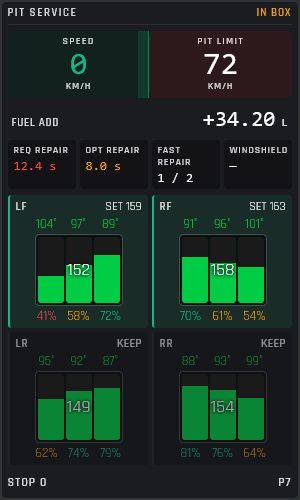

---

### Fuel

Lap-by-lap consumption graph, laps remaining, add-fuel suggestion, and tank fill level. Line or bar chart mode.

- **LAPS LEFT:** Current driving range in laps based on fuel in the tank.
- **EST. FINISH:** Projected fuel balance (surplus or deficit in liters) at the end of the race.
- **PIT WARNING:** Appears when you need to refuel, showing exactly how many liters to add (including a +1 lap buffer) to reach the finish.

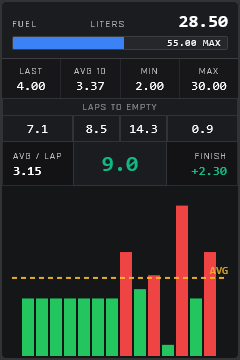
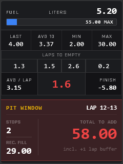

---

### Weather

Wind direction compass, temperature, humidity, and forecast strip for dynamic weather sessions.

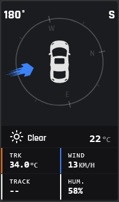

---

## Streaming

### Stream Chat

Twitch and YouTube live chat merged into a single feed on top of the sim, so you can read your stream without alt-tabbing. Messages carry a platform glyph and role badges (moderator, VIP, subscriber) as compact text plates or the original badge artwork. Channel events — raids, subs, cheers and donations — appear as highlighted rows, and the footer strip shows viewer counts, message rate and totals. Row density, message limit and auto-expiry are configurable, and every block can be turned off.

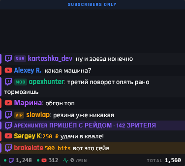

---

## Layouts & Screens

### Layout Editor

Every layout is arranged in a visual editor that mirrors your actual desktop: each monitor is drawn to scale in its Windows position, and widgets are dragged straight across a screen edge onto the neighbour. Zoom out for the whole desktop when you are moving things around, or into a single screen for detail work. Each monitor can carry its own background image so you can place widgets against a screenshot of the cockpit instead of an empty rectangle, and everything follows along if you rearrange your displays in Windows.

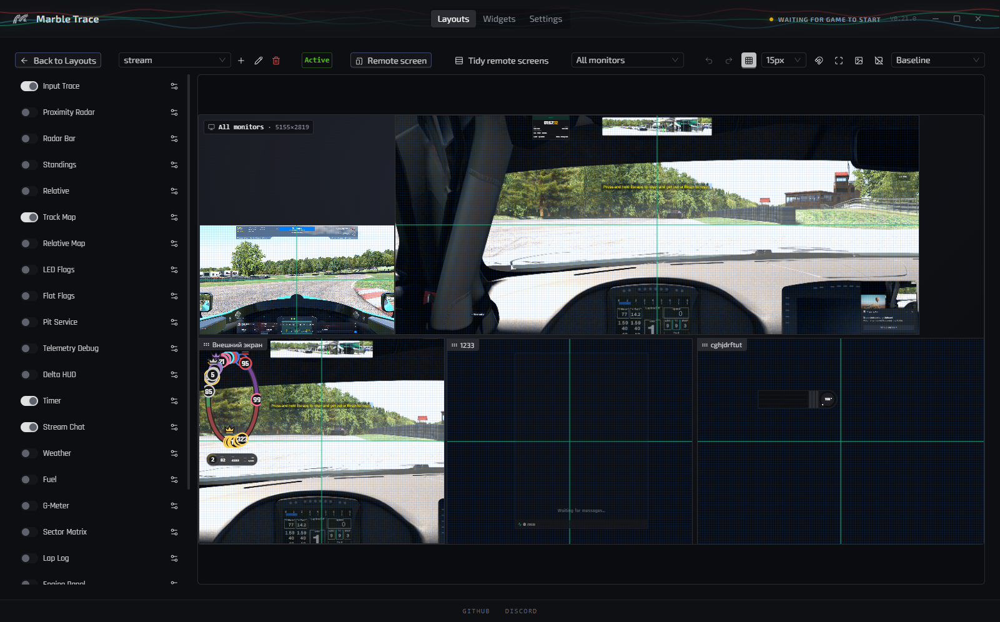

Layouts are independent of each other — build one for endurance, one for qualifying, one for ovals. Each remembers which screens it uses and which widgets sit on them. Switch between them from the toolbar, by a key or wheel button, or let the app switch automatically by session type.

### Remote Screens

A layout can also contain screens with **no monitor behind them**. Marble Trace serves those screens over your local network, so a phone, a tablet or a second PC opens one in its browser and shows live widgets — the same widgets, settings and telemetry as the overlay, with nothing to install on the device.

- **Scan and go** — every remote screen has a QR code in Settings. Point the device's camera at it instead of typing an IP by hand, then add it to the home screen to run it full-screen.
- **Fit to the device** — the device reports the viewport it actually has, and one click resizes the screen to match, carrying its widgets with it.
- **Token protected** — the link carries an access token, hidden until you ask for it (so a window capture on stream never puts it on air), copyable while covered, and regenerable at any time. Serving to the network is a separate switch; with it off nothing leaves this machine.
- **Read-only by protocol** — a connected device paints what it is sent and cannot write anything back into your settings.
- **Tunable** — the port and the telemetry push rate (5–60 Hz) are configurable, so a phone on weak Wi-Fi can be given less to chew on.

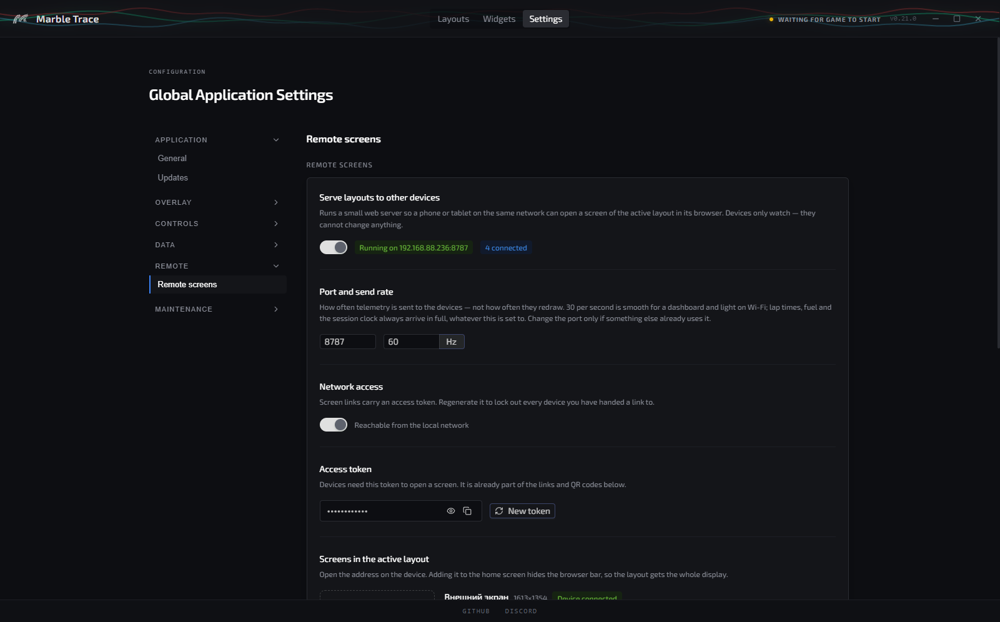

Remote screens appear on the layout canvas next to your monitors, can be dragged anywhere on it, and a **Tidy remote screens** button lays them out in rows under the desktop.

---

## Input Devices

Every action can be bound to a keyboard key **or** to a button on your wheel, button box, joystick or handbrake — read straight from the device, so bindings still fire while iRacing has focus. All of them live in one **Input bindings** screen in Settings, grouped by widget, with search and a warning next to any button used twice; one action can carry several bindings at once.

Bindings are app-wide, not per layout. Devices are matched by their DirectInput instance GUID, so replugging or moving to another USB port keeps your bindings; a driver reinstall that regenerates the GUID is re-matched by vendor and product. A device that is currently unplugged keeps its bindings too, shown greyed out until it comes back.

---

## Prerequisites

| Tool                                                                | Version                     |
| ------------------------------------------------------------------- | --------------------------- |
| [Node.js](https://nodejs.org/)                                      | 18+                         |
| [Rust](https://rustup.rs/)                                          | 1.70+                       |
| [Tauri v2 prerequisites](https://v2.tauri.app/start/prerequisites/) | —                           |
| Windows                                                             | iRacing SDK is Windows-only |

## Setup

```bash
npm install
```

## Development

```bash
npm run tauri:dev
```

## Build

```bash
npm run tauri:build:release
```

---

## Analytics & Privacy

Marble Trace uses [Aptabase](https://github.com/aptabase/aptabase) — an open-source, privacy-first analytics platform. No personal data is collected. The following anonymous events are tracked:

| Event         | When                                                                                       |
| ------------- | ------------------------------------------------------------------------------------------ |
| `app_started` | On every launch — includes primary monitor resolution, scale factor, system locale and DPI |

Aptabase automatically captures: OS, app version, country (from IP), and locale. No user IDs, no file paths, no telemetry data from iRacing.

---

## Contributing

Contributions, bug reports, and feature requests are very welcome!
Please read [CONTRIBUTING.md](CONTRIBUTING.md) before opening a PR.

---

## Changelog

See [CHANGELOG.md](CHANGELOG.md) for the full release history.

---

## License

Distributed under the [MIT License](LICENSE). © 2026 voof
