# Architecture

This document is the map you should read first. It explains what Marble-Trace
is, how each half of it is built, how the two halves talk, and where your code
belongs when you add something. It assumes no prior knowledge of the codebase.

**How to read it.** [Orientation](#part-0--orientation) is the ten-minute
version. [Backend](#part-i--backend) and [Frontend](#part-ii--frontend) each
describe one half on its own terms, module by module.
[Interaction](#part-iii--how-the-two-halves-talk) is the complete catalogue of
everything that crosses between them — every command, every event, every file.
[Cross-cutting concerns](#part-iv--cross-cutting-concerns) covers what belongs to
no single layer: performance, settings, testing.

### Contents

**Part 0 — Orientation**

- [What the app does](#what-the-app-does)
- [The two processes](#the-two-processes)
- [The two windows](#the-two-windows)
- [The generated contract](#the-generated-contract)

**Part I — Backend**

- [Backend layers](#backend-layers)
- [`model/` — the contract](#model--the-contract)
- [`sources/` — the only layer that knows a sim](#sources--the-only-layer-that-knows-a-sim)
- [`computations/` — pure logic](#computations--pure-logic)
- [`telemetry/` — the runtime](#telemetry--the-runtime)
- [`input/`, `chat/` and the command surface](#input-chat-and-the-command-surface)

**Part II — Frontend**

- [Frontend layers](#frontend-layers)
- [`types/` — the contract layer](#types--the-contract-layer)
- [`utils/` — pure helpers](#utils--pure-helpers)
- [`platform/` — the outside world](#platform--the-outside-world)
- [`store/` — state and business logic](#store--state-and-business-logic)
- [`ui/` — everything that renders](#ui--everything-that-renders)

**Part III — How the two halves talk**

- [The three channels](#the-three-channels)
- [Command catalogue](#command-catalogue-frontend--backend)
- [Event catalogue](#event-catalogue)
- [Cross-window synchronization](#cross-window-synchronization)
- [Worked example: one number, end to end](#worked-example-one-number-end-to-end)

**Part IV — Cross-cutting concerns**

- [Performance](#performance)
- [Settings and persistence](#settings-and-persistence)
- [Testing](#testing)
- [Where does my code go?](#where-does-my-code-go)
- [Commands](#commands)

---

---

# Part 0 — Orientation

## What the app does

Marble-Trace is a desktop overlay for sim racing. A racing simulator (currently
iRacing) publishes telemetry — speed, fuel, tire temperatures, the position of
every car on track — at roughly 60 times per second. Marble-Trace reads that
stream, computes things the sim does not give you directly (fuel to the end of
the race, gaps to the cars around you, a live standings table), and paints them
as a set of always-on-top widgets over the game window.

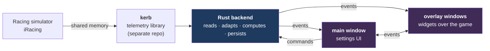

Two ideas drive every decision documented below:

1. **The sim is fast and the UI is slow.** 60 Hz of data must not become 60 Hz of
   React renders. A large part of this architecture exists to control _where_ that
   rate gets absorbed. See [Performance](#performance).
2. **Exactly one layer knows which sim we are talking to.** Everything downstream
   works on our own neutral shapes, so adding a second sim never ripples through
   the app. See [`sources/`](#sources--the-only-layer-that-knows-a-sim).

## The two processes

Marble-Trace is a [Tauri 2](https://tauri.app) application: a native Rust binary
hosting system webviews. There is no Node.js at runtime — the frontend ships as a
static bundle.

|             | Backend                                        | Frontend                                     |
| ----------- | ---------------------------------------------- | -------------------------------------------- |
| Language    | Rust                                           | TypeScript + React 19                        |
| Lives in    | `src-tauri/src/`                               | `src/`                                       |
| Job         | read the sim, compute, persist, talk to the OS | render, hold UI state, collect user settings |
| State       | telemetry runtime state between ticks          | MobX stores, one set per window              |
| Entry point | `lib.rs` / `main.rs`                           | `src/main.tsx`                               |

## The two windows

One Tauri app, several windows, each with **its own JavaScript context**.

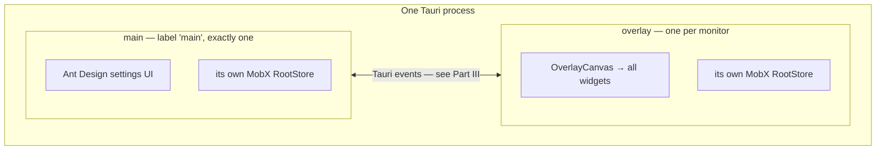

**The windows share no memory.** They each boot their own `RootStore`, their own
MobX observables, their own React tree. A value you mutate in main does not exist
in the overlay until an event carries it there. This is the single most common
source of confusion for newcomers, and
[Cross-window synchronization](#cross-window-synchronization) maps the link in
full.

- **main** — the settings application: layout editor, widget settings panels, key
  bindings, Twitch connection. Ant Design. Owns persistence, the hotkey runner and
  overlay window management.
- **overlay** — transparent, always on top, click-through except where a widget is
  interactive. Renders _every_ widget through a single `OverlayCanvas`; there is no
  window-per-widget. One overlay window per monitor, labelled by monitor name.

## The generated contract

The boundary between the halves is generated, not hand-written. Rust types in
`src-tauri/src/model/` are annotated with
[specta](https://github.com/specta-rs/specta), and `npm run tauri:dev` regenerates
`src/types/bindings.ts` from them.

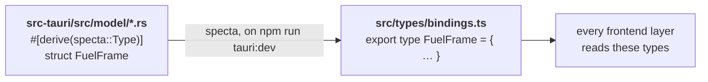

> [!IMPORTANT]
> **Never edit `src/types/bindings.ts` by hand, and never hand-write a TypeScript
> interface that duplicates a backend payload.** If a shape is wrong, fix the Rust
> struct and regenerate. A hand-written duplicate will drift, and nothing will
> tell you.

---

---

# Part I — Backend

## Backend layers

`src-tauri/src/` is four layers with a strict one-way import direction. Read each
arrow as "may be imported by".

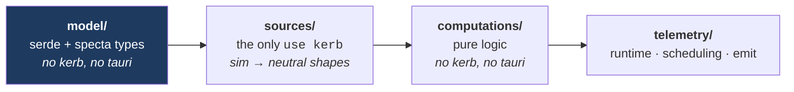

| Layer           | Owns                    | Must not                           |
| --------------- | ----------------------- | ---------------------------------- |
| `model/`        | the wire format         | know about kerb, tauri, or any sim |
| `sources/`      | everything sim-specific | leak a sim concept downstream      |
| `computations/` | derived telemetry       | do I/O, or know a sim              |
| `telemetry/`    | the loop, timing, emit  | contain domain math                |

The payoff: a sim quirk fixed in `sources/` is fixed everywhere, and
`computations/` stays unit-testable with no sim running.

## `model/` — the contract

Plain data. `serde` for the wire format, `specta` for TypeScript generation. One
file per subject:

| File               | Holds                                                           |
| ------------------ | --------------------------------------------------------------- |
| `cars.rs`          | per-car frames — dynamics, inputs, positions, status, `car_idx` |
| `session.rs`       | session snapshot, results, qualifying entries, driver roster    |
| `environment.rs`   | track and weather conditions                                    |
| `flags.rs`         | flag state                                                      |
| `player.rs`        | the player's own car and lap timing                             |
| `lap_log.rs`       | completed-lap records                                           |
| `reference_lap.rs` | the stored reference lap                                        |
| `relative.rs`      | relative-gap entries                                            |
| `track_shape.rs`   | the recorded track outline                                      |
| `pit_command.rs`   | pit service orders                                              |
| `input.rs`         | controller devices and button events                            |
| `chat.rs`          | chat messages, presence, deletions                              |
| `capabilities.rs`  | what the connected sim supports                                 |
| `enums.rs`         | shared enums — session type, flags, spotter state               |

This layer is the **entire** backend↔frontend contract. If the frontend can see
it, it is defined here.

> [!WARNING]
> **Never put `f32::INFINITY` or `f32::NAN` in a payload.** They do not survive
> JSON. Use a finite placeholder or `Option<f32>`.

## `sources/` — the only layer that knows a sim

Everything sim-specific is quarantined behind one trait in `source.rs`:

```rust
pub trait TelemetrySource {
    fn sim_type(&self) -> SimType;
    fn capabilities(&self) -> Capabilities;
    fn read_frame(&mut self, timeout_ms: u32) -> SourceReadResult<SourceFrame>;
    fn session_changed(&mut self) -> bool;
    fn poll_session(&mut self) -> Option<ParsedSession>;
}
```

> [!IMPORTANT]
> **This is the only place `use kerb` is allowed.** Adding a second sim means
> adding a sibling folder that implements this trait — and touching nothing else.

### Module map — `sources/iracing/`

| File               | Responsibility                                                                                   |
| ------------------ | ------------------------------------------------------------------------------------------------ |
| `source.rs`        | implements `TelemetrySource`: connection lifecycle, frame reads                                  |
| `frame_map.rs`     | maps kerb's `IracingFrame` onto our neutral `SourceFrame` — the field-by-field translation table |
| `session_parse.rs` | parses the session YAML blob into `ParsedSession`                                                |
| `car_classes.rs`   | resolves class badges and colors (see below)                                                     |
| `flags.rs`         | decodes the iRacing flag bitfield                                                                |
| `weather.rs`       | weather and track-condition decoding                                                             |
| `pit_command.rs`   | encodes our pit orders into iRacing's command format                                             |

### Normalizations that happen here, and only here

These exist because letting a sim's convention travel downstream costs you a bug
in every consumer:

| Quirk                                                   | Handling                                                                                                       |
| ------------------------------------------------------- | -------------------------------------------------------------------------------------------------------------- |
| iRacing counts some positions from 0, others from 1     | everything is normalized to **1-indexed** at this boundary; `standings.rs` downstream has no compensating `+1` |
| The session YAML may contain characters illegal in YAML | sanitized before parsing, rather than failing the parse                                                        |
| Spotter state arrives as a bare integer                 | decoded to an enum, unknown values falling back to `Clear`                                                     |
| `CarClassShortName` is empty in AI and hosted sessions  | resolved through the fallback chain below                                                                      |

#### Car class badges

The badge shown next to a driver is not simply a field you can read.
`CarClassShortName` from the session YAML is **empty in AI and hosted sessions**,
and holds the _car_ name in single-model classes. So `car_class_short_name` is
resolved in order, all of it inside `car_classes.rs`:

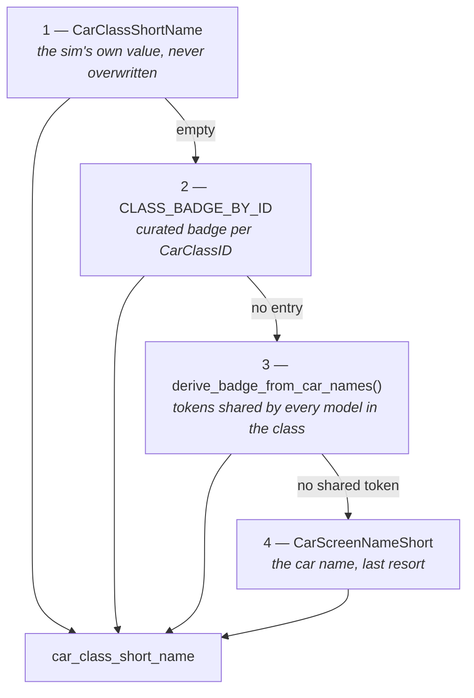

Step 3 is the interesting one: `"BMW M4 GT3 EVO"` + `"Ferrari 296 GT3"` share the
token `GT3`, so a multi-model class names itself. **Add to `CLASS_BADGE_BY_ID` only
for single-model classes whose car name is too long for the badge column** —
multi-model classes resolve themselves.

`CLASS_COLOR_MAP` corrects known mismatches between telemetry and in-game colors.
`session_parse.rs` only calls `apply_class_badges()` and `normalize_class_color()`;
the constants, the logic and its tests all stay in `car_classes.rs`.

To read real `CarClassID` values, dump the session YAML with iRacing running
(`kerb::utils::save_session`, or `cargo run --example session_diagnostics` in
`kerb/examples`), then:

```bash
grep -o "CarClassID: [0-9]*\|CarScreenNameShort: .*" dump.yaml | paste - - | sort -u
```

## `computations/` — pure logic

Nine processors, one subject each, sharing one shape:

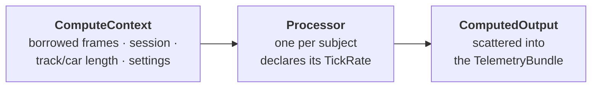

| Processor          | Computes                                         |
| ------------------ | ------------------------------------------------ |
| `fuel.rs`          | consumption average, laps remaining, fuel to add |
| `lap_delta.rs`     | delta to reference and session-best              |
| `lap_log.rs`       | per-lap records as laps complete                 |
| `pit_stops.rs`     | pit timing and stop detection                    |
| `proximity.rs`     | cars alongside, for the radar widgets            |
| `reference_lap.rs` | capture and comparison of the reference lap      |
| `relative.rs`      | relative gaps to cars around you                 |
| `standings.rs`     | the live standings table, per class              |
| `track_shape.rs`   | records the track outline from driven laps       |

No `kerb`, no `tauri`, no I/O. That is exactly why this layer is the easy one to
unit-test — and why sim quirks must be resolved upstream before they reach it.

## `telemetry/` — the runtime

| File              | Role                                                                   |
| ----------------- | ---------------------------------------------------------------------- |
| `runtime.rs`      | owns the telemetry thread and the connection lifecycle                 |
| `state.rs`        | what persists between ticks                                            |
| `scheduler.rs`    | decides which rate tiers are due this tick                             |
| `emitter.rs`      | runs the processor registry, assembles one `TelemetryBundle`, emits it |
| `capabilities.rs` | reports what the connected sim can actually provide                    |

### Rate tiers

The backend does not emit everything 60 times a second. Fields are grouped by how
fast they actually change, and each tick emits one bundle containing only the
tiers that are due.

| Rate  | Fields                                                       |
| ----- | ------------------------------------------------------------ |
| 60 Hz | `car_dynamics`, `car_inputs`, `car_positions`, `lap_delta`   |
| 10 Hz | `car_idx`, `chassis`, `lap_timing`, `proximity`, `standings` |
| 4 Hz  | `car_status`, `fuel`, `pit_stops`                            |
| 1 Hz  | `session`, `environment`                                     |

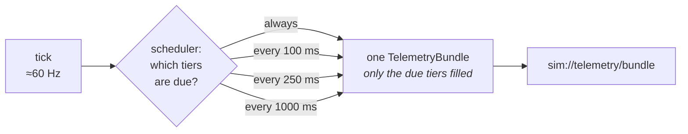

> [!NOTE]
> Sources do not tick at exactly 60 Hz — iRacing wakes on a Win32 event, other sims
> poll with a `sleep` and drift between roughly 58 and 62 Hz. The scheduler
> therefore gates the 10/4/1 Hz groups on **elapsed monotonic time, never on a
> frame count.**

The emitter also handles side-channel work that is not part of the periodic
bundle: saving a discovered track shape, persisting a reference lap, and patching
pit lane percentages once they become known (which re-emits the track shape).

### Demand gating on the 60 Hz tier

Being due is necessary but not sufficient: the four 60 Hz fields are filled only
while some widget actually wants them. Each widget names what it reads in its own
`manifest.ts`:

```ts
export const G_METER_MANIFEST: WidgetManifest = {
  id: 'g-meter',
  telemetryEvents: ['carDynamics'],
  ...
};
```

`SimStore.updateActiveEvents` unions the declarations of the enabled widgets in
the active layout and sends the result to `set_active_events` as a bitmask;
`emitter.rs` reads it and leaves an unrequested field out of the bundle. The
names and their bit values live in `src/types/telemetry-events.ts` and mirror
`telemetry/state.rs`.

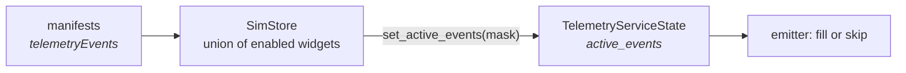

> [!IMPORTANT]
> **The mask gates publication, not computation.** Every processor that carries
> state — fuel, lap log, pit stops, standings, the reference lap — runs on every
> tick regardless, so a widget enabled mid-race finds its history intact. Only a
> field that is a pure snapshot of the current tick may be skipped at the source,
> which is why the mask covers the raw 60 Hz frames and `lap_delta` (whose state
> is owned by the reference-lap processor, not by the delta itself).
>
> What is saved is everything downstream of the computation: the serialization,
> the IPC hop into _each_ window and remote screen, the parse, and the store
> write. For a 60 Hz frame that is the entire cost.

A widget reading a gated field without declaring it renders empty; one declaring
a field it does not read makes every other window pay for the traffic. The
declaration therefore lives next to the widget, not in a list somewhere else —
a list is what drifts.

## `input/`, `chat/` and the command surface

| Module              | Role                                                                                           |
| ------------------- | ---------------------------------------------------------------------------------------------- |
| `input/dinput.rs`   | DirectInput8 game-controller polling                                                           |
| `input/identity.rs` | device identity and re-matching after a driver reinstall                                       |
| `input/runtime.rs`  | the polling thread                                                                             |
| `input/commands.rs` | `resolve_input_devices`, `set_input_polling_enabled`                                           |
| `chat/`             | Twitch chat stream — independent of any sim connection                                         |
| `commands.rs`       | the main Tauri command surface (see [Command catalogue](#command-catalogue-frontend--backend)) |
| `capabilities.rs`   | per-sim feature reporting                                                                      |
| `logging.rs`        | tracing setup — `RUST_LOG=marble_trace_lib=debug npm run tauri:dev`                            |

Device ids are DirectInput `guidInstance`, so replugging and port changes keep
bindings intact. A driver reinstall that regenerates the GUID is re-matched by
vendor/product and the stored id rewritten once. **Two identical devices are never
auto-matched** — there is no way to tell them apart.

---

---

# Part II — Frontend

## Frontend layers

`src/` mirrors the backend: four layers plus a contract layer, one-way imports.

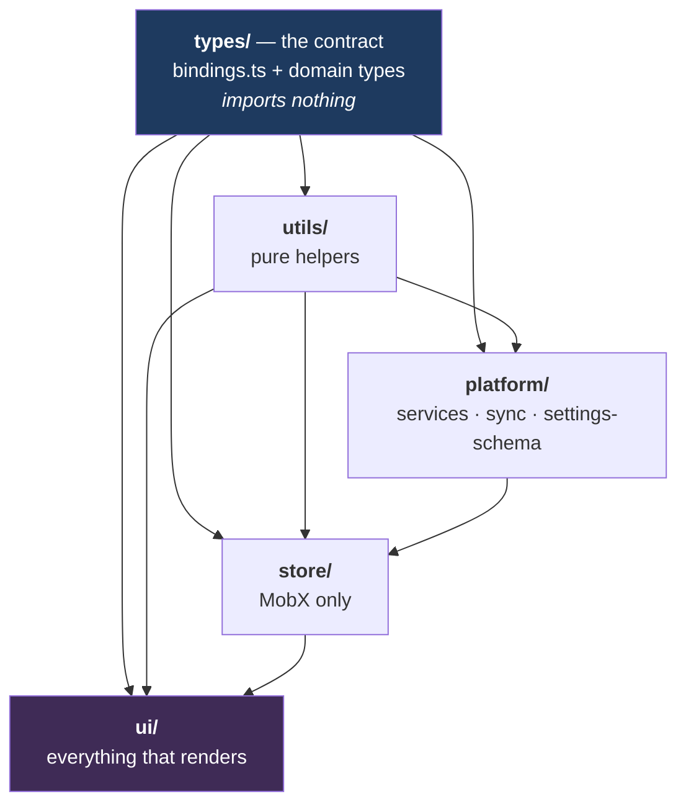

Summarized as a direction: `utils/ ← ui/ → store/ → platform/`.

| Layer       | Holds                                                    | May import                                                  |
| ----------- | -------------------------------------------------------- | ----------------------------------------------------------- |
| `platform/` | everything that talks to the OS, the disk or the backend | `utils/`, `types/` — and `sync/` alone may also read stores |
| `store/`    | MobX only                                                | `platform/`, `utils/`, `types/`                             |
| `ui/`       | everything that renders                                  | `store/`, `utils/`, `types/`                                |
| `utils/`    | pure helpers                                             | `types/`                                                    |
| `types/`    | `bindings.ts` plus hand-written domain types             | nothing                                                     |

> [!IMPORTANT]
> **The direction is enforced by lint, not by convention.** `no-restricted-imports`
> overrides in `.oxlintrc.json` fail `npm run lint` on any violation.

Two files are exempt and say why in a comment: `store/root-store.ts` (composes
widget stores that live next to their widgets) and `store/widget-catalog.ts`
(assembles the per-widget manifests, which also live next to their widgets).

Path aliases match the layers one-to-one: `@platform/*`, `@store/*`, `@ui/*`,
`@utils/*`, and `@/*` for `types`, `styles`, `locales` and `storybook`.

## `types/` — the contract layer

| File                    | Holds                                                     |
| ----------------------- | --------------------------------------------------------- |
| `bindings.ts`           | **generated by specta** — every backend payload shape     |
| `widget-settings.ts`    | per-widget settings interfaces and `WidgetCustomSettings` |
| `input-bindings.ts`     | `Binding`, `BindingMap` — the key-binding wire types      |
| `telemetry-snapshot.ts` | hand-written domain types over the generated ones         |
| `index.ts`              | shared app-level types (units, language)                  |

Imports nothing. Every other layer imports it.

## `utils/` — pure helpers

Grouped by **domain, not by kind** — one file per subject, never a `constants/` or
`formatters/` bucket, since those cut across every domain and tell you nothing.

| File                       | Subject                                       |
| -------------------------- | --------------------------------------------- |
| `animation.ts`             | easing and animation timing                   |
| `canvas.ts`                | DPR sizing and canvas geometry                |
| `colors.ts`                | the JS-side palette, matching the SCSS tokens |
| `car-signals.ts`           | deriving signals from raw car state           |
| `delta-utils.ts`           | delta formatting and latching                 |
| `driver.ts`                | driver names, ratings, identity               |
| `driving-coach-utils.ts`   | coach advisory logic                          |
| `fuel-constants.ts`        | fuel math constants                           |
| `qualifying-visibility.ts` | what is hidden during qualifying              |
| `radar-constants.ts`       | radar geometry constants                      |
| `telemetry-format.ts`      | number and time formatting for display        |
| `timer-utils.ts`           | timing helpers                                |
| `weather-utils.ts`         | weather icons, labels and colors              |

A new helper joins the file whose subject it shares; a new file needs a subject
none of these covers.

## `platform/` — the outside world

If a line of code calls `invoke`, listens to an event, reads a file or asks about a
monitor, it lives here. **Nothing above this layer imports from `@tauri-apps/*`.**

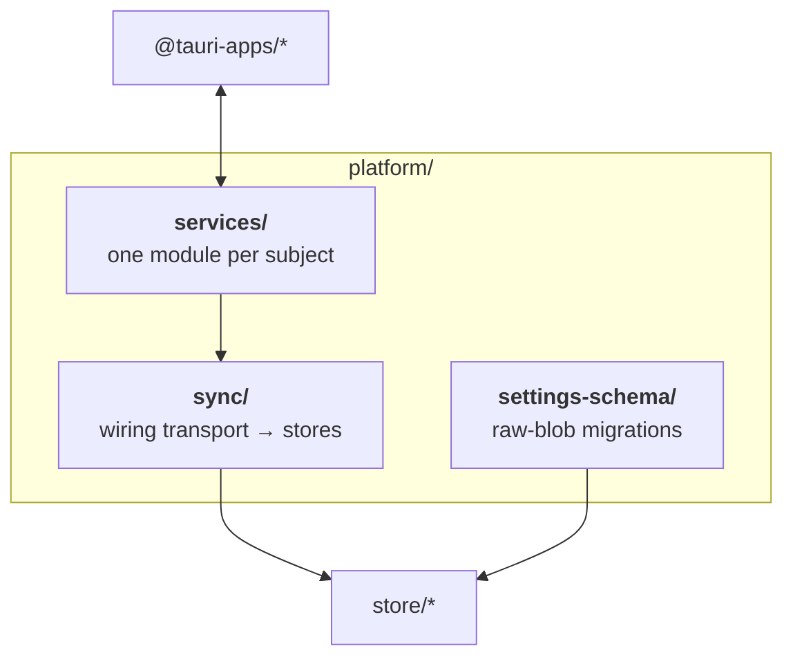

### `services/` — the seam

| File                   | Wraps                                                                                                                                  |
| ---------------------- | -------------------------------------------------------------------------------------------------------------------------------------- |
| `events.service.ts`    | **the only `@tauri-apps/api/event` import in the codebase** — every emitter and `listenTo`                                             |
| `telemetry.service.ts` | `startTelemetryStream`, `stopTelemetryStream`, `getConnectionStatus`, `getLastSessionInfo`, `setActiveEventsSilent`                    |
| `track.service.ts`     | `getCachedTrackShape`, `deleteTrackShape`, `resetPitLanePct`, `getReferenceLap`, `deleteReferenceLap`                                  |
| `settings.service.ts`  | `settingsFileExists`, `backupSettingsFile`, `logSettingsSnapshot`, `deleteSettingsFile`, and the `*Silent` setters                     |
| `twitch.service.ts`    | `twitchHasClientId`, `twitchCurrentLogin`, `twitchRequestDeviceCode`, `twitchPollDeviceToken`, `twitchSignOut`, chat stream start/stop |
| `input.service.ts`     | `resolveInputDevices`, `setInputPollingEnabled`                                                                                        |
| `pit.service.ts`       | `sendPitOrder`                                                                                                                         |

Because services are the seam, **tests mock services, not Tauri.**

### `sync/` — the wiring

The one part of `platform/` allowed to read stores.

| File                                         | Role                                                                                          |
| -------------------------------------------- | --------------------------------------------------------------------------------------------- |
| `listeners.ts`                               | `setupMainListeners` / `setupOverlayListeners` — which store each incoming payload belongs to |
| `main-sync.ts`                               | main-side `reaction`s that emit on store change                                               |
| `overlay-sync.ts`                            | overlay-side reactions — drag mode, geometry write-back                                       |
| `persistence.ts` · `persistence-sync.ts`     | writing settings to disk                                                                      |
| `chat-sync.ts`                               | Twitch chat stream wiring                                                                     |
| `pit-service-sync.ts`                        | pit-service cross-window state                                                                |
| `overlay-windows.ts`                         | creating, labelling and tearing down overlay windows                                          |
| `overlay-labels.ts`                          | the monitor-name → window-label mapping                                                       |
| `overlay-resolution.ts` · `monitor-watch.ts` | monitor geometry and hot-plug                                                                 |
| `sim-events.ts`                              | **every backend event name constant**                                                         |

> [!IMPORTANT]
> Import event names from `sim-events.ts`. Never type an event name as a string
> literal at a call site.

### `settings-schema/`

Raw-blob migrations — see [Settings and persistence](#settings-and-persistence).

## `store/` — state and business logic

MobX, and nothing else. No JSX, no DOM.

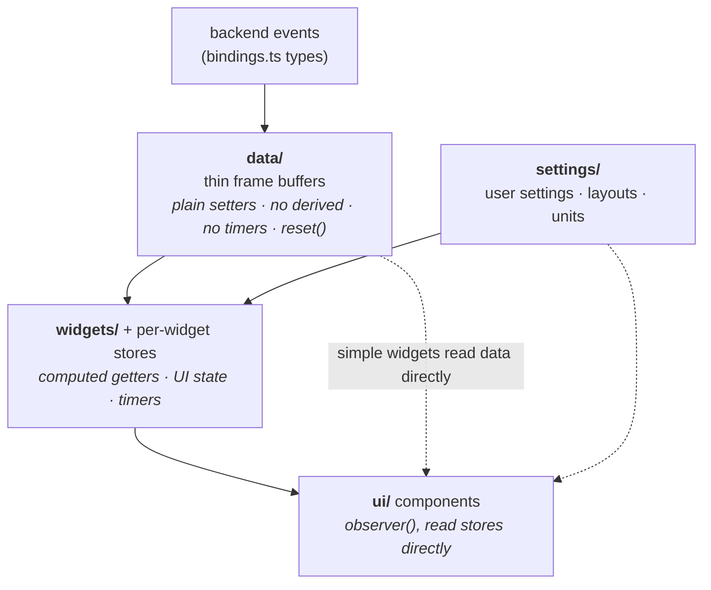

Every store hangs off one `RootStore` (`src/store/root-store.ts`), reached through
the context hooks in `src/store/root-store-context.ts`.

> [!WARNING]
> **Never import a store as a singleton.** Each window constructs its own
> `RootStore`; a module-level instance would silently be the wrong one.

### Module map

| Folder                                    | Holds                                                                                                                                                                                                          |
| ----------------------------------------- | -------------------------------------------------------------------------------------------------------------------------------------------------------------------------------------------------------------- |
| `data/`                                   | `player`, `cars`, `session`, `environment`, `chat`, `reference-lap` frame buffers, plus `computed.store.ts` for derived values shared by 2+ widgets                                                            |
| `settings/`                               | `app-settings`, `layouts`, `widget-defaults`, `widget-settings`, `units`, `twitch-auth`, plus layout helpers (`layout-resolution`, `layout-resize`, `layout-background`, `widget-history`, `widget-placement`) |
| `widgets/`                                | stores read by 2+ widgets — `flags`, `pace-car`, `radar`, `standings` — plus app-level ones (`widget-auto-hide`, `settings-panel-ui`)                                                                          |
| `sim/`                                    | sim connection state, `track-condition`, `debug`                                                                                                                                                               |
| `hotkeys/`                                | `actions` registry, `action-registry`, `bindings.store`, `binding-runner`, `bindings-sync`, `bindings-ui`, `device-input`                                                                                      |
| `preview/`                                | neutral sample data — scenarios, sample telemetry, sample track, the preview animator                                                                                                                          |
| `root-store.ts` · `root-store-context.ts` | composition and access                                                                                                                                                                                         |
| `widget-catalog.ts`                       | assembles the per-widget manifests                                                                                                                                                                             |

> [!NOTE]
> `preview/` exists so the app never imports from `src/storybook`. Shared fixtures
> live in this neutral place, which both the app and Storybook may read.

### The six store rules

1. **Data stores** use types from `bindings.ts` only — never a hand-written
   duplicate of a backend event shape. They stay thin: plain setters, no derived
   values, no timers, and an explicit `reset()`.
2. **Widget stores** exist only when a widget has UI state, timers, or non-trivial
   derived logic. Simple widgets read data stores directly.
3. **Derived logic shared by 2+ widgets** becomes a `computed` getter on the data
   store, never duplicated per widget.
4. **One-way flow.** Widget stores read data and settings stores; data stores know
   nothing about widgets.
5. **Hooks are DOM-only** — `ResizeObserver`, `getBoundingClientRect`, RAF.
   Everything else belongs in a store.
6. **Each value has exactly one owner.**

### Reactivity rules

| Rule                                                                    | Why                                                                                    |
| ----------------------------------------------------------------------- | -------------------------------------------------------------------------------------- |
| Derived values are `computed` getters in a store, never `useMemo`       | `useMemo` is per-component; a computed is shared and cached once                       |
| `updateUserSettings` mutates in place with `Object.assign`              | replacing the `userSettings` reference detaches every existing observer                |
| Widget layout changes go through `resolveLayoutChange` in the manifest  | keeps per-widget branching out of the shared store                                     |
| Reactions depend on `widgetMutationId`, bumped by every settings setter | comparing `JSON.stringify` of the settings tree on every change is both slow and wrong |

### Input bindings

Keyboard shortcuts and controller buttons are **app-level, not per layout**.

| Concern                                 | Location                              |
| --------------------------------------- | ------------------------------------- |
| wire types                              | `src/types/input-bindings.ts`         |
| action registry                         | `src/store/hotkeys/actions.ts`        |
| persisted map (`actionId -> Binding[]`) | `src/store/hotkeys/bindings.store.ts` |
| dispatch + OS registration              | `src/store/hotkeys/binding-runner.ts` |
| device polling                          | `src-tauri/src/input/`                |

> [!TIP]
> **Adding a bindable action is one entry in `ACTIONS` plus one key under
> `bindings.actions` in `main-app.json`.** Nothing else — the runner, the settings
> UI, persistence and the save reaction are all driven off the registry.

- `owner` is a widget id or `'app'`. Widget-owned actions fire only when that
  widget is in the active layout, checked **at dispatch time**, so nothing is
  broadcast to an overlay for a widget that isn't there. `ignoreLayoutGate: true`
  opts out; only the generated `widget:<id>:toggle-in-layout` actions do.
- `trigger: 'press'` fires on key down; `'hold'` fires on both edges with the
  pressed state.
- **The runner lives in the main window only.** Overlays are reached through
  `emitToOverlays` inside an action's `run`.
- Conflicts (one key on two actions) are allowed and only warned about.

## `ui/` — everything that renders

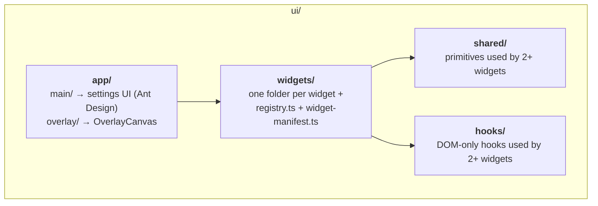

| Folder                       | Holds                                                                                                                                                                       |
| ---------------------------- | --------------------------------------------------------------------------------------------------------------------------------------------------------------------------- |
| `app/main/`                  | `MainWindow.tsx`, the settings UI, `sim-name.ts`, `capture-snapshot.ts`                                                                                                     |
| `app/overlay/`               | `OverlayWindow.tsx`, `OverlayCanvas`                                                                                                                                        |
| `app/widget-frame.ts`        | frame geometry shared by the two window shells                                                                                                                              |
| `widgets/<Name>/`            | one folder per widget — components, manifest, store, helpers, tests                                                                                                         |
| `widgets/registry.ts`        | id → React component                                                                                                                                                        |
| `widgets/widget-manifest.ts` | values shared across manifests — `COMMON_WIDGET_DEFAULTS`, appearance defaults, `makeColumnLayoutResolver`                                                                  |
| `shared/`                    | `WidgetPanel`, `StatPill`, `WidgetValue`, `WidgetLabel`, badges, `CarDot`, `ScrollIndicator`, `NoDataPlaceholder`, `ErrorBoundary`                                          |
| `hooks/`                     | `useCanvasAutoResize`, `useReactiveCanvasLoop`, `useVisibleRowCount`, `useRowMoveAnimation`, `useClickOutside`, `usePitState`, `useProximityRadarData`, `useWidgetAutoHide` |

Components talk to MobX stores and to nothing else. They never import from
`@tauri-apps/*` or `@platform/*` — the one exception being window and webview APIs
(`getCurrentWindow`, `getCurrentWebviewWindow`) inside the window-shell components,
which is what those components are _for_.

### The widget system

A widget declares itself as **plain data** in `manifest.ts`: id, label, design
size, shipped `userSettings`, and an optional `resolveLayoutChange`.

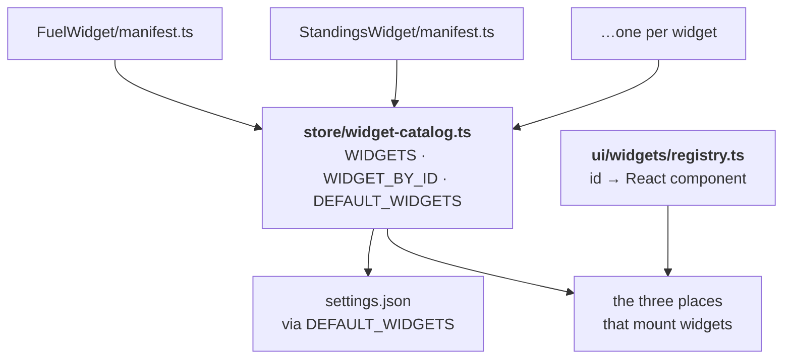

> [!IMPORTANT]
> **A manifest never imports its own component.** That single rule is what lets the
> catalog live in `store/` without dragging the UI layer along with it.

`WidgetContainer` applies scale, opacity and the radial-gradient background from
user settings, so a widget never hardcodes its own background.

### Where a widget's files live

**One consumer → the widget folder. Two or more → the shared folder.**

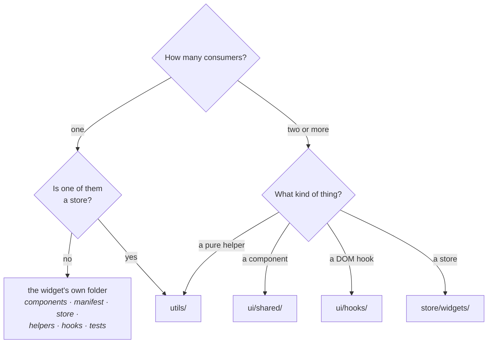

The store branch is not an exception but a consequence: **a store importing from
`@ui/` is a lint error**, so a helper shared by a widget and a store has nowhere to
live but `utils/`, even with only two consumers.

A helper with a single **non-widget** owner does not go to `utils/` at all; it sits
with its owner — `store/settings/layout-*.ts`, `store/sim/debug.ts`,
`ui/app/main/sim-name.ts`, `ui/app/widget-frame.ts`.

A helper that gains a second consumer moves up; one that loses it moves back down.

Settings panels stay together in
`src/ui/app/main/components/WidgetSettings/panels/` — they share `Card`,
`SettingRow` and `WidgetEditorContext`, and belong to the main window, not the
overlay.

### Decomposition rules

- `WidgetName.tsx` is a thin orchestrator — never a monolithic render function.
- **Every component is `observer()`** — root, sub-components, leaves. `observer`
  gives you the MobX subscription _and_ an automatic `React.memo`.
- **Every component reads the store it needs directly.** Don't pass store data down
  as props when the child can read it. Pass observable objects or identifiers, not
  derived primitives — dereferencing a value in the parent kills reactivity for
  everything below it.
- **A root widget must not read 60 Hz fields** (`carDynamics`, `carInputs`).
  Delegate them to the smallest leaf that needs them. See
  [Performance](#performance).
- Decompose any visual section that is self-contained, updates at its own rate, or
  would push the parent past roughly 150 lines.

### `ws()` scaling

A widget is designed once at a fixed size and then scales as a whole.
`WidgetContainer` sets a single CSS variable:

```
--wfs = currentWidth / designWidth
```

Every dimension in the widget is expressed as a multiple of it, so one resize
scales type, spacing, borders and geometry together instead of reflowing the
layout.

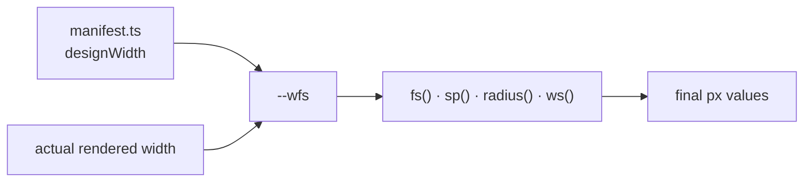

| Function        | Use for                                                                      | Scale                                                                |
| --------------- | ---------------------------------------------------------------------------- | -------------------------------------------------------------------- |
| `fs($step)`     | font size                                                                    | xxxs(10) xxs(11) xs(12) sm(13) md(15) lg(18) xl(22) xxl(28) xxxl(32) |
| `sp($step)`     | spacing, 2px grid                                                            | xxxs(2) xxs(4) xs(6) sm(8) md(10) lg(12) xl(16) xxl(20)              |
| `radius($step)` | corner radius                                                                | sm(3) md(4) lg(6)                                                    |
| `ws($px)`       | raw geometry not on a scale — grid columns, canvas and SVG sizes, icon sizes | any px value                                                         |

> [!WARNING]
> Never use `rem` (does not scale with `--wfs`), never `vw` / `vh` (**in the
> overlay they mean _screen_ size, not widget size**), and never `ws()` for
> borders — a scaled border rounds to 0 and disappears. Borders are plain `px`.

**Toggleable-column widgets** (Standings, Relative) are the one complication: their
`designWidth` is not constant, because hiding a column should not blow up the type
size of everything else. `designWidth` tracks the visible column set through
`colSpecs` in `*-utils.ts`, and `makeColumnLayoutResolver` (in
`ui/widgets/widget-manifest.ts`) keeps `--wfs` constant while the widget resizes.

### Canvas widgets

Canvas widgets bypass React's render path entirely for their pixels: React mounts
the element, and everything after that is imperative drawing.

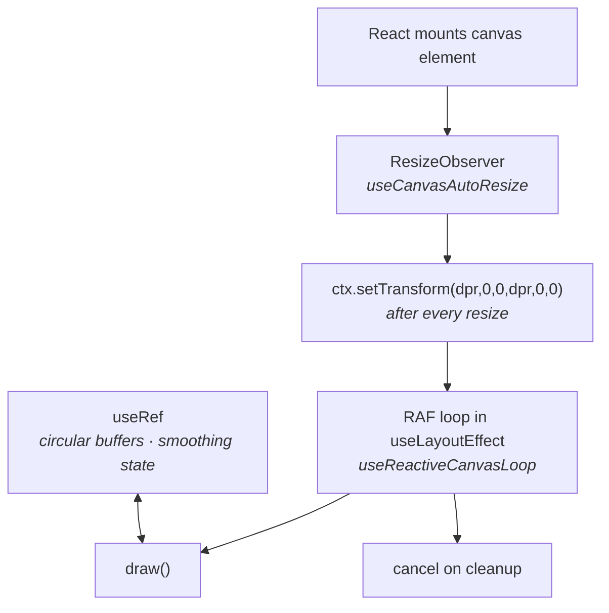

The rules that make that safe:

| Rule                                                                           | Why                                                                                           |
| ------------------------------------------------------------------------------ | --------------------------------------------------------------------------------------------- |
| Per-frame mutable state (circular buffers, smoothing) lives in `useRef`        | putting it in state would re-render at 60 Hz — the exact thing canvas exists to avoid         |
| Draws are scheduled with RAF inside `useLayoutEffect`, cancelled on cleanup    | an uncancelled loop keeps drawing into a detached canvas after unmount                        |
| Resize through `ResizeObserver`, then `ctx.setTransform(dpr, 0, 0, dpr, 0, 0)` | the transform is reset by a size change; skipping it gives you a blurry or half-scaled canvas |
| Colors come from the JS palette, not from CSS                                  | canvas cannot read SCSS tokens — see `utils/colors.ts` and the per-widget `*-utils.ts`        |

Shared DPR sizing and the auto-resize observer live in `ui/hooks/` —
`useCanvasAutoResize` and `useReactiveCanvasLoop` — so a new canvas widget should
not hand-roll either.

### Styling

- A `ComponentName.module.scss` sits next to every component. **Never import a
  stylesheet from a parent or a sibling.**
- `_variables.scss`, `_functions.scss` and `_widget-tokens.scss` are auto-injected
  by Vite and Storybook via `additionalData` — do not import them manually.
- No inline styles; conditional styling uses named classes. The exception is
  genuinely data-driven values, such as a car-class color or a dynamic
  `grid-template`.
- Flat camelCase class names (`driverNamePlayer`). SCSS modifier classes are
  declared _after_ their base class.
- CSS variable names must not name a color.
- `$font-widget` is `'Rajdhani', sans-serif`; `$font-mono` is `'Consolas', monospace`.
- Layout is flexbox with `flex: 1 1 0` and `min-width: 0`; column sizing uses `ch`
  units when the maximum character count is known.

> [!WARNING]
> **Never hardcode a hex or rgba value in a widget.** Use the semantic tokens from
> `_widget-tokens.scss`; the `$race-*` palette follows Tailwind 500/600. The
> JS-side equivalents for canvas live in the widget manifests,
> `ui/widgets/GMeterWidget/g-meter-utils.ts`, `utils/weather-utils.ts` and
> `utils/colors.ts`, using the same palette hexes.

### Code style

- Arrow functions everywhere, always assigned to a named `const`. No anonymous
  standalone functions.
- Descriptive names; 1–3 character names are forbidden, including callback
  parameters.
- No magic numbers — name the constant.
- No comments unless the intent is genuinely not obvious from the name.
- All non-UI business logic lives in MobX stores.
- Icons from `lucide-react` only.
- No barrel-file imports — always a direct file path.
- `if`/`else` always in block form, with a blank line before `return` and a blank
  line before and after every `if`/`else` block.

### Adding a widget — checklist

1. Root element is `<WidgetPanel>`, never a bare `<div>`.
2. No hardcoded background.
3. Decompose from the start.
4. Every component `observer()`.
5. Add `*.stories.tsx` — seed stores via `runInAction` in decorators, include a
   background decorator.
6. Add `*SettingsPanel.tsx` in
   `src/ui/app/main/components/WidgetSettings/panels/` and wire it into
   `WidgetSettings.tsx`.
7. Add `interface *WidgetSettings` to `src/types/widget-settings.ts` and add it to
   `WidgetCustomSettings`.
8. Create `manifest.ts` next to the widget, list it in
   `src/store/widget-catalog.ts`, add the component to `src/ui/widgets/registry.ts`.
9. Use the `fs()` / `sp()` / `radius()` tokens, `$font-widget`, the
   `$widget-text-*` tokens and the `$race-*` palette.

---

---

# Part III — How the two halves talk

## The three channels

Everything crossing a process or window boundary uses one of three channels.

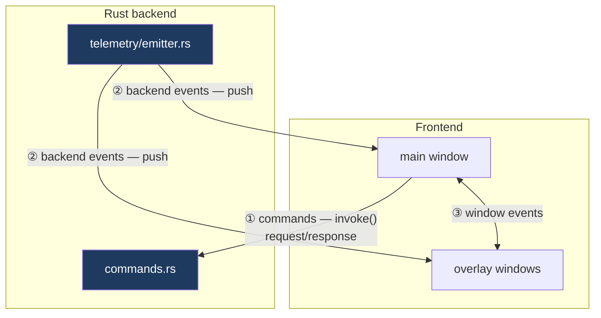

| #   | Channel            | Direction                               | Frontend entry point                  | Backend entry point                            |
| --- | ------------------ | --------------------------------------- | ------------------------------------- | ---------------------------------------------- |
| ①   | **Commands**       | frontend → backend, with a return value | `platform/services/*.service.ts`      | `commands.rs`, `input/commands.rs`             |
| ②   | **Backend events** | backend → both windows, fire-and-forget | `platform/sync/listeners.ts`          | `telemetry/emitter.rs` and friends             |
| ③   | **Window events**  | main ↔ overlay                          | `platform/services/events.service.ts` | — (never reaches Rust, except two noted below) |

> [!NOTE]
> **Backend events are not relayed between windows.** Each window subscribes to the
> backend independently, so telemetry reaches the overlay without passing through
> main. Only _derived_ and _user_ state crosses the window boundary on channel ③.

## Command catalogue (frontend → backend)

Every `invoke` in the app goes through a service function. No component and no
store calls `invoke` directly.

| Service file           | Function                                         | Rust command                | Purpose                                              |
| ---------------------- | ------------------------------------------------ | --------------------------- | ---------------------------------------------------- |
| `telemetry.service.ts` | `startTelemetryStream`                           | `start_telemetry_stream`    | begin reading the sim                                |
|                        | `stopTelemetryStream`                            | `stop_telemetry_stream`     | stop reading                                         |
|                        | `getConnectionStatus`                            | `get_connection_status`     | is a sim connected                                   |
|                        | `getLastSessionInfo`                             | `get_last_session_info`     | last known session, for a cold start                 |
|                        | `setActiveEventsSilent`                          | `set_active_events`         | tell the backend which events anyone is listening to |
| `track.service.ts`     | `getCachedTrackShape`                            | `get_cached_track_shape`    | load a recorded track outline                        |
|                        | `deleteTrackShape`                               | `delete_track_shape`        | discard it                                           |
|                        | `resetPitLanePct`                                | `reset_pit_lane_pct`        | re-detect pit lane bounds                            |
|                        | `getReferenceLap`                                | `get_reference_lap`         | load the stored reference lap                        |
|                        | `deleteReferenceLap`                             | `delete_reference_lap`      | discard it                                           |
| `settings.service.ts`  | `settingsFileExists`                             | `settings_file_exists`      | first-run detection                                  |
|                        | `backupSettingsFile`                             | `backup_settings_file`      | snapshot before a risky write                        |
|                        | `deleteSettingsFile`                             | `delete_settings_file`      | factory reset                                        |
|                        | `logSettingsSnapshot`                            | `log_settings_snapshot`     | diagnostics                                          |
|                        | `setPitWarningLapsSilent`                        | `set_pit_warning_laps`      | push a computation setting                           |
|                        | `setFuelAvgWindowSilent`                         | `set_fuel_avg_window`       | push a computation setting                           |
|                        | `setCarLengthSilent`                             | `set_car_length`            | push a computation setting                           |
| `twitch.service.ts`    | `twitchHasClientId` … `twitchSignOut`            | Twitch auth commands        | device-code OAuth flow                               |
|                        | `startChatStreamSilent` / `stopChatStreamSilent` | chat stream commands        | connect and disconnect chat                          |
| `input.service.ts`     | `resolveInputDevices`                            | `resolve_input_devices`     | enumerate controllers                                |
|                        | `setInputPollingEnabled`                         | `set_input_polling_enabled` | start/stop DirectInput polling                       |
| `pit.service.ts`       | `sendPitOrder`                                   | `send_pit_order`            | send a pit service order to the sim                  |

The `*Silent` naming marks a setter that pushes a value into the backend without
expecting anything back — a fire-and-forget command, not an event.

## Event catalogue

### Channel ② — backend → frontend

Names are constants in `platform/sync/sim-events.ts`; handlers are wired in
`platform/sync/listeners.ts`.

| Event                                                    | Emitted by                  | Rate                          | Lands in                            |
| -------------------------------------------------------- | --------------------------- | ----------------------------- | ----------------------------------- |
| `sim://telemetry/bundle`                                 | `telemetry/emitter.rs`      | every tick, tiered            | the `data/` stores                  |
| `sim://session`                                          | session polling             | on change                     | `session.store.ts`                  |
| `sim://weather`                                          | weather decoding            | async                         | `environment.store.ts`              |
| `sim://status`                                           | connection lifecycle        | on change                     | `sim.store.ts`                      |
| `sim://disconnected`                                     | connection lifecycle        | on loss                       | `sim.store.ts` — triggers `reset()` |
| `sim://capabilities`                                     | `telemetry/capabilities.rs` | on connect                    | `sim.store.ts`                      |
| `sim://track-shape`                                      | `telemetry/emitter.rs`      | on discovery or pit-pct patch | the track map widget store          |
| `sim://reference-lap/updated`                            | `telemetry/emitter.rs`      | on capture                    | `reference-lap.store.ts`            |
| `input://devices`                                        | `input/runtime.rs`          | on device change              | `device-input.store.ts`             |
| `input://button`                                         | `input/runtime.rs`          | on press/release              | `binding-runner.ts`                 |
| `chat://message` · `chat://presence` · `chat://deletion` | `chat/`                     | async                         | `chat.store.ts`                     |

### Channel ③ — main ↔ overlay

All emitters are named functions in `platform/services/events.service.ts`. The
helper you call determines the direction:

| Helper                | Reaches                                        |
| --------------------- | ---------------------------------------------- |
| `emitToOverlays(...)` | every open overlay window, by label            |
| `emitTo('main', ...)` | the main window only                           |
| `emit(...)`           | broadcast — **both windows and the Rust side** |

#### main → overlay (settings)

Emitted from `main-sync.ts` reactions, received in `setupOverlayListeners`.

| Event                                   | Emitter function                | Payload             |
| --------------------------------------- | ------------------------------- | ------------------- |
| `hide-all-widgets-changed`              | `emitHideAllWidgets`            | `boolean`           |
| `hide-widgets-when-game-closed-changed` | `emitHideWidgetsWhenGameClosed` | `boolean`           |
| `units-changed`                         | `emitUnitsChanged`              | `UnitSystem`        |
| `steering-lock-changed`                 | `emitSteeringLockChanged`       | `number`            |
| `language-changed`                      | `emitLanguageChanged`           | `AppLanguage`       |
| `standings-class-index-changed`         | `emitStandingsClassIndex`       | `number`            |
| `session-layouts-changed`               | `emitSessionLayoutsChanged`     | `SessionLayoutMap`  |
| `auto-switch-layouts-changed`           | `emitAutoSwitchLayoutsChanged`  | `boolean`           |
| `stream-chat-filters-changed`           | `emitStreamChatFilters`         | `StreamChatFilters` |
| `stream-chat-cleared`                   | `emitStreamChatCleared`         | `null`              |
| `bindings-changed`                      | `emitBindingsChanged`           | `BindingMap`        |
| `interact-mode-changed`                 | `emitInteractMode`              | `boolean`           |

#### main → overlay (commands)

A hotkey fires in main — the runner lives there — and must act on a widget that
lives in the overlay.

| Event                | Emitter function       | Effect                            |
| -------------------- | ---------------------- | --------------------------------- |
| `pit-service-toggle` | `emitPitServiceToggle` | toggle the pit service panel      |
| `pit-service-reveal` | `emitPitServiceReveal` | reveal it                         |
| `standings-scroll`   | `emitStandingsScroll`  | scroll the standings by a delta   |
| `stream-chat-scroll` | `emitStreamChatScroll` | scroll the stream chat by a delta |

#### overlay → main

| Event                     | Emitter function           | Why                                                                                                                       |
| ------------------------- | -------------------------- | ------------------------------------------------------------------------------------------------------------------------- |
| `widget-settings-updated` | `emitWidgetSettingsToMain` | drag and resize happen in the overlay; **main owns the file**, so geometry is sent back to be persisted (debounced 16 ms) |

#### Both directions

| Event                           | Emitter function                            | Why both ways                                                                                                                                                            |
| ------------------------------- | ------------------------------------------- | ------------------------------------------------------------------------------------------------------------------------------------------------------------------------ |
| `drag-mode-changed`             | `emitDragMode` (broadcast `emit`)           | drag mode is toggled from either window and both must agree                                                                                                              |
| `pit-service-auto-suspended`    | `emitPitServiceAutoSuspended` (broadcast)   | the driver can touch the pit order from either side — checkboxes in the overlay, hotkeys in main — so both windows mirror the flag and draw the same AUTO / MANUAL badge |
| `pit-service-halves-taken-over` | `emitPitServiceHalvesTakenOver` (broadcast) | same reason: a fuel nudge from a hotkey in main and a tire checkbox in the overlay each claim one half                                                                   |
| `layout-activated`              | `emitLayoutActivated` (broadcast)           | either side may activate a layout                                                                                                                                        |

#### Frontend → backend, over the event channel

Two events use the event channel instead of a command, because their listener is
the Rust recorder rather than a window:

| Event                   | Emitter function         | Heard by                                                                           |
| ----------------------- | ------------------------ | ---------------------------------------------------------------------------------- |
| `track-map:clear`       | `emitTrackMapClear`      | both windows **and** the backend recorder — everyone drops their copy of the track |
| `track-map:force-start` | `emitTrackMapForceStart` | the backend recorder only                                                          |

### One event name, two directions

`widget-settings-updated` travels **both ways under one name**:

- `emitActiveLayoutToOverlays(monitors, widgets)` sends it main → overlay, once per
  monitor, with a `MonitorWidgetsPayload`;
- `emitWidgetSettingsToMain(payload)` sends it overlay → main after a drag.

Two details of that payload are load-bearing:

- **The monitor name always travels with the widget list.** Without it, an edit made
  on one screen would overwrite the widgets of another.
- **Every overlay receives the whole widget list, not its own slice.** A widget
  dragged across a monitor edge has to appear on the neighbour, and only the
  receiving window can decide that — by testing centre points against its own
  bounds. The payload therefore also carries the layout's `monitors`.

## Cross-window synchronization

### Ownership

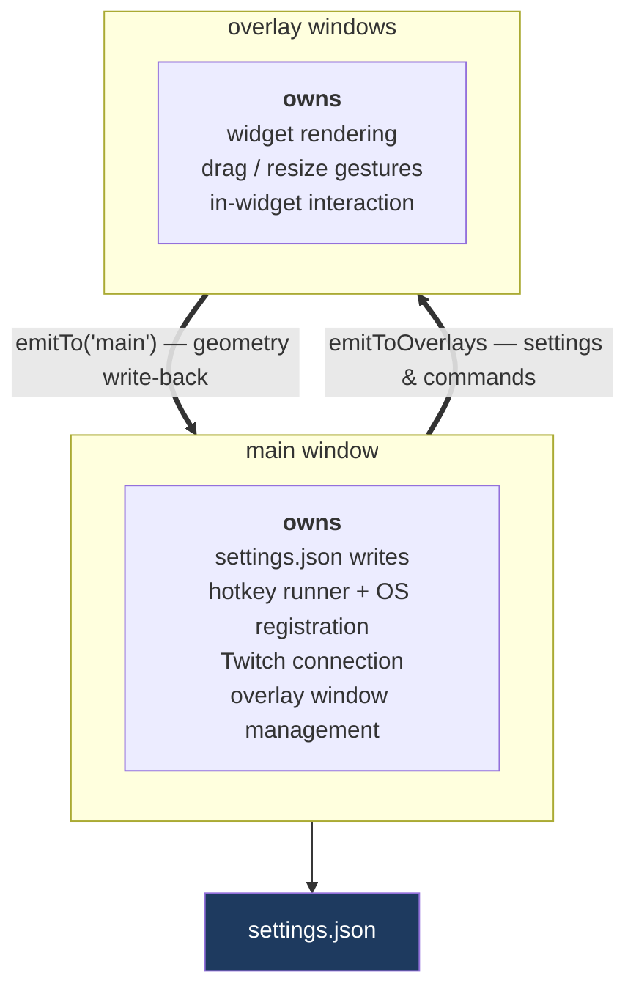

**Main is the owner of persistence.** The overlay never writes `settings.json`.
Drag a widget in the overlay and the new geometry is emitted to main; main saves it.

### The round-trip hazard

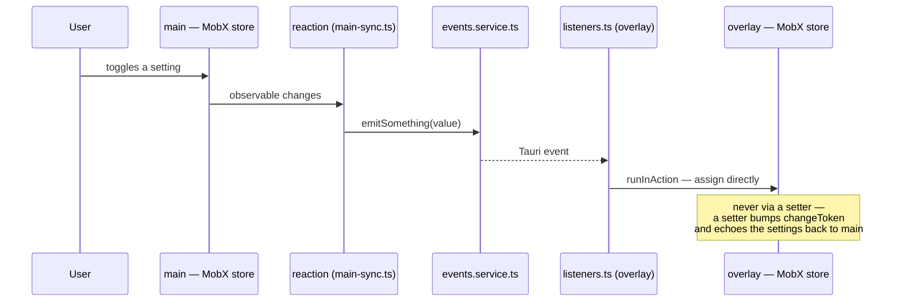

```ts
// main — platform/sync/main-sync.ts
reaction(
  () => store.value,
  (value) => emitSomething(value)
);

// overlay — platform/sync/listeners.ts
listenTo('event-name', (event) =>
  runInAction(() => (store.value = event.payload))
);
```

> [!WARNING]
> An overlay-synced value is assigned to the sub-store data **directly, never
> through a setter.** A setter bumps `changeToken`, which echoes the settings back
> to main and creates a feedback loop.

### Startup ordering

During startup main can react before any overlay window exists, which makes Tauri
log _"event emitted but no listeners found"_. This is harmless: overlays hydrate
the same values from disk on their own boot, so an emit that lands before they are
up is simply skipped.

## Worked example: one number, end to end

Fuel remaining, from shared memory to a pixel:

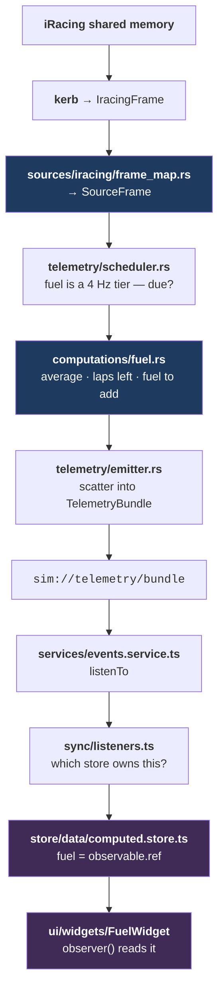

Every arrow is one-way. Nothing downstream calls back upstream.

---

---

# Part IV — Cross-cutting concerns

## Performance

The governing constraint: **the sim produces 60 Hz and React cannot render at
60 Hz.** The architecture absorbs that rate in four places, each one cheaper than
the layer above it.

```mermaid
flowchart TB
    L1["<b>1 — Backend tiering</b><br/>only 4 fields are truly 60 Hz;<br/>the rest emit at 10 / 4 / 1 Hz"]
    L2["<b>2 — observable.ref</b><br/>frames are replaced, never mutated in place —<br/>no deep observability cost per field"]
    L3["<b>3 — Component decomposition</b><br/>a 60 Hz value is read by the smallest leaf,<br/>so one cell re-renders, not a widget"]
    L4["<b>4 — Canvas</b><br/>high-frequency visuals bypass React entirely;<br/>RAF + useRef, no renders at all"]

    L1 --> L2 --> L3 --> L4
```

| Technique                                        | Where                                                | The failure it prevents                                                                                                                 |
| ------------------------------------------------ | ---------------------------------------------------- | --------------------------------------------------------------------------------------------------------------------------------------- |
| Rate tiers                                       | `telemetry/scheduler.rs`                             | sending standings 60 times a second when it changes 10 times                                                                            |
| Demand gating (`telemetryEvents`)                | widget manifests → `telemetry/emitter.rs`            | serializing and parsing a 60 Hz frame in every window when no widget on screen reads it                                                 |
| `observable.ref` on frame buffers                | `store/data/cars.store.ts`, `computed.store.ts`      | MobX walking every field of every car on every frame — frames are swapped wholesale, so reference equality is all the reactivity needed |
| Split computeds                                  | `store/data/computed.store.ts` and the widget stores | one changed field invalidating an unrelated derived value                                                                               |
| `observer()` on every component                  | all of `ui/`                                         | a parent re-render cascading into leaves that did not change                                                                            |
| Reading the store in the leaf, not passing props | all of `ui/`                                         | dereferencing in the parent, which makes the parent the subscriber and re-renders the whole subtree                                     |
| Root widgets never read 60 Hz fields             | all widget roots                                     | a whole widget re-rendering at 60 Hz for one number                                                                                     |
| Canvas + `useRef` + RAF                          | `ui/hooks/useReactiveCanvasLoop`, canvas widgets     | 60 Hz React renders for something that is just pixels                                                                                   |
| `widgetMutationId`                               | `store/settings/`                                    | `JSON.stringify` of the settings tree on every keystroke                                                                                |
| Debounced geometry write-back (16 ms)            | `overlay-sync.ts`                                    | a settings write per mouse-move during a drag                                                                                           |

> [!WARNING]
> **Never integrate 60 Hz values using the telemetry `sessionTime`.** It stalls,
> jumps and rewinds. Use `performance.now()` on the frontend.

## Settings and persistence

`settings.json` carries an integer `schemaVersion` at its top level, unrelated to
the app's semantic version. Format changes go through the migration chain in
`src/platform/settings-schema/`, which runs on the **raw blob** — between reading
the file and hydrating the stores.

```mermaid
flowchart LR
    FILE["settings.json<br/>on disk"]
    CHAIN["<b>settings-schema/</b><br/>migration chain<br/><i>pure functions, raw blob</i>"]
    MERGE["mergeWithDefaults<br/><i>does not reach layouts[].widgets[]</i>"]
    STORES["settings stores"]

    FILE --> CHAIN --> MERGE --> STORES
    STORES -->|"persistence-sync.ts<br/>(main window only)"| FILE

    style FILE fill:#1e3a5f,color:#fff
```

Three rules, each of which exists because breaking it corrupts real users' files:

| Rule                                                                                                                                | Why                                                                           |
| ----------------------------------------------------------------------------------------------------------------------------------- | ----------------------------------------------------------------------------- |
| A migration is a **pure function** and must **never import live types, defaults or registries** — freeze what it needs as a literal | otherwise a step written today silently rewrites history by next year's rules |
| `mergeWithDefaults` runs _after_ the chain and never reaches `layouts[].widgets[]`                                                  | a migration must clean those copies itself                                    |
| A file this build cannot migrate **locks settings against every write**                                                             | better a read-only session than a repaired-or-deleted file                    |

Most changes need no migration at all. Full guide:
[`docs/settings-schema.md`](./settings-schema.md).

## Testing

| Kind             | Tool                            | Notes                                                                                                                                                |
| ---------------- | ------------------------------- | ---------------------------------------------------------------------------------------------------------------------------------------------------- |
| Unit             | `vitest` (`npm test`)           | also runs on commit via lefthook                                                                                                                     |
| Rust unit        | `cargo test`                    | `computations/` and `car_classes.rs` are the well-covered parts                                                                                      |
| Widget isolation | Storybook (`npm run storybook`) | stories only; seed stores via `runInAction` in decorators, always include a background decorator                                                     |
| Live UI          | Tauri MCP Bridge                | `driver_session` on port 9223 with the app in dev mode, then `webview_screenshot`, `webview_find_element`, `webview_interact`, `ipc_execute_command` |

Frontend tests **mock services, not Tauri** — that is what the `platform/services/`
seam is for.

> [!WARNING]
> **Never test the UI in a plain browser.** The overlay depends on window geometry,
> transparency and Tauri APIs that no browser provides.

Storybook conventions: named `const` PascalCase exports, no default exports, no
anonymous functions.

## Where does my code go?

```mermaid
flowchart TB
    Q1{"Does it talk to the OS,<br/>the disk or the backend?"}
    Q2{"Does it render?"}
    Q3{"Does it hold state<br/>or business logic?"}
    Q4{"Is it a pure helper?"}
    Q5{"Used by 2+ widgets,<br/>or by a widget AND a store?"}

    P["<b>platform/</b>"]
    U["<b>ui/</b>"]
    S["<b>store/</b>"]
    UT["<b>utils/</b>"]
    W["the widget's own folder"]
    T["<b>types/</b>"]

    Q1 -->|yes| P
    Q1 -->|no| Q2
    Q2 -->|yes| U
    Q2 -->|no| Q3
    Q3 -->|yes| S
    Q3 -->|no| Q4
    Q4 -->|yes| Q5
    Q4 -->|no| T
    Q5 -->|yes| UT
    Q5 -->|no| W
```

| I want to…                         | Do this                                                                                       |
| ---------------------------------- | --------------------------------------------------------------------------------------------- |
| add a field to a backend payload   | edit the struct in `model/`, run `npm run tauri:dev` to regenerate `bindings.ts`              |
| add a new computed telemetry value | add or extend a processor in `computations/`, scatter its output in `emitter.rs`              |
| support a sim quirk                | fix it in `sources/` — never let it reach `computations/`                                     |
| add a widget                       | follow the [checklist](#adding-a-widget--checklist)                                           |
| add a keyboard shortcut            | one entry in `ACTIONS`, one key in `main-app.json`                                            |
| call a new backend command         | a function in the matching `platform/services/*.service.ts`                                   |
| share a value between the windows  | a reaction in `main-sync.ts`, a listener in `listeners.ts`, an emitter in `events.service.ts` |
| change the settings file format    | a migration in `platform/settings-schema/`                                                    |
| draw something at 60 Hz            | a canvas widget — see [Canvas widgets](#canvas-widgets)                                       |

## Commands

```bash
npm run tauri:dev          # run the app in dev mode (also regenerates bindings.ts)
npm run tauri:build:dev    # dev build, unsigned
npm run tauri:build:release

npm test                   # vitest run (also runs on commit via lefthook)
npm run typecheck          # tsc --noEmit
npm run lint               # oxlint --type-aware — this is what enforces the layers
npm run lint:fix
npm run format             # oxfmt write
npm run storybook          # isolated widget stories on :6006

cd src-tauri && cargo fmt
RUST_LOG=marble_trace_lib=debug npm run tauri:dev   # verbose backend logs
```
