# Architecture

This document is the map you should read first. It explains what Marble Trace™
is, how each half of it is built, how the two halves talk, and where your code
belongs when you add something. It assumes no prior knowledge of the codebase.

**How to read it.** [Orientation](#part-0--orientation) is the ten-minute
version. [Backend](#part-i--backend) and [Frontend](#part-ii--frontend) each
describe one half on its own terms, module by module.
[Interaction](#part-iii--how-the-two-halves-talk) is the complete catalogue of
everything that crosses between them — every command, every event, every file.
[Cross-cutting concerns](#part-iv--cross-cutting-concerns) covers what belongs to
no single layer: performance, settings, testing.

### Contents

**Part 0 — Orientation**

- [What the app does](#what-the-app-does)
- [The two processes](#the-two-processes)
- [The two windows](#the-two-windows)
- [The generated contract](#the-generated-contract)

**Part I — Backend**

- [Backend layers](#backend-layers)
- [`model/` — the contract](#model--the-contract)
- [`sources/` — the only layer that knows a sim](#sources--the-only-layer-that-knows-a-sim)
- [`computations/` — pure logic](#computations--pure-logic)
- [`telemetry/` — the runtime](#telemetry--the-runtime)
- [`input/`, `chat/` and the command surface](#input-chat-and-the-command-surface)

**Part II — Frontend**

- [Frontend layers](#frontend-layers)
- [`shared/` — no domain](#shared--no-domain)
- [`entities/` — sim data and the app's model](#entities--sim-data-and-the-apps-model)
- [`features/` — what the user does](#features--what-the-user-does)
- [`widgets/` — the overlay widgets](#widgets--the-overlay-widgets)
- [`pages/` — the main window's tabs](#pages--the-main-windows-tabs)
- [`app/` — windows, roots, sync](#app--windows-roots-sync)
- [Building a widget](#building-a-widget)

**Part III — How the two halves talk**

- [The three channels](#the-three-channels)
- [Command catalogue](#command-catalogue-frontend--backend)
- [Event catalogue](#event-catalogue)
- [Cross-window synchronization](#cross-window-synchronization)
- [Worked example: one number, end to end](#worked-example-one-number-end-to-end)

**Part IV — Cross-cutting concerns**

- [Performance](#performance)
- [Settings and persistence](#settings-and-persistence)
- [Content Security Policy](#content-security-policy)
- [Testing](#testing)
- [Where does my code go?](#where-does-my-code-go)
- [Commands](#commands)

---

---

# Part 0 — Orientation

## What the app does

Marble-Trace is a desktop overlay for sim racing. A racing simulator (currently
iRacing) publishes telemetry — speed, fuel, tire temperatures, the position of
every car on track — at roughly 60 times per second. Marble-Trace reads that
stream, computes things the sim does not give you directly (fuel to the end of
the race, gaps to the cars around you, a live standings table), and paints them
as a set of always-on-top widgets over the game window.

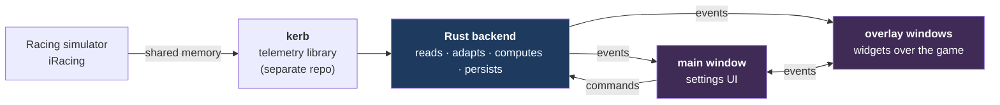
```mermaid
flowchart LR
    SIM["Racing simulator<br/>iRacing"]
    KERB["<b>kerb</b><br/>telemetry library<br/>(separate repo)"]
    RUST["<b>Rust backend</b><br/>reads · adapts · computes · persists"]
    MAIN["<b>main window</b><br/>settings UI"]
    OVL["<b>overlay windows</b><br/>widgets over the game"]

    SIM -->|shared memory| KERB
    KERB --> RUST
    RUST -->|events| OVL
    RUST -->|events| MAIN
    MAIN -->|commands| RUST
    MAIN <-->|events| OVL

    style RUST fill:#1e3a5f,color:#fff
    style OVL fill:#3f2b56,color:#fff
    style MAIN fill:#3f2b56,color:#fff
```

Two ideas drive every decision documented below:

1. **The sim is fast and the UI is slow.** 60 Hz of data must not become 60 Hz of
   React renders. A large part of this architecture exists to control _where_ that
   rate gets absorbed. See [Performance](#performance).
2. **Exactly one layer knows which sim we are talking to.** Everything downstream
   works on our own neutral shapes, so adding a second sim never ripples through
   the app. See [`sources/`](#sources--the-only-layer-that-knows-a-sim).

## The two processes

Marble-Trace is a [Tauri 2](https://tauri.app) application: a native Rust binary
hosting system webviews. There is no Node.js at runtime — the frontend ships as a
static bundle.

|             | Backend                                        | Frontend                                     |
| ----------- | ---------------------------------------------- | -------------------------------------------- |
| Language    | Rust                                           | TypeScript + React 19                        |
| Lives in    | `src-tauri/src/`                               | `src/`                                       |
| Job         | read the sim, compute, persist, talk to the OS | render, hold UI state, collect user settings |
| State       | telemetry runtime state between ticks          | MobX stores, one set per window              |
| Entry point | `lib.rs` / `main.rs`                           | `src/main.tsx`                               |

## The two windows

One Tauri app, several windows, each with **its own JavaScript context**.

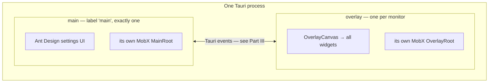
```mermaid
flowchart TB
    subgraph app["One Tauri process"]
        direction LR
        subgraph m["main — label 'main', exactly one"]
            M1["Ant Design settings UI"]
            M2["its own MobX MainRoot"]
        end
        subgraph o["overlay — one per monitor"]
            O1["OverlayCanvas → all widgets"]
            O2["its own MobX OverlayRoot"]
        end
    end
    m <-->|"Tauri events — see Part III"| o
```

**The windows share no memory.** They each boot their own root (`MainRoot`,
`OverlayRoot`, `HudRoot`; `RemoteRoot` in a browser), their own
MobX observables, their own React tree. A value you mutate in main does not exist
in the overlay until an event carries it there. This is the single most common
source of confusion for newcomers, and
[Cross-window synchronization](#cross-window-synchronization) maps the link in
full.

- **main** — the settings application: layout editor, widget settings panels, key
  bindings, Twitch connection. Ant Design. Owns persistence and overlay window
  management, and applies the hotkeys that write settings — the keys themselves
  are caught and dispatched in Rust (`src-tauri/src/hotkeys/`). Renders no
  widgets, so it is **off the telemetry bundle** and takes
  [the slow slice](#the-slow-slice) instead — the car status, for the layout
  auto-switch.
- **overlay** — transparent, always on top, click-through except where a widget is
  interactive. Renders _every_ widget through a single `OverlayCanvas`; there is no
  window-per-widget. One overlay window per monitor, labelled by monitor name.

## The generated contract

The boundary between the halves is generated, not hand-written. Rust types in
`src-tauri/src/model/` are annotated with
[specta](https://github.com/specta-rs/specta), and `npm run tauri:dev` regenerates
`src/shared/contracts/bindings.ts` from them.

The export itself lives in `src-tauri/src/bindings.rs`, and every module
registers its own types in a `register_types` next to where they are declared —
`model/`, `computations/`, `sources/`, `telemetry/`. A type registered nowhere
does not fail the build; it simply vanishes from `bindings.ts` and fails at the
frontend instead, which is why the registration sits beside the declaration
rather than in one list in `lib.rs`.

To regenerate without launching the app:

```bash
UPDATE_BINDINGS=1 cargo test --features dev regenerates_the_contract
npm run format   # the checked-in copy is oxfmt-formatted
```

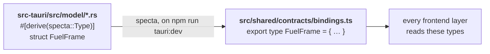
```mermaid
flowchart LR
    A["<b>src-tauri/src/model/*.rs</b><br/>#[derive(specta::Type)]<br/>struct FuelFrame"]
    B["<b>src/shared/contracts/bindings.ts</b><br/>export type FuelFrame = { … }"]
    C["every frontend layer<br/>reads these types"]
    A -->|"specta, on npm run tauri:dev"| B --> C
```

> [!IMPORTANT]
> **Never edit `src/shared/contracts/bindings.ts` by hand, and never hand-write a TypeScript
> interface that duplicates a backend payload.** If a shape is wrong, fix the Rust
> struct and regenerate. A hand-written duplicate will drift, and nothing will
> tell you.

### Values are not types, and do not go through specta

Specta exports _types_. A default like `carLength = 4.4`, a limit the backend
validates against, or an event name is a **value** — and the frontend needs these
as compile-time literals, because widget manifests are read while the module is
still being imported, long before anything could `await` a command.

So they are declared once in Rust, through the `ts_values!` macro in
`src-tauri/src/model/ts_values.rs`, which emits both the Rust `const` and the
TypeScript from a single list:

| Rust                | Generated TypeScript                        |
| ------------------- | ------------------------------------------- |
| `model/defaults.rs` | `src/shared/contracts/backend-constants.ts` |
| `model/events.rs`   | `src/shared/contracts/backend-events.ts`    |

They land in `src/shared/contracts/` beside `bindings.ts`, as plain `const`
exports rather than types — which is why they skip specta. Both generated files are checked in and pinned by
a test, so a constant changed in Rust without regenerating fails `cargo test`
rather than silently leaving the two halves on different numbers.

### Envelope and computed frames are camelCase; raw frames carry kerb's names

`TelemetryBundle`, `TelemetrySlowBundle` and `SourceFrame` all carry
`#[serde(rename_all = "camelCase")]`, so every field _they_ name is camelCase.
The outer bundles used to be the exception, which produced reads like
`bundle.track_recording.isRecording` — two conventions in one expression.

Every frame the project _produces_ is camelCase too — the `computations/`
output, the parsed session snapshot — and says "no value" with `Option` (`null`
on the wire), never with a `-1` or `0` marker.

The raw sim frames are not, on purpose: `carDynamics`, `carInputs`,
`carStatus`, `chassis`, `lapTiming`, `carIdx` and `carPositions` keep kerb's
snake_case names (`CarStatusFrame.fuel_level`, `car_idx_lap_dist_pct`) and the
sim's own markers, so a field reads the same here as in kerb and in the SDK
docs. Check `bindings.ts` for the frame you are reading rather than assuming.

> [!WARNING]
> If you add or change a rename, check `SLOW_FIELD_KEYS` in `remote/hub.rs`. It
> matches field names against the **already-encoded** bundle to decide whether a
> tick carries anything below 60 Hz, and a stale entry there fails nothing — it
> quietly makes every bundle look 60 Hz-only and starts throwing the session
> clock and the fuel numbers off every remote screen.

---

---

# Part I — Backend

## Backend layers

`src-tauri/src/` is four layers with a strict one-way import direction. Read each
arrow as "may be imported by".

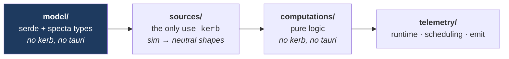
```mermaid
flowchart LR
    MODEL["<b>model/</b><br/>serde + specta types<br/><i>no kerb, no tauri</i>"]
    SOURCES["<b>sources/</b><br/>the only <code>use kerb</code><br/><i>sim → neutral shapes</i>"]
    COMPUTATIONS["<b>computations/</b><br/>pure logic<br/><i>no kerb, no tauri</i>"]
    TELEMETRY["<b>telemetry/</b><br/>runtime · scheduling · emit"]

    MODEL --> SOURCES --> COMPUTATIONS --> TELEMETRY

    style MODEL fill:#1e3a5f,color:#fff
```

| Layer           | Owns                    | Must not                           |
| --------------- | ----------------------- | ---------------------------------- |
| `model/`        | the wire format         | know about kerb, tauri, or any sim |
| `sources/`      | everything sim-specific | leak a sim concept downstream      |
| `computations/` | derived telemetry       | do I/O, or know a sim              |
| `telemetry/`    | the loop, timing, emit  | contain domain math                |

The payoff: a sim quirk fixed in `sources/` is fixed everywhere, and
`computations/` stays unit-testable with no sim running.

## `model/` — the contract

Plain data. `serde` for the wire format, `specta` for TypeScript generation. One
file per subject:

| File               | Holds                                                           |
| ------------------ | --------------------------------------------------------------- |
| `cars.rs`          | per-car frames — dynamics, inputs, positions, status, `car_idx` |
| `session.rs`       | session snapshot, results, qualifying entries, driver roster    |
| `environment.rs`   | track and weather conditions                                    |
| `flags.rs`         | flag state                                                      |
| `player.rs`        | the player's own car and lap timing                             |
| `lap_log.rs`       | completed-lap records                                           |
| `reference_lap.rs` | the stored reference lap                                        |
| `relative.rs`      | relative-gap entries                                            |
| `track_shape.rs`   | the recorded track outline                                      |
| `pit_command.rs`   | pit service orders                                              |
| `input.rs`         | controller devices and button events                            |
| `chat.rs`          | chat messages, presence, deletions                              |
| `capabilities.rs`  | what the connected sim supports                                 |
| `enums.rs`         | shared enums — session type, flags, spotter state               |

This layer is the **entire** backend↔frontend contract. If the frontend can see
it, it is defined here.

> [!WARNING]
> **Never put `f32::INFINITY` or `f32::NAN` in a payload.** They do not survive
> JSON. Use a finite placeholder or `Option<f32>`.

## `sources/` — the only layer that knows a sim

Everything sim-specific is quarantined behind one trait in `source.rs`:

```rust
pub trait TelemetrySource {
    fn sim_type(&self) -> SimType;
    fn capabilities(&self) -> Capabilities;
    fn read_frame(&mut self, timeout_ms: u32) -> SourceReadResult<SourceFrame>;
    fn session_changed(&mut self) -> bool;
    fn poll_session(&mut self) -> Option<String>;
    fn session_parser(&self) -> SessionParser;
}
```

`poll_session` only copies the raw session text out — the connection may not
leave the telemetry thread. The text is parsed on the telemetry I/O worker
(`telemetry/io_worker.rs`) with the function `session_parser` names, and the
parsed session comes back to the loop with the files read for it.

> [!IMPORTANT]
> **This is the only place `use kerb` is allowed.** Adding a second sim means
> adding a sibling folder that implements this trait — and touching nothing else.

### Module map — `sources/iracing/`

| File               | Responsibility                                                                                   |
| ------------------ | ------------------------------------------------------------------------------------------------ |
| `source.rs`        | implements `TelemetrySource`: connection lifecycle, frame reads                                  |
| `frame_map.rs`     | maps kerb's `IracingFrame` onto our neutral `SourceFrame` — the field-by-field translation table |
| `session_parse.rs` | parses the session YAML blob into `ParsedSession`                                                |
| `car_classes.rs`   | resolves class badges (map in `car_badges.rs`) and colors (see below)                            |
| `flags.rs`         | decodes the iRacing flag bitfield                                                                |
| `weather.rs`       | weather and track-condition decoding                                                             |
| `pit_command.rs`   | encodes our pit orders into iRacing's command format                                             |

### Normalizations that happen here, and only here

These exist because letting a sim's convention travel downstream costs you a bug
in every consumer:

| Quirk                                                   | Handling                                                                                                       |
| ------------------------------------------------------- | -------------------------------------------------------------------------------------------------------------- |
| iRacing counts some positions from 0, others from 1     | everything is normalized to **1-indexed** at this boundary; `standings.rs` downstream has no compensating `+1` |
| The session YAML may contain characters illegal in YAML | sanitized before parsing, rather than failing the parse                                                        |
| Spotter state arrives as a bare integer                 | decoded to an enum, unknown values falling back to `Clear`                                                     |
| `CarClassShortName` is empty in AI and hosted sessions  | resolved through the fallback chain below                                                                      |

#### Car class badges

The badge shown next to a driver is not a field you can read.
`CarClassShortName` from the session YAML is **empty in AI and hosted sessions**,
and in official ones reads "GT3 Class" or the car name. What the sim always sends
is each driver's `CarID` and `CarClassID`, so one badge per class is resolved
from the cars in it, inside `car_classes.rs`:

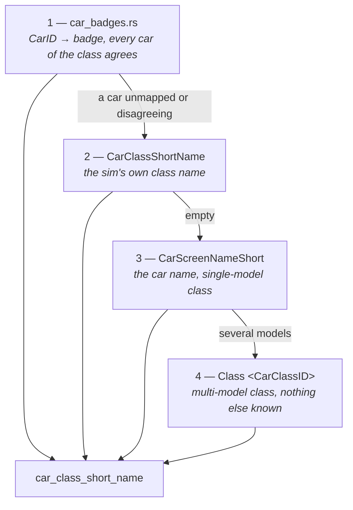
```mermaid
flowchart TB
    S1["1 — car_badges.rs<br/><i>CarID → badge, every car of the class agrees</i>"]
    S2["2 — CarClassShortName<br/><i>the sim's own class name</i>"]
    S3["3 — CarScreenNameShort<br/><i>the car name, single-model class</i>"]
    S4["4 — Class &lt;CarClassID&gt;<br/><i>multi-model class, nothing else known</i>"]
    OUT["car_class_short_name"]

    S1 -->|a car unmapped or disagreeing| S2 -->|empty| S3 -->|several models| S4
    S1 --> OUT
    S2 --> OUT
    S3 --> OUT
    S4 --> OUT
```

The map in `car_badges.rs` is the only hand-maintained list, and it is keyed by
**car**, not by class: the Ferrari 296 GT3 is class 2708 in a multi-make field
and 4036 in its own series, and `GT3` in both. The order follows irdashies, with
the map ahead of the sim's name so "GT3 Class" never reaches a badge column
sized for `GT3`.

`CLASS_COLOR_MAP` corrects known mismatches between telemetry and in-game colors.
`session_parse.rs` only calls `apply_class_badges()` and `normalize_class_color()`.

To read real `CarID` values, dump the session YAML with iRacing running
(`kerb::save_session`, or `cargo run --example test` in
`kerb/examples`, which writes `session.yaml`), then:

```bash
grep -o "CarID: [0-9]*\|CarClassID: [0-9]*\|CarScreenName: .*" session.yaml | paste - - - | sort -u
```

## `computations/` — pure logic

Nine processors, one subject each, sharing one shape:

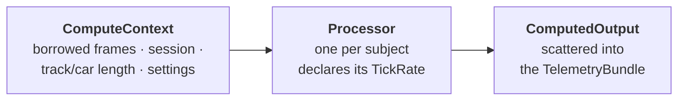
```mermaid
flowchart LR
    CTX["<b>ComputeContext</b><br/>borrowed frames · session ·<br/>track/car length · settings"]
    P["<b>Processor</b><br/>one per subject<br/>declares its TickRate"]
    OUT["<b>ComputedOutput</b><br/>scattered into<br/>the TelemetryBundle"]
    CTX --> P --> OUT
```

| Processor          | Computes                                         |
| ------------------ | ------------------------------------------------ |
| `fuel.rs`          | consumption average, laps remaining, fuel to add |
| `lap_delta.rs`     | delta to reference and session-best              |
| `lap_log.rs`       | per-lap records as laps complete                 |
| `pit_stops.rs`     | pit timing and stop detection                    |
| `proximity.rs`     | cars alongside, for the radar widgets            |
| `reference_lap.rs` | capture and comparison of the reference lap      |
| `relative.rs`      | relative gaps to cars around you                 |
| `standings.rs`     | the live standings table, per class              |
| `track_shape.rs`   | records the track outline from driven laps       |

No `kerb`, no `tauri`, no I/O. That is exactly why this layer is the easy one to
unit-test — and why sim quirks must be resolved upstream before they reach it.

## `telemetry/` — the runtime

| File              | Role                                                                   |
| ----------------- | ---------------------------------------------------------------------- |
| `runtime.rs`      | owns the telemetry thread and the connection lifecycle                 |
| `state.rs`        | only what crosses threads: command sender, snapshots, masks, counters  |
| `loop_state.rs`   | what the loop alone writes — session, grid, pit markers, processors    |
| `control.rs`      | `TelemetryCommand`s and the config a run starts with                   |
| `scheduler.rs`    | decides which rate tiers are due this tick                             |
| `emitter.rs`      | runs the processor registry, assembles one `TelemetryBundle`, emits it |
| `io_worker.rs`    | session-YAML parsing and every file read or write, off the loop        |
| `storage.rs`      | the track-shape and reference-lap files, shared with the commands      |
| `capabilities.rs` | reports what the connected sim can actually provide                    |

The thread owns its state. A command never writes it: it sends a
`TelemetryCommand`, drained at the top of the next tick, and a value that must
survive a stop (car length, fuel tuning, inspector open) is also kept in the
config the next run starts with. What commands read back — the session, the
inspector frame, whether a frame has arrived — is published by the loop when it
changes. A tick takes three locks: the masks, the delivery counters and the
tick timings.

### Rate tiers

The backend does not emit everything 60 times a second. Fields are grouped by how
fast they actually change, and each tick emits one bundle containing only the
tiers that are due.

| Rate  | Fields                                                            |
| ----- | ----------------------------------------------------------------- |
| 60 Hz | `car_dynamics`, `car_inputs`, `car_positions`, `lap_delta`        |
| 10 Hz | `car_idx`, `chassis`, `lap_timing`, `proximity`, `driver_entries` |
| 4 Hz  | `car_status`, `fuel`, `pit_stops`                                 |
| 1 Hz  | `session`, `environment`                                          |

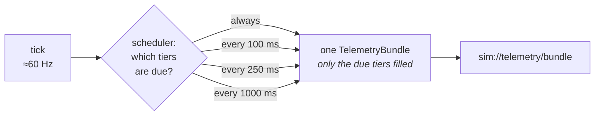
```mermaid
flowchart LR
    T["tick<br/>≈60 Hz"]
    SCH{"scheduler:<br/>which tiers<br/>are due?"}
    B["one TelemetryBundle<br/><i>only the due tiers filled</i>"]
    E["sim://telemetry/bundle"]

    T --> SCH
    SCH -->|always| B
    SCH -->|"every 100 ms"| B
    SCH -->|"every 250 ms"| B
    SCH -->|"every 1000 ms"| B
    B --> E
```

> [!NOTE]
> Sources do not tick at exactly 60 Hz — iRacing wakes on a Win32 event, other sims
> poll with a `sleep` and drift between roughly 58 and 62 Hz. The scheduler
> therefore gates the 10/4/1 Hz groups on **elapsed monotonic time, never on a
> frame count.**

The emitter also handles side-channel work that is not part of the periodic
bundle: saving a discovered track shape, persisting a reference lap, and patching
pit lane percentages once they become known (which re-emits the track shape).

### The slow slice

Tauri delivers an event only to webviews that hold a listener for it, so a window
which never subscribes to the bundle pays nothing at all: no IPC, no parse, no
store write. Only windows that draw widgets subscribe — `SimStore.subscribeBundle`
gates on the `overlay` hash — which leaves the main window off 60 bundles a second
it would render nothing from.

Not rendering is not quite the same as needing nothing: the layout auto-switch
reads `is_on_track`. `sim://telemetry/slow` carries the player's `car_status`
at 4 Hz for it, and nothing else.

It used to carry four frames, because the hotkey runner lived in main and decided
off the sim — the fuel calculation, the order the sim holds, pit road. That is
how the pit order once lost its fuel: a key read a frame main did not have, and
the field went missing from the order without a sound. The keys are dispatched
in Rust now and every pit order — automatic, a key, a click — is resolved on the
telemetry thread against its own frame (`computations/pit_auto.rs`,
`computations/pit_actions.rs`), so no window has to be fed the right slice for
an order to be right.

A new consumer in main adds its frame to `TelemetrySlowBundle` in `emitter.rs`
and to `SimStore.subscribeSlowBundle`; it does not go back to the bundle.

### Demand gating

Being due is necessary but not sufficient: a gated field is filled only while
some widget actually wants it. Two groups are gated — the four raw 60 Hz frames,
where the whole cost is downstream of the sim, and the three per-car frames on
the 10 Hz tier, which are by far the largest payloads the app moves (a
`DriverEntry` is ~25 fields, times the whole field).

> [!NOTE]
> `driver_entries` is the table of the whole field — positions, laps, times, pit
> state — not "the Standings widget's data". Six widgets read it; the Standings
> widget is only the one that draws all of it. The processor that builds it is
> `computations/driver_entries.rs`.
>
> Who a car is — driver, number, class, car, licence, rating, incidents — is not
> on it: that holds for the session and arrives once, in `SessionSnapshot.cars`
> on `sim://session`. `BackendComputedStore` joins the two by `carIdx`
> (`entities/cars/driver-entry-join.ts`) and every widget reads the joined row
> (`shared/contracts/driver-entry.ts`) through `fieldEntries`, `relativeEntries`,
> `driverIdentities` or `driverEntryOf` — never the bindings type, which is the
> wire half. A fixture that states whole rows seeds them with
> `features/preview/field-seed.ts`, which splits them back the same way.

| Gated field                                                | Tier  |
| ---------------------------------------------------------- | ----- |
| `car_dynamics`, `car_inputs`, `car_positions`, `lap_delta` | 60 Hz |
| `driver_entries`, `relative`, `proximity`                  | 10 Hz |

Everything else is small, infrequent, or both, and is always sent. Each widget names what it reads in its own
`manifest.ts`:

```ts
export const G_METER_MANIFEST: WidgetManifest = {
  id: 'g-meter',
  telemetryEvents: ['carDynamics'],
  ...
};
```

`SimStore` (`updateOwnActiveEvents`) unions the declarations of the enabled widgets in
the active layout and sends the result to `set_active_events` as a bitmask;
`emitter.rs` reads it and leaves an unrequested field out of the bundle. The
names and their bit values are declared once in `model/telemetry_events.rs` and
generated into `src/shared/contracts/telemetry-event-bits.ts`, which
`src/shared/contracts/telemetry-events.ts` derives `TelemetryEventName` from.

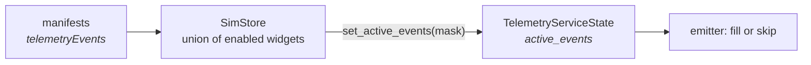
```mermaid
flowchart LR
    M["manifests<br/><i>telemetryEvents</i>"] --> U["SimStore<br/>union of enabled widgets"]
    U -->|"set_active_events(mask)"| S["TelemetryServiceState<br/><i>active_events</i>"]
    S --> E["emitter: fill or skip"]
```

> [!IMPORTANT]
> **The mask gates publication, not computation.** Every processor that carries
> state — fuel, lap log, pit stops, standings, the reference lap — runs on every
> tick regardless, so a widget enabled mid-race finds its history intact. Only a
> field that is a pure snapshot of the current tick may be skipped at the source,
> which is why the mask covers the raw 60 Hz frames, `lap_delta` (whose state is
> owned by the reference-lap processor, not by the delta itself) and the three
> per-car frames, which are dropped from the bundle _after_ their processors have
> run.
>
> What is saved is everything downstream of the computation: the serialization,
> the IPC hop into _each_ window and remote screen, the parse, and the store
> write. For a 60 Hz frame that is the entire cost.

A widget reading a gated field without declaring it renders empty; one declaring
a field it does not read makes every other window pay for the traffic. The
declaration therefore lives next to the widget, not in a list somewhere else —
a list is what drifts.

### Quantization and repeat suppression

Gating removes fields nobody wants. The other half of the saving is removing
_ticks_ nobody needs, and it takes two steps that only work together.

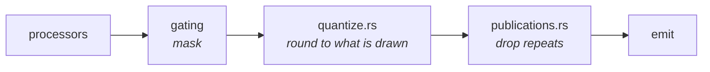
```mermaid
flowchart LR
    P["processors"] --> G["gating<br/><i>mask</i>"] --> Q["quantize.rs<br/><i>round to what is drawn</i>"] --> R["publications.rs<br/><i>drop repeats</i>"] --> E["emit"]
```

**Quantize** (`telemetry/quantize.rs`) rounds the per-car frames to the precision
a widget actually draws — positions to 4 dp, gaps to 2 dp, lap times to 3 dp,
distances to 2 dp. Every one of those is at least one decimal finer than the
`toFixed` that renders it.

**Suppress repeats** (`telemetry/publications.rs`) compares each frame against
the last one published and drops it if they are equal.

The order is the point. A raw simulator float is never bit-identical two ticks
running: a car parked in its pit box still jitters in the seventh decimal of
`car_idx_lap_dist_pct`, so nothing would ever compare equal and the second step
alone would save nothing. Rounding first is what turns "visually unchanged" into
"literally unchanged". Both steps run _after_ gating, so a field the mask removed
is never recorded as published — otherwise re-enabling its widget would wait for
the next real change to see anything.

> [!IMPORTANT]
> Rounding happens at publication, never on the way in. `computations/` always
> sees raw values: a processor that integrates over time or compares against a
> threshold — fuel projection, lap delta, anything differencing consecutive
> frames — would accumulate the error. This is the same publication-only rule the
> mask follows, for the same reason.
>
> `car_dynamics` and `car_inputs` are deliberately left unrounded. They are two
> small structs that genuinely change every tick while driving, so there is
> nothing to suppress, and they feed the smoothing in the coach and the input
> trace.

### The telemetry inspector pulls, it does not subscribe

Its own section under Settings → Maintenance, in dev builds only (`tauri:dev`,
`tauri:build:dev` — see `pages/settings/dev-tools.ts`). It shows what the sim sends and
what the app made of it, as a lazily expanded tree:

| Source         | Where it comes from                                                                                |
| -------------- | -------------------------------------------------------------------------------------------------- |
| `rawTelemetry` | every variable under iRacing's names (kerb's `telemetry_snapshot`), pulled at 4 Hz — the default   |
| `rawSession`   | the session YAML as written, as text and as a tree (`get_raw_session`), re-read on `sim://session` |
| `telemetry`    | the live `SourceFrame` — our adapter's output — pulled with the raw values                         |
| `session`      | the parsed session snapshot, already in this window from `sim://session`                           |

The raw sources are the sim's data, copied one to one out of kerb's types
(`sources/raw.rs`); the panel marks the two processed ones as ours and names the
files that process them. The adapted frame still shows every field the adapter
produced, including the ones no widget is sent. Selecting either session
**stops** the feed outright: nothing would be reading the frames. A replayed tape
holds adapted frames only, so `rawTelemetry` stays empty under one.

It is built the opposite way round from a widget:

|                        | Widgets                        | Inspector                                                               |
| ---------------------- | ------------------------------ | ----------------------------------------------------------------------- |
| Direction              | push, `sim://telemetry/bundle` | pull, `get_inspector_frame`                                             |
| Rate                   | 60 / 10 / 4 / 1 Hz             | 4 Hz while its panel is mounted                                         |
| Cost when nobody looks | —                              | **nothing**: `inspector_active` is false and the backend keeps no frame |

> [!WARNING]
> **The settings window must never subscribe to the telemetry bundle.** It was
> taken off it on purpose (a window that draws no widgets has no use for 60
> bundles a second), and an inspector that listened for the bundle would hand
> that entire cost straight back. `TelemetryInspectorStore` therefore imports no
> event API at all — only two commands.

4 Hz is not a compromise: nobody reads a table of a hundred numbers sixty times a
second. The same feed backs the snapshot export, which opens it for one frame and
closes it again — before that, the export read this window's stores and wrote a
file whose dynamics, inputs, per-car arrays and lap timing were all `null`.

A held-back field is a field a newcomer never sees, so the 1 Hz tier forces a
full bundle: an overlay that just reloaded, or a phone that just opened a remote
screen, starts with empty stores and would otherwise stay empty until something
changed. That bounds the blindness to one second and costs one full bundle per
second. A disconnect clears the record entirely, because the windows have reset
too.

## `input/`, `chat/` and the command surface

| Module              | Role                                                                                                                                                          |
| ------------------- | ------------------------------------------------------------------------------------------------------------------------------------------------------------- |
| `input/dinput.rs`   | DirectInput8 game-controller polling                                                                                                                          |
| `input/identity.rs` | device identity and re-matching after a driver reinstall                                                                                                      |
| `input/runtime.rs`  | the polling thread                                                                                                                                            |
| `input/commands.rs` | `resolve_input_devices`, `set_input_polling_enabled`                                                                                                          |
| `chat/`             | Twitch chat stream — independent of any sim connection                                                                                                        |
| `commands/`         | the Tauri command surface, split by what it touches — `settings`, `telemetry`, `track`, `pit` (see [Command catalogue](#command-catalogue-frontend--backend)) |
| `capabilities.rs`   | per-sim feature reporting                                                                                                                                     |
| `logging.rs`        | tracing setup — `RUST_LOG=marble_trace_lib=debug npm run tauri:dev`                                                                                           |

### Twitch: two sources, one owner per event

Chat arrives over anonymous IRC, which works with no account at all. That is the
floor, and it stays the floor — a viewer watching someone else's channel gets it
and nothing more.

`chat/eventsub.rs` adds a second socket for what IRC cannot carry: a follow is
never announced there, and a subscription arrives only as the rendered sentence
in `system-msg`, with tier, months and gift size buried in prose. It needs a
signed-in account (`moderator:read:followers`, `channel:read:subscriptions`) and
runs **only for that account's own channel** — every scope involved is granted
over one's own broadcast.

Subscriptions therefore reach the app twice whenever EventSub is up.
`ChatServiceState::eventsub_owns_subs` is the single switch that says which
source owns them: raised once the socket's subscriptions are accepted, lowered
the moment it drops, and read by the IRC `USERNOTICE` path, which then stays
quiet about subs while still carrying raids. A flag rather than a time window —
the two copies arrive milliseconds apart, and a window wide enough to catch that
would also swallow two people subscribing at once.

Scopes are baked into a token at issue time and a refresh carries the same set
forward, so an account signed in before a scope was added keeps a valid token
that cannot do the new thing. `twitch_account` reports the shortfall as
`missingScopes` and the settings card asks for a reconnect; nothing is migrated
and nobody is signed out.

Device ids are DirectInput `guidInstance`, so replugging and port changes keep
bindings intact. A driver reinstall that regenerates the GUID is re-matched by
vendor/product and the stored id rewritten once. **Two identical devices are never
auto-matched** — there is no way to tell them apart.

---

---

# Part II — Frontend

## Frontend layers

`src/` is laid out by Feature-Sliced Design
([ADR-0008](adr/0008-frontend-by-feature-sliced-design.md)): six layers, each
importing only the layers below it.

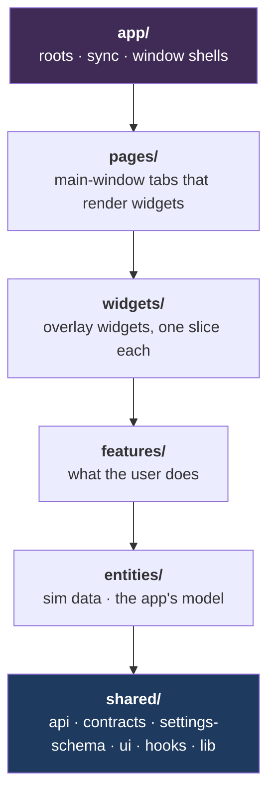
```mermaid
flowchart TB
    APP["<b>app/</b><br/>roots · sync · window shells"]
    PAGES["<b>pages/</b><br/>main-window tabs that render widgets"]
    WIDGETS["<b>widgets/</b><br/>overlay widgets, one slice each"]
    FEATURES["<b>features/</b><br/>what the user does"]
    ENTITIES["<b>entities/</b><br/>sim data · the app's model"]
    SHARED["<b>shared/</b><br/>api · contracts · settings-schema · ui · hooks · lib"]

    APP --> PAGES --> WIDGETS --> FEATURES --> ENTITIES --> SHARED

    style SHARED fill:#1e3a5f,color:#fff
    style APP fill:#3f2b56,color:#fff
```

| Layer       | Holds                                                                                        | May import            |
| ----------- | -------------------------------------------------------------------------------------------- | --------------------- |
| `app/`      | window roots, sync, window shells, the store providers                                       | everything below      |
| `pages/`    | main-window tabs that render widgets: widgets, layouts, settings                             | the four layers below |
| `widgets/`  | overlay widgets only, one slice each, plus the layer's registry and shared manifest values   | the three below       |
| `features/` | something the user does: pit service, bindings, layout editor model, settings panel kit, …   | `entities`, `shared`  |
| `entities/` | sim data and the app's model: sim, session, cars, player, track, widget, layout, settings, … | `shared`              |
| `shared/`   | no domain: `api/`, `contracts/`, `settings-schema/`, `ui/`, `hooks/`, `lib/`                 | nothing above         |

Inside `entities/`, `features/`, `widgets/` and `pages/` every folder is a
**slice**, and **a slice does not import a sibling slice of its own layer**.
The edges between entities that must exist are named one by one in
`allowedSiblings` (`.oxlintrc.json`) and kept acyclic; `shared/contracts/`
imports nothing but itself. A file directly in a layer folder
(`widgets/registry.ts`) belongs to no slice.

> [!IMPORTANT]
> **The direction is enforced by lint, not by convention.** `layers/boundaries`
> (`scripts/lint/layers-plugin.mjs`, an oxlint JS plugin) fails `npm run lint`
> on an upward import, a sibling-slice import or a contract reaching out;
> `no-restricted-imports` overrides hold the rest (Tauri behind `shared/api`,
> components off it, the window shells, preview isolation, migrations).

Two places read a layer above them, and both do it with `import.meta.glob` — a
path, not an import — so neither needs an exemption: the catalogue
(`entities/widget/widget-catalog.ts`) collects `widgets/*/manifest.ts`, and the
panel registry (`features/widget-settings/panel-registry.ts`) collects
`widgets/*/*SettingsPanel.tsx`. There is no `index.ts` anywhere: a caller names
the file it imports.

Path aliases match the layers one-to-one: `@app/*`, `@pages/*`, `@widgets/*`,
`@features/*`, `@entities/*`, `@shared/*`, and `@/*` for `styles`, `locales`
and `storybook`.

## `shared/` — no domain

### `contracts/` — the types every layer reads

| File                                                                     | Holds                                                                      |
| ------------------------------------------------------------------------ | -------------------------------------------------------------------------- |
| `bindings.ts`                                                            | **generated by specta** — every backend payload shape                      |
| `backend-constants.ts` · `backend-events.ts` · `telemetry-event-bits.ts` | **generated by `ts_values!`** — defaults, event names, the demand mask     |
| `telemetry-events.ts`                                                    | `TelemetryEventName`, derived from the generated bits                      |
| `client-protocol.ts` · `remote.ts`                                       | the client protocol: `ClientSnapshot`, commands, remote screens (ADR-0007) |
| `widget-settings.ts`                                                     | widget records, `WidgetManifest`, `BaseUserSettings`, `WidgetUserSettings` |
| `widget-choices.ts`                                                      | the setting choices several widgets share (`QUALIFYING_VISIBILITY`, …)     |
| `input-bindings.ts` · `hotkey-actions.ts`                                | `Binding`, `BindingMap`; the generated action list for the settings UI     |
| `pit-strategy.ts` · `diagnostics.ts` · `telemetry-snapshot.ts` · `…`     | hand-written types that the API or the snapshot carries                    |
| `domain.ts`                                                              | small app-level types (units, language, flag type, track surface)          |

Imports nothing outside itself. A type only one slice reads stays in that slice.

### `lib/` — pure helpers

Grouped by **domain, not by kind** — one file per subject, never a `constants/` or
`formatters/` bucket, since those cut across every domain and tell you nothing.
The full list, one line each, is `docs/widget-toolbox.md` (a test keeps it
complete); the ones that carry structure:

| File                     | Subject                                                                       |
| ------------------------ | ----------------------------------------------------------------------------- |
| `widget-settings-dsl.ts` | the settings schema DSL every widget slice describes its settings with        |
| `store-context.ts`       | `createStoreContext` — the one `createContext` helper every store's hook uses |
| `canvas.ts`              | DPR sizing, canvas geometry, fixed-digit drawing                              |
| `colors.ts`              | the JS-side palette, matching the SCSS tokens                                 |
| `telemetry-format.ts`    | number and time formatting for display                                        |

A new helper joins the file whose subject it shares; a new file needs a subject
none of these covers.

### `api/` — the seam

If a line of code calls `invoke`, listens to an event, reads a file or asks about a
monitor, it lives here (or, for the wiring, in `app/sync/`). **Nothing else
imports from `@tauri-apps/*`** except the window shells reaching their own
window.

| File                                          | Wraps                                                                                                                             |
| --------------------------------------------- | --------------------------------------------------------------------------------------------------------------------------------- |
| `events.service.ts`                           | **the only `@tauri-apps/api/event` import in the codebase** — every emitter and `listenTo`                                        |
| `telemetry.service.ts`                        | `startTelemetryStream`, `stopTelemetryStream`, `getConnectionStatus`, `getLastSessionInfo`, `setActiveEventsSilent`               |
| `track.service.ts`                            | `getCachedTrackShape`, `deleteTrackShape`, `resetPitLanePct`, `getActiveReferenceLap`, `deleteReferenceLap`                       |
| `settings.service.ts`                         | `settingsFileExists`, `backupSettingsFile`, `logSettingsSnapshot`, `deleteSettingsFile`, and the `*Silent` setters                |
| `twitch.service.ts`                           | `twitchHasClientId`, `twitchAccount`, `twitchRequestDeviceCode`, `twitchPollDeviceToken`, `twitchSignOut`, chat stream start/stop |
| `input.service.ts`                            | `resolveInputDevices`, `setInputPollingEnabled`                                                                                   |
| `pit.service.ts`                              | `sendPitOrder`                                                                                                                    |
| `remote-socket.service.ts`                    | the remote page's WebSocket — the browser half of the client transport                                                            |
| `sim-events.ts`                               | **every backend event name constant**, re-exported from the generated `@shared/contracts/backend-events`                          |
| `overlay-labels.ts` · `overlay-resolution.ts` | the monitor-name → window-label mapping; monitor geometry                                                                         |

Because services are the seam, **tests mock services, not Tauri.**

> [!IMPORTANT]
> Import event names from `sim-events.ts`. Never type an event name as a string
> literal at a call site. The names themselves are declared in
> `src-tauri/src/model/events.rs` — that is where you add one, not here.

### `settings-schema/`

Raw-blob migrations — see [Settings and persistence](#settings-and-persistence).
It imports nothing live: a migration's own folder is barred even from the rest
of `shared/`.

### `ui/` and `hooks/`

Primitives used by two or more slices — `WidgetPanel`, `StatPill`,
`WidgetValue`, `WidgetLabel`, `FixedDigits`, the badges, `CarDot`,
`ScrollIndicator`, `NoDataPlaceholder`, `SettingsCard`, `ErrorBoundary` — and
the DOM-only hooks (`useReactiveDomWrite`, `useReactiveCanvasLoop`,
`useCanvasAutoResize`, `useVisibleRowCount`, `useRowMoveAnimation`,
`useClickOutside`). Neither reads a store.

## `entities/` — sim data and the app's model

MobX stores, the hooks that reach them, and the helpers that belong to them. No
JSX except the odd primitive an entity owns (`app-settings/ReservedSlot`).

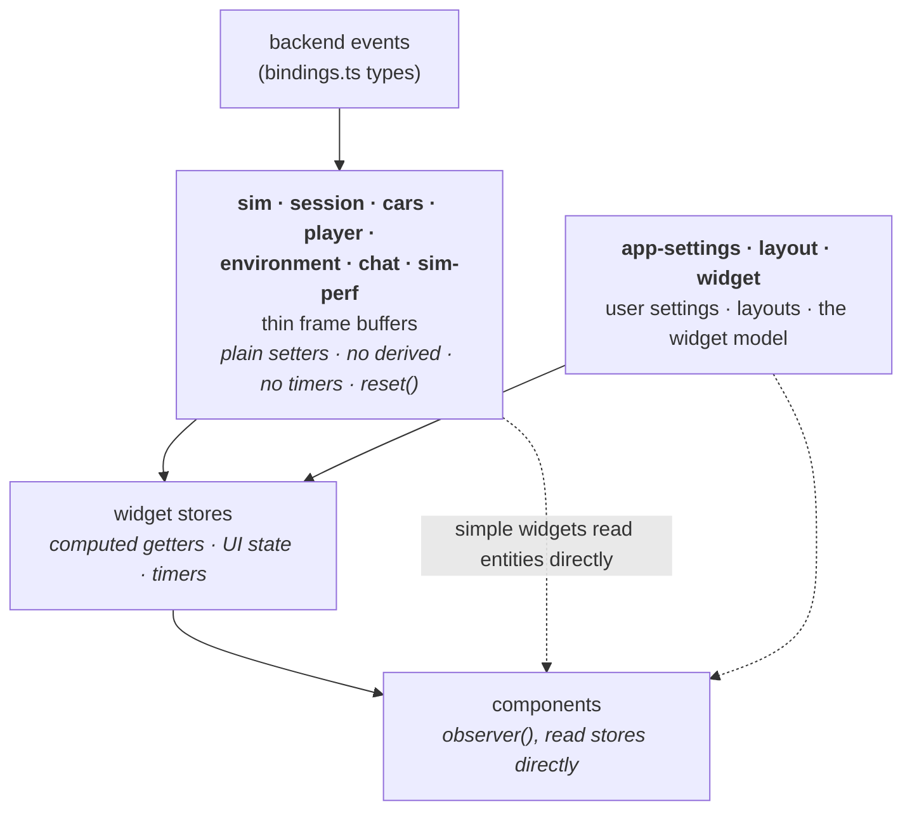
```mermaid
flowchart TB
    BE["backend events<br/>(bindings.ts types)"]
    DATA["<b>sim · session · cars · player ·<br/>environment · chat · sim-perf</b><br/>thin frame buffers<br/><i>plain setters · no derived · no timers · reset()</i>"]
    SET["<b>app-settings · layout · widget</b><br/>user settings · layouts · the widget model"]
    WID["widget stores<br/><i>computed getters · UI state · timers</i>"]
    COMP["components<br/><i>observer(), read stores directly</i>"]

    BE --> DATA --> WID --> COMP
    SET --> WID
    DATA -.->|"simple widgets read entities directly"| COMP
    SET -.-> COMP
```

| Slice                                               | Holds                                                                                                                                                           |
| --------------------------------------------------- | --------------------------------------------------------------------------------------------------------------------------------------------------------------- |
| `sim/`                                              | the sim store, `apply-bundle` (bundle → stores), `telemetry-mask` (the demand mask), `debug`                                                                    |
| `session/` · `environment/` · `chat/` · `sim-perf/` | one frame buffer each                                                                                                                                           |
| `cars/`                                             | `cars.store`, `computed.store` (derived values shared by 2+ widgets), `car-identity`, `driver-entry-join`                                                       |
| `player/`                                           | `player`, `player-position`, `reference-lap`                                                                                                                    |
| `track/` · `flags/` · `radar/` · `incidents/`       | the stores several widgets share and that have no actions of their own; a schema two widgets share sits here too (`radar.settings-schema.ts`)                   |
| `widget/`                                           | the widget **as data**: catalogue, instance records and stores (`widget-instances.store`), defaults, placement, availability, frame geometry, `checkedSettings` |
| `layout/`                                           | layouts, the live widget set (`live-widgets.store`), the mutation log, undo history, virtual desktop, `useWidgetSettings`                                       |
| `app-settings/`                                     | app settings, units, the system locale                                                                                                                          |

Each store's context and hook sit beside it in a `*-context.ts`, made with
`createStoreContext`; a hook read where nothing provides its store throws,
naming the store. A store's constructor takes a narrow interface of what it
reads (`type FuelWidgetDeps = { … }`), so it never names `RendererCore`.

> [!WARNING]
> **Never import a store as a singleton.** Each window constructs its own
> root; a module-level instance would silently be the wrong one.

### The six store rules

1. **Entity stores** use types from `bindings.ts` only — never a hand-written
   duplicate of a backend event shape. They stay thin: plain setters, no derived
   values, no timers, and an explicit `reset()`.
2. **Widget stores** exist only when a widget has UI state, timers, or non-trivial
   derived logic. Simple widgets read entity stores directly.
3. **Derived logic shared by 2+ widgets** becomes a `computed` getter on the entity
   store, never duplicated per widget.
4. **One-way flow.** Widget stores read entity and settings stores; entity stores
   know nothing about widgets.
5. **Hooks are DOM-only** — `ResizeObserver`, `getBoundingClientRect`, RAF —
   apart from the store hooks themselves. Everything else belongs in a store.
6. **Each value has exactly one owner.**

### Reactivity rules

| Rule                                                                     | Why                                                                                    |
| ------------------------------------------------------------------------ | -------------------------------------------------------------------------------------- |
| Derived values are `computed` getters in a store, never `useMemo`        | `useMemo` is per-component; a computed is shared and cached once                       |
| `updateUserSettings` mutates in place with `Object.assign`               | replacing the `userSettings` reference detaches every existing observer                |
| Widget layout changes go through `resolveLayoutChange` in the manifest   | keeps per-widget branching out of the shared store                                     |
| Reactions to a settings edit watch `changeToken` (`SettingsMutationLog`) | comparing `JSON.stringify` of the settings tree on every change is both slow and wrong |

## `features/` — what the user does

A feature owns its store, its hook and the UI section that drives it, in one
folder.

| Slice                              | Holds                                                                                                                                |
| ---------------------------------- | ------------------------------------------------------------------------------------------------------------------------------------ |
| `pit-service/`                     | the pit-service state, approach, tyres, the order and auto mode — one folder, read by three widgets and main                         |
| `hotkey-bindings/`                 | the action registry, the bindings store, device input, settings actions, `BindingCaptureModal`                                       |
| `layout-editor/`                   | the editor's model: store, gestures, snapping. Its canvas renders widgets and is a page                                              |
| `widget-settings/`                 | the panel kit (`Card`, `SettingRow`, `setting-rows`, `schema-rows`), `WidgetSettings.tsx`, the panel registry, the two-widget panels |
| `widget-auto-hide/`                | when a widget hides itself (wheel-to-wheel, flags, radar)                                                                            |
| `telemetry-inspector/`             | the inspector's feed, its tree, its settings section                                                                                 |
| `diagnostics/`                     | FPS diagnostics, the export, the HUD store                                                                                           |
| `remote-screens/`                  | remote screens and devices, their settings section                                                                                   |
| `companion-apps/` · `twitch-auth/` | the integrations and their settings sections                                                                                         |
| `preview/`                         | neutral sample data — scenarios, mock builders, sample telemetry and track, the animator                                             |

> [!NOTE]
> `features/preview/` exists so the app never imports from `src/storybook`.
> Shared fixtures live in this neutral place, which both pages and Storybook
> may read.

**The preview store is isolated, and the linter holds it there.** A scenario and
every mock builder write only into the `PreviewCore` handed to
them — never into the stores a running widget reads. So `src/features/preview/**`
carries its own `no-restricted-imports` override: the root contexts
(`*-root-context`), `@app/**`, `@pages/**`, `@shared/api/**` and
`@tauri-apps/**` are all refused there. A fixture that reached a live store
would go unnoticed in the layout editor and surface as a wrong number in a
driver's session; see [ADR-0004](adr/0004-widget-preview-runs-on-mocks.md),
rule 1. A page that renders a preview gets it through `PreviewWorldContext`
(`features/preview/preview-host-context.ts`), provided by the main window.

### Input bindings

Keyboard shortcuts and controller buttons are **app-level, not per layout**, and
**dispatched in Rust**: a key acts on the car with every webview paused, and a
paused main window costs only the actions that write settings.

| Concern                                         | Location                                                    |
| ----------------------------------------------- | ----------------------------------------------------------- |
| action list — id, owner, label, default, effect | `src-tauri/src/model/hotkeys.rs`                            |
| dispatch, OS registration, drag/interact modes  | `src-tauri/src/hotkeys/`                                    |
| device polling                                  | `src-tauri/src/input/`                                      |
| wire types                                      | `bindings.ts`, via `src/shared/contracts/input-bindings.ts` |
| settings-UI registry, visibility actions        | `src/features/hotkey-bindings/actions.ts`                   |
| persisted map (`actionId -> Binding[]`)         | `src/features/hotkey-bindings/bindings.store.ts`            |
| settings actions                                | `src/features/hotkey-bindings/settings-actions.ts`          |
| main's half                                     | `src/app/sync/hotkey-sync.ts`                               |

> [!TIP]
> **Adding a bindable action is one entry in `HOTKEY_ACTIONS` plus one key under
> `bindings.actions` in `main-app.json`.** The list is generated into
> `@shared/contracts/hotkey-actions` for the settings UI; persistence and the save reaction
> are driven off it.

An action's `HotkeyEffect` decides its kind:

| Kind       | Effects                             | Runs                                                                       |
| ---------- | ----------------------------------- | -------------------------------------------------------------------------- |
| `sim`      | `Pit(PitAction)`, `PitAutoMode`     | a command to the telemetry thread, resolved against its frame              |
| `view`     | `View(ViewControl)`, drag, interact | a control message to the overlays and the remote hub, or the overlay modes |
| `settings` | `Settings`, the visibility actions  | `hotkey://settings-action` to main, applied by `settings-actions.ts`       |

- `owner` is a widget type or `'app'`. Widget-owned actions fire only while that
  widget is on screen in the live layout, checked **per press** against the set
  main pushes with `set_hotkey_context`. Only the generated
  `widget:<type>:toggle-visibility` actions skip the gate; the dispatcher knows
  them by the shape of their id, since the widget catalog is the frontend's.
- `press` fires on key down; `hold` (interact only) on both edges.
- Main pushes the **effective** map — defaults folded in — with
  `set_hotkey_bindings`. Nothing is registered before it arrives, so a key the
  user cleared cannot fire on a stale default.
- **Drag and interact mode are the dispatcher's.** It enforces that only one is
  on, runs the interact auto-off watchdog, and broadcasts `app://overlay-modes`;
  every window mirrors the pair (`appSettings.applyOverlayModes`) and asks for a
  change with `set_drag_mode` / `set_interact_mode`.
- A view action is sent as a step, never a value: each client applies it to the
  instances it holds that are marked for hotkeys.
- Conflicts (one key on two actions) are allowed and only warned about.

## `widgets/` — the overlay widgets

One slice per overlay widget, kebab-case (`pit-service/`, `g-meter/`), flat
inside: components, `settings-schema.ts`, `manifest.ts`, `mount.ts`, its own
store, helpers, its settings panel, stories, tests. Beside the slices, the
layer's own files:

| File                     | Holds                                                                                                      |
| ------------------------ | ---------------------------------------------------------------------------------------------------------- |
| `registry.ts`            | id → React component, collected from every `mount.ts`                                                      |
| `widget-mount.ts`        | the `WidgetMount` shape a `mount.ts` exports; `WidgetCore` / `WidgetHost`, what a widget store may read    |
| `widget-manifest.ts`     | values shared across manifests — `COMMON_WIDGET_DEFAULTS`, appearance defaults, `makeColumnLayoutResolver` |
| `widget-host-context.ts` | how the instance scope is handed the stores a widget store may read                                        |
| `instance-scope/`        | `WidgetInstanceScope`: builds an instance's store on mount, disposes it on unmount                         |

This layer holds **overlay widgets only**. A compound block of the main window
that FSD would also call a widget (the header, the widget list) lives in
`app/` or `pages/`, so "widget" means one thing here. The widget _as data_ —
instance record, manifest type, catalogue — is the entity `entities/widget/`.

## `pages/` — the main window's tabs

| Slice       | Holds                                                                                           |
| ----------- | ----------------------------------------------------------------------------------------------- |
| `widgets/`  | the widget list, workbench and preview                                                          |
| `layouts/`  | the layout editor's UI: canvas, list, widget panel, inspector                                   |
| `settings/` | the settings page, its navigation and sections — `bindings/` among them — and the release notes |

A page is above `widgets/` because it renders them; that is why the editor's
model is a feature and its canvas is a page.

## `app/` — windows, roots, sync

Every window builds one root over a shared `RendererCore`
(`src/app/roots/renderer-core.ts`): the entity stores, the sim, the settings
projection widgets read, units, the app-wide widget stores (shared ones, the
pit service, the recorded track) and the registry of per-instance widget
stores. `MainRoot` adds what only the settings UI uses (editor, inspector,
diagnostics, companion apps, chat sign-in, device list), `OverlayRoot` adds only
the bindings and the settings-panel state its drag-mode popup needs, plus the
`settingsClient` that sends its commands to main, `RemoteRoot` starts the core
without Tauri, and `HudRoot` holds the banner's one store and no core at all.
The roots stay MobX classes, not React providers: sync, hotkeys, previews and
Storybook need the stores outside React.

`app/store-providers.tsx` hands a root to React: `CoreProvider` provides every
core store's context from one `RendererCore`, `AppWindowProvider` and
`MainProvider` the rest — each a flat typed list, so a wrong store is a compile
error there. A main-only store's context is not provided in an overlay, so the
lint keeps `widgets/`, `shared/ui`, `shared/hooks` and the overlay, remote and
hud shells off the main-only `*-context` files, and `overlay-root.test.ts`
checks the overlay builds none of their stores.

### `sync/` — the wiring

Transport to stores, per window. It reads stores of every layer below and
starts with the window; it never reaches the window shells.

| File                                       | Role                                                                                      |
| ------------------------------------------ | ----------------------------------------------------------------------------------------- |
| `listeners.ts`                             | `setupMainListeners` / `setupOverlayListeners` — overlay modes, and the overlay's signals |
| `main-sync.ts`                             | main's startup and the reactions that save                                                |
| `client-snapshot.ts` · `client-publish.ts` | main's half of the client protocol: snapshots out, commands in (ADR-0007)                 |
| `client-sync.ts`                           | a client's half, transport-free: installs a snapshot, runs a signal                       |
| `overlay-sync.ts` · `remote-sync.ts`       | the two transports into `client-sync.ts` — Tauri events, the remote socket                |
| `settings-client.store.ts`                 | the overlay's commands to main                                                            |
| `remote-publish.ts`                        | the remote server's lifetime and one snapshot per remote screen                           |
| `settings-file.ts`                         | the codec between `settings.json` and the stores                                          |
| `persistence.ts` · `persistence-sync.ts`   | writing settings to disk                                                                  |
| `hotkey-sync.ts`                           | main's half of the bindings: push the map and the context, apply settings actions         |
| `chat-sync.ts`                             | Twitch chat stream wiring                                                                 |
| `pit-service-sync.ts`                      | pit-service cross-window state                                                            |
| `overlay-windows.ts` · `monitor-watch.ts`  | creating, labelling and tearing down overlay windows; monitor hot-plug                    |

### `windows/` — the shells

`main/` (`MainWindow`, header, footer, status, banners), `overlay/`
(`OverlayWindow`, `OverlayCanvas`, `WidgetContainer`, the drag toolbar, the F9
picker), `remote/` and `hud/`. Components talk to MobX stores and to nothing
else. They never import from `@tauri-apps/*` or `@shared/api/*` — the one
exception being window and webview APIs (`getCurrentWindow`,
`getCurrentWebviewWindow`) and starting the window's sync inside the
window-shell components named in `.oxlintrc.json`, which is what those
components are _for_.

## Building a widget

### The widget system

A widget declares itself in three files of its own slice, and nothing lists it
anywhere: `settings-schema.ts` describes every setting once, `manifest.ts` is
**plain data** — id, label, design size, shipped `userSettings` (the schema's
defaults spread in), the schema itself, an optional `resolveLayoutChange` — and
`mount.ts` is the pair `{ id, component }`. Manifests and mounts are collected
by `import.meta.glob`.

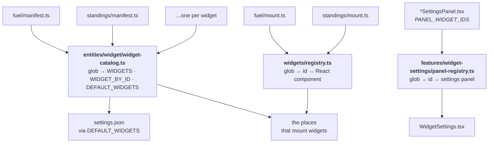
```mermaid
flowchart TB
    M1["fuel/manifest.ts"]
    M2["standings/manifest.ts"]
    M3["…one per widget"]
    MT1["fuel/mount.ts"]
    MT2["standings/mount.ts"]
    P["*SettingsPanel.tsx<br/><i>PANEL_WIDGET_IDS</i>"]
    CAT["<b>entities/widget/widget-catalog.ts</b><br/>glob → WIDGETS · WIDGET_BY_ID · DEFAULT_WIDGETS"]
    REG["<b>widgets/registry.ts</b><br/>glob → id → React component"]
    PREG["<b>features/widget-settings/panel-registry.ts</b><br/>glob → id → settings panel"]
    MOUNT["the places<br/>that mount widgets"]
    WS["WidgetSettings.tsx"]
    SETTINGS["settings.json<br/>via DEFAULT_WIDGETS"]

    M1 & M2 & M3 --> CAT
    MT1 & MT2 --> REG
    P --> PREG
    CAT --> SETTINGS
    CAT --> MOUNT
    REG --> MOUNT
    PREG --> WS
```

> [!IMPORTANT]
> **A manifest never imports its own component** — that is why the mount is a
> second file. The manifest is read by `entities/widget` at import time, and by
> things that never render at all (migrations, `DEFAULT_WIDGETS`, node-side
> tests); a manifest carrying React would drag the UI layer into all of them.
> The two also change for unrelated reasons, and a file edited for two unrelated
> reasons is the file two parallel branches collide on.

> [!NOTE]
> Because all three registries collect by glob, **a new widget edits no shared
> file** — it is a new folder plus its settings panel. That is what lets two
> widgets be built at the same time without conflicting.

**Widget lists are alphabetical by label.** The Widgets page, each monitor's
list in the layout editor and the F9 picker all show the catalog in that order
(`compareManifests` in `src/entities/widget/widget-catalog.ts`: label, case-insensitive,
then id), so a manifest declares no position of its own — a new widget lands
where its name puts it, and two widgets built in parallel cannot collide on a
number. Any new list of widgets shown to the user keeps that order: build it from
`WIDGETS` / `DEFAULT_WIDGETS` or sort by label, never by id or by insertion.

**A setting is described once, in the slice** (ADR-0008). `settings-schema.ts`
calls `defineSettings('<locale block>', { … })` with the builders of
`shared/lib/widget-settings-dsl.ts` — `bool`, `num`, `choice`, `color`,
`numRecord`, `nullable` — and from that one description come:

| consumer       | what it takes from the schema                                                                                                                                                                                       |
| -------------- | ------------------------------------------------------------------------------------------------------------------------------------------------------------------------------------------------------------------- |
| the type       | `SettingsOf<typeof X_SETTINGS.shape>`, exported by the schema file                                                                                                                                                  |
| the manifest   | `...X_SETTINGS.defaults` in `userSettings`, and `settingsSchema: X_SETTINGS`                                                                                                                                        |
| load and write | `checkedSettings(type, settings)` (`entities/widget/widget-catalog.ts`): a wrong type or member falls back to the shipped value, a number out of range is clamped — in the file codec and both `updateUserSettings` |
| the panel      | `schemaRows(X_SETTINGS)` → `<Row setting="…" />`, the control picked by the field's kind                                                                                                                            |
| Storybook      | the controls, choices as selects through `selectOptions`                                                                                                                                                            |

There is no union of every widget's settings type: `WidgetUserSettings` is
`BaseUserSettings & Record<string, unknown>`, and code below `widgets/` that
reads one widget's settings declares the narrow interface it needs. Choices
several widgets share are constants in `shared/contracts/widget-choices.ts`.
The format of `settings.json` did not change with the schema.

Inside a panel, a row is one element: `<Row setting="showPower" />` reads the
widget from the panel context, writes it back itself, and takes its title from
`settingsPanels.<locale block>.<setting>` and its description from
`<setting>Desc` — the locale keys are the setting keys, in the shared
`locales/<lang>/widgets.json`, with `common.*` for strings several widgets
share. Anything with logic of its own (a slider with a unit in its tooltip, a
segmented control whose labels are not the members) is still written out by
hand in a `SettingRow`.

A row that only means something while another is on declares it —
`dependsOn="showCompass"`, or a predicate — instead of the panel wrapping it in
a condition; hand-written controls take the same prop on `DependentBlock`. The
row hides with its parent and is drawn indented under it. The join is pure CSS
(`.cardContent > .fieldSubRow`), which is why a dependant goes straight after
its parent and nesting stops at one level.

Settings panels are collected the same way — each exports `PANEL_WIDGET_IDS`
— but into their own registry rather than into `mount.ts`: the remote screen
renders widgets through the widget registry and is a plain browser page, so a
mount carrying its Ant Design panel would ship the whole settings UI to every
phone on the LAN. The panel itself sits in its widget's slice — only main's
panel registry globs `*SettingsPanel.tsx`, so the import graph, not the folder,
keeps it off the remote screen. A panel serving two widgets (radar, flags)
cannot sit in either slice and lives in `features/widget-settings/panels/`.

`WidgetContainer` applies scale, opacity and the radial-gradient background from
user settings, so a widget never hardcodes its own background.

### Where a file lives

**A file sits next to its lowest consumer, and moves up only when its consumers
sit in different branches of the tree.** The full table is in `AGENTS.md` →
Where a file lives.

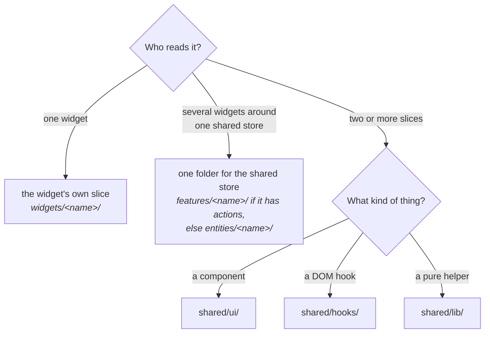
```mermaid
flowchart TB
    Q1{"Who reads it?"}
    W["the widget's own slice<br/><i>widgets/&lt;name&gt;/</i>"]
    F["one folder for the shared store<br/><i>features/&lt;name&gt;/ if it has actions,<br/>else entities/&lt;name&gt;/</i>"]
    KIND{"What kind of thing?"}
    SH["shared/ui/"]
    HK["shared/hooks/"]
    UT["shared/lib/"]

    Q1 -->|one widget| W
    Q1 -->|"several widgets around<br/>one shared store"| F
    Q1 -->|"two or more slices"| KIND
    KIND -->|a component| SH
    KIND -->|a DOM hook| HK
    KIND -->|a pure helper| UT
```

The shared-store branch works because the layers point one way: a widget may
import an entity or a feature, so a helper read by a shared store and its
widgets sits with the store and every widget reaches it. The store is never
split between an entity (its state) and a feature (its actions) for the sake of
layer purity — the subsystem would be in three places again.

A helper with a single **non-widget** owner sits with its owner —
`entities/layout/layout-resolution.ts`, `entities/sim/debug.ts`,
`app/windows/main/sim-name.ts`, `entities/widget/widget-frame.ts`. A widget
never imports from another widget's slice, and the lint refuses it: a second
consumer moves the file down, and one that loses it moves back.

Every MobX class lives in a `*.store.ts` file, and nothing else does; its
context and hook live in the `*-context.ts` beside it.

### Decomposition rules

- `WidgetName.tsx` is a thin orchestrator — never a monolithic render function.
- **Every component is `observer()`** — root, sub-components, leaves. `observer`
  gives you the MobX subscription _and_ an automatic `React.memo`.
- **Every component reads the store it needs directly.** Don't pass store data down
  as props when the child can read it. Pass observable objects or identifiers, not
  derived primitives — dereferencing a value in the parent kills reactivity for
  everything below it.
- **A root widget must not read 60 Hz fields** (`carDynamics`, `carInputs`).
  Delegate them to the smallest leaf that needs them. See
  [Performance](#performance).
- Decompose any visual section that is self-contained, updates at its own rate, or
  would push the parent past roughly 150 lines.

### `ws()` scaling

A widget is designed once at a fixed size and then scales as a whole.
`WidgetContainer` sets a single CSS variable:

```
--wfs = currentWidth / designWidth
```

Every dimension in the widget is expressed as a multiple of it, so one resize
scales type, spacing, borders and geometry together instead of reflowing the
layout.

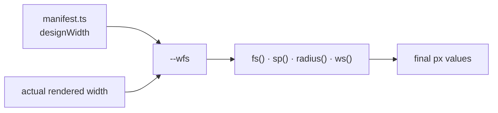
```mermaid
flowchart LR
    DW["manifest.ts<br/>designWidth"]
    CW["actual rendered width"]
    WFS["--wfs"]
    TOK["fs() · sp() · radius() · ws()"]
    PX["final px values"]

    DW --> WFS
    CW --> WFS
    WFS --> TOK --> PX
```

| Function        | Use for                                                                      | Scale                                                                |
| --------------- | ---------------------------------------------------------------------------- | -------------------------------------------------------------------- |
| `fs($step)`     | font size                                                                    | xxxs(10) xxs(11) xs(12) sm(13) md(15) lg(18) xl(22) xxl(28) xxxl(32) |
| `sp($step)`     | spacing, 2px grid                                                            | xxxs(2) xxs(4) xs(6) sm(8) md(10) lg(12) xl(16) xxl(20)              |
| `radius($step)` | corner radius                                                                | sm(3) md(4) lg(6)                                                    |
| `ws($px)`       | raw geometry not on a scale — grid columns, canvas and SVG sizes, icon sizes | any px value                                                         |

> [!WARNING]
> Never use `rem` (does not scale with `--wfs`), never `vw` / `vh` (**in the
> overlay they mean _screen_ size, not widget size**), and never `ws()` for
> borders — a scaled border rounds to 0 and disappears. Borders are plain `px`.

**Toggleable-column widgets** (Standings, Relative) are the one complication: their
`designWidth` is not constant, because hiding a column should not blow up the type
size of everything else. `designWidth` tracks the visible column set through
`colSpecs` in `*-utils.ts`, and `makeColumnLayoutResolver` (in
`widgets/widget-manifest.ts`) keeps `--wfs` constant while the widget resizes.

> [!IMPORTANT]
> A `designWidth` its own settings can compute is **not state — it is a cache**,
> and a cache saved to settings.json drifts. Every widget whose design width is
> a function of its settings declares **both** halves in its manifest:
> `resolveLayoutChange` rescales `currentWidth` at the moment of the toggle, so
> `--wfs` does not jump under the driver, and `deriveDesignWidth` recomputes the
> width wherever a widget is installed — file load (`decodeWidget`), layout
> switch, and a client installing main's snapshot (`syncWidgetSet`). One without the other
> is the bug: with only the resolver, a stored width left behind by an older
> setting survives every reload, `--wfs` renders the widget at the wrong scale
> and crops it, and the next toggle reads that same wrong ratio back as `scale`
> and multiplies `currentWidth` by it again — the widget grows on every click.
> It applies to a two-state orientation switch (`WeatherWidget`'s `horizontal`)
> exactly as it does to a table of columns; two design widths are still two.

### Canvas widgets

Canvas widgets bypass React's render path entirely for their pixels: React mounts
the element, and everything after that is imperative drawing.

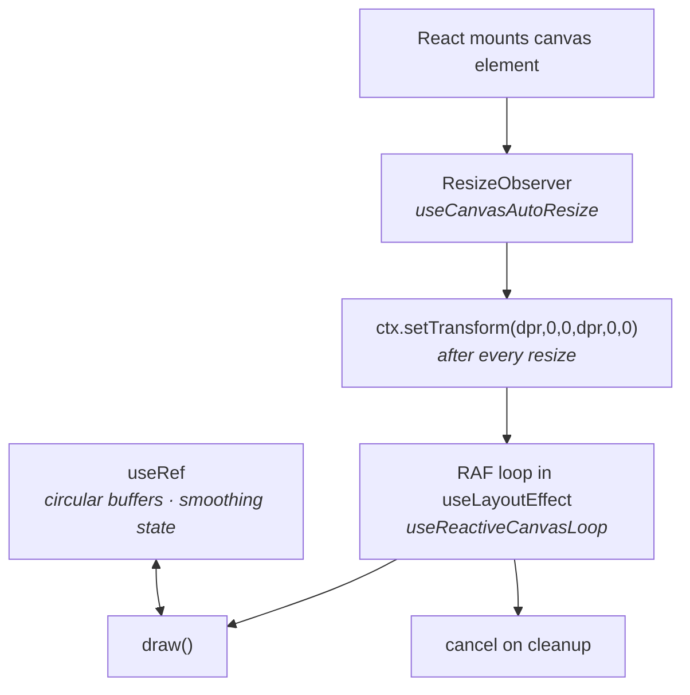
```mermaid
flowchart TB
    MOUNT["React mounts canvas element"]
    RO["ResizeObserver<br/><i>useCanvasAutoResize</i>"]
    DPR["ctx.setTransform(dpr,0,0,dpr,0,0)<br/><i>after every resize</i>"]
    RAF["RAF loop in useLayoutEffect<br/><i>useReactiveCanvasLoop</i>"]
    REF["useRef<br/><i>circular buffers · smoothing state</i>"]
    DRAW["draw()"]
    CLEAN["cancel on cleanup"]

    MOUNT --> RO --> DPR --> RAF --> DRAW
    REF <--> DRAW
    RAF --> CLEAN
```

The rules that make that safe:

| Rule                                                                           | Why                                                                                           |
| ------------------------------------------------------------------------------ | --------------------------------------------------------------------------------------------- |
| Per-frame mutable state (circular buffers, smoothing) lives in `useRef`        | putting it in state would re-render at 60 Hz — the exact thing canvas exists to avoid         |
| Draws are scheduled with RAF inside `useLayoutEffect`, cancelled on cleanup    | an uncancelled loop keeps drawing into a detached canvas after unmount                        |
| Resize through `ResizeObserver`, then `ctx.setTransform(dpr, 0, 0, dpr, 0, 0)` | the transform is reset by a size change; skipping it gives you a blurry or half-scaled canvas |
| Colors come from the JS palette, not from CSS                                  | canvas cannot read SCSS tokens — see `shared/lib/colors.ts` and the per-widget `*-utils.ts`   |

Shared DPR sizing and the auto-resize observer live in `shared/hooks/` —
`useCanvasAutoResize` and `useReactiveCanvasLoop` — so a new canvas widget should
not hand-roll either.

### Styling

- A `ComponentName.module.scss` sits next to every component. **Never import a
  stylesheet from a parent or a sibling.**
- `_variables.scss`, `_functions.scss` and `_widget-tokens.scss` are auto-injected
  by Vite and Storybook via `additionalData` — do not import them manually.
- No inline styles; conditional styling uses named classes. The exception is
  genuinely data-driven values, such as a car-class color or a dynamic
  `grid-template`.
- Flat camelCase class names (`driverNamePlayer`). SCSS modifier classes are
  declared _after_ their base class.
- CSS variable names must not name a color.
- `$font-widget` is `'Rajdhani', sans-serif`; `$font-mono` is `'Consolas', monospace`.
- Layout is flexbox with `flex: 1 1 0` and `min-width: 0`; column sizing uses `ch`
  units when the maximum character count is known.

> [!WARNING]
> **Never hardcode a hex or rgba value in a widget.** Use the semantic tokens from
> `_widget-tokens.scss`; the `$race-*` palette follows Tailwind 500/600. The
> JS-side equivalents for canvas live in the widget manifests,
> `widgets/g-meter/g-meter-utils.ts`, `shared/lib/weather-utils.ts` and
> `shared/lib/colors.ts`, using the same palette hexes.

### Code style

- Arrow functions everywhere, always assigned to a named `const`. No anonymous
  standalone functions.
- Descriptive names; 1–3 character names are forbidden, including callback
  parameters.
- No magic numbers — name the constant.
- No comments unless the intent is genuinely not obvious from the name.
- All non-UI business logic lives in MobX stores.
- Icons from `lucide-react` only.
- No barrel-file imports — always a direct file path.
- `if`/`else` always in block form, with a blank line before `return` and a blank
  line before and after every `if`/`else` block.

### Adding a widget — checklist

1. Root element is `<WidgetPanel>`, never a bare `<div>`.
2. No hardcoded background.
3. Decompose from the start.
4. Every component `observer()`.
5. Add `*.stories.tsx` through `defineWidgetStories` — see
   [widget-stories.md](widget-stories.md).
6. Add `*SettingsPanel.tsx` in the widget slice, built on `schemaRows`, and
   export `PANEL_WIDGET_IDS` from it — the registry picks it up, nothing to wire.
7. Describe every setting once in the slice's `settings-schema.ts`, with its
   strings under `settingsPanels.<locale block>` in all four
   `locales/*/widgets.json`.
8. Create `manifest.ts` and `mount.ts` in the slice — both are collected by
   glob, so no shared file is edited.
9. Use the `fs()` / `sp()` / `radius()` tokens, `$font-widget`, the
   `$widget-text-*` tokens and the `$race-*` palette.

---

---

# Part III — How the two halves talk

## The three channels

Everything crossing a process or window boundary uses one of three channels.

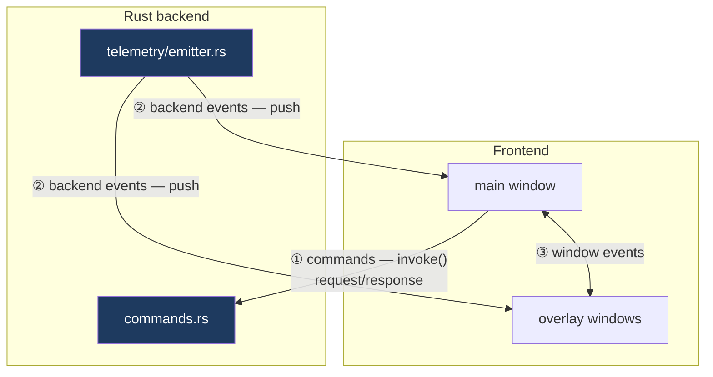
```mermaid
flowchart TB
    subgraph FE["Frontend"]
        M["main window"]
        O["overlay windows"]
    end
    subgraph BE["Rust backend"]
        CMD["commands.rs"]
        TEL["telemetry/emitter.rs"]
    end

    M -->|"① commands — invoke()<br/>request/response"| CMD
    TEL -->|"② backend events — push"| M
    TEL -->|"② backend events — push"| O
    M <-->|"③ window events"| O

    style CMD fill:#1e3a5f,color:#fff
    style TEL fill:#1e3a5f,color:#fff
```

| #   | Channel            | Direction                               | Frontend entry point           | Backend entry point                            |
| --- | ------------------ | --------------------------------------- | ------------------------------ | ---------------------------------------------- |
| ①   | **Commands**       | frontend → backend, with a return value | `shared/api/*.service.ts`      | `commands.rs`, `input/commands.rs`             |
| ②   | **Backend events** | backend → both windows, fire-and-forget | `app/sync/listeners.ts`        | `telemetry/emitter.rs` and friends             |
| ③   | **Window events**  | main ↔ overlay                          | `shared/api/events.service.ts` | — (never reaches Rust, except two noted below) |

> [!NOTE]
> **Backend events are not relayed between windows.** Each window subscribes to the
> backend independently, so telemetry reaches the overlay without passing through
> main. Only _derived_ and _user_ state crosses the window boundary on channel ③.

## Command catalogue (frontend → backend)

Every `invoke` in the app goes through a service function. No component and no
store calls `invoke` directly.

| Service file           | Function                                         | Rust command                          | Purpose                                                    |
| ---------------------- | ------------------------------------------------ | ------------------------------------- | ---------------------------------------------------------- |
| `telemetry.service.ts` | `startTelemetryStream`                           | `start_telemetry_stream`              | begin reading the sim                                      |
|                        | `stopTelemetryStream`                            | `stop_telemetry_stream`               | stop reading                                               |
|                        | `getConnectionStatus`                            | `get_connection_status`               | is a sim connected                                         |
|                        | `getLastSessionInfo`                             | `get_last_session_info`               | last known session, for a cold start                       |
|                        | `setActiveEventsSilent`                          | `set_active_events`                   | tell the backend which events anyone is listening to       |
| `track.service.ts`     | `getCachedTrackShape`                            | `get_cached_track_shape`              | load a recorded track outline                              |
|                        | `deleteTrackShape`                               | `delete_track_shape`                  | discard it                                                 |
|                        | `resetPitLanePct`                                | `reset_pit_lane_pct`                  | re-detect pit lane bounds                                  |
|                        | `getActiveReferenceLap`                          | `get_active_reference_lap`            | the reference lap the telemetry thread made active         |
|                        | `deleteReferenceLap`                             | `delete_reference_lap`                | discard it                                                 |
| `settings.service.ts`  | `settingsFileExists`                             | `settings_file_exists`                | first-run detection                                        |
|                        | `backupSettingsFile`                             | `backup_settings_file`                | snapshot before a risky write                              |
|                        | `deleteSettingsFile`                             | `delete_settings_file`                | factory reset                                              |
|                        | `logSettingsSnapshot`                            | `log_settings_snapshot`               | diagnostics                                                |
|                        | `setPitWarningLapsSilent`                        | `set_pit_warning_laps`                | push a computation setting                                 |
|                        | `setFuelAvgWindowSilent`                         | `set_fuel_avg_window`                 | push a computation setting                                 |
|                        | `setCarLengthSilent`                             | `set_car_length`                      | push a computation setting                                 |
| `twitch.service.ts`    | `twitchHasClientId` … `twitchSignOut`            | Twitch auth commands                  | device-code OAuth flow                                     |
|                        | `startChatStreamSilent` / `stopChatStreamSilent` | chat stream commands                  | connect and disconnect chat                                |
| `input.service.ts`     | `resolveInputDevices`                            | `resolve_input_devices`               | enumerate controllers                                      |
|                        | `setInputPollingEnabled`                         | `set_input_polling_enabled`           | start/stop DirectInput polling                             |
| `pit.service.ts`       | `runPitAction`                                   | `run_pit_action`                      | a click on the pit order, resolved on the telemetry thread |
|                        | `togglePitAuto`                                  | `toggle_pit_auto`                     | the auto mode plate                                        |
|                        | `setPitStrategySilent`                           | `set_pit_strategy`                    | push the pit rules, the fuel step and the layout gate      |
| `hotkeys.service.ts`   | `setHotkeyBindings`                              | `set_hotkey_bindings`                 | the effective binding map, to the dispatcher               |
|                        | `setHotkeyContext`                               | `set_hotkey_context`                  | the layout gate and the interact key's settings            |
|                        | `requestDragMode` / `requestInteractMode`        | `set_drag_mode` / `set_interact_mode` | ask the dispatcher to switch a mode                        |
|                        | `getOverlayModes`                                | `get_overlay_modes`                   | the modes, for a window that just loaded                   |

The `*Silent` naming marks a setter that pushes a value into the backend without
expecting anything back — a fire-and-forget command, not an event.

## Event catalogue

### Channel ② — backend → frontend

Names come from `src-tauri/src/model/events.rs` through the generated
`@shared/contracts/backend-events`, re-exported by `shared/api/sim-events.ts`; handlers are wired in
`app/sync/listeners.ts`.

| Event                                                    | Emitted by                  | Rate                          | Lands in                                             |
| -------------------------------------------------------- | --------------------------- | ----------------------------- | ---------------------------------------------------- |
| `sim://telemetry/bundle`                                 | `telemetry/emitter.rs`      | every tick, tiered            | the `data/` stores                                   |
| `sim://session`                                          | session polling             | on change                     | `session.store.ts`                                   |
| `sim://weather`                                          | weather decoding            | async                         | `environment.store.ts`                               |
| `sim://status`                                           | connection lifecycle        | on change                     | `sim.store.ts`                                       |
| `sim://disconnected`                                     | connection lifecycle        | on loss                       | `sim.store.ts` — triggers `reset()`                  |
| `sim://capabilities`                                     | `telemetry/capabilities.rs` | on connect                    | `sim.store.ts`                                       |
| `sim://track-shape`                                      | `telemetry/emitter.rs`      | on discovery or pit-pct patch | the track map widget store                           |
| `sim://reference-lap/updated`                            | `telemetry/emitter.rs`      | active reference changes      | `reference-lap.store.ts`                             |
| `sim://telemetry/slow`                                   | `telemetry/emitter.rs`      | 4 Hz                          | `player.store.ts` — **windows off the bundle only**  |
| `app://overlay-modes`                                    | `hotkeys/runtime.rs`        | on change                     | `app-settings.store.ts`, every window                |
| `hotkey://settings-action`                               | `hotkeys/runtime.rs`        | on a settings key             | `settings-actions.ts`, main only                     |
| `client://control`                                       | `hotkeys/runtime.rs`, main  | on a view key or signal       | `applyControl` in every overlay, plus the remote hub |
| `sim://perf`                                             | `telemetry/emitter.rs`      | 1 Hz                          | `sim-perf.store.ts`                                  |
| `input://devices`                                        | `input/runtime.rs`          | on device change              | `device-input.store.ts`                              |
| `input://button`                                         | `input/runtime.rs`          | on press/release              | `device-input.store.ts`, for binding capture         |
| `chat://message` · `chat://presence` · `chat://deletion` | `chat/`                     | async                         | `chat.store.ts`                                      |

### Channel ③ — main ↔ clients

Main holds the settings; every overlay and every remote screen is a **client**
of one protocol (ADR-0007, `docs/adr/0007-main-owns-settings.md`). The envelope
is `ClientEnvelope` in `src-tauri/src/model/client_protocol.rs`; the payloads
are `src/shared/contracts/client-protocol.ts`.

| Message    | Direction           | Event / transport                         | Payload                                              |
| ---------- | ------------------- | ----------------------------------------- | ---------------------------------------------------- |
| `hello`    | overlay → main      | `client://to-main`                        | `clientId` — the window label                        |
| `command`  | overlay → main      | `client://to-main`                        | `commandNo`, `layoutId`, one `ClientCommand`         |
| `snapshot` | main → overlay      | `client://from-main`, to that window only | `ClientSnapshot`, `lastHandledCommandNo`, `rejected` |
| snapshot   | main → remote       | the socket, through the hub               | `ClientSnapshot`, bare                               |
| signal     | main → every client | `client://control` / the socket           | `{ type: RemoteControlKind, data }`                  |

#### Frontend → backend, over the event channel

Two events use the event channel instead of a command, because their listener is
the Rust recorder rather than a window:

| Event                   | Emitter function         | Heard by                                                                                         |
| ----------------------- | ------------------------ | ------------------------------------------------------------------------------------------------ |
| `track-map:clear`       | `emitTrackMapClear`      | the backend recorder; the clients drop their copy on the `track-map-cleared` signal sent with it |
| `track-map:force-start` | `emitTrackMapForceStart` | the backend recorder only                                                                        |

## Cross-window synchronization

### Ownership

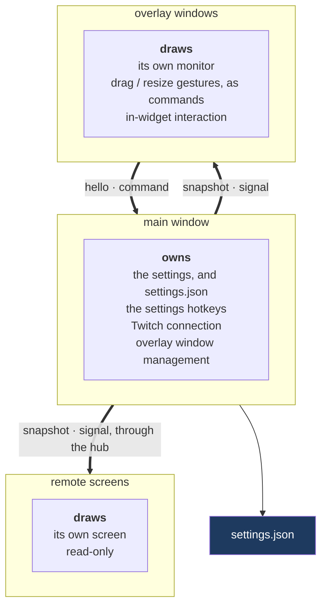
```mermaid
flowchart TB
    subgraph MAIN["main window"]
        MOWN["<b>owns</b><br/>the settings, and settings.json<br/>the settings hotkeys<br/>Twitch connection<br/>overlay window management"]
    end
    subgraph OVL["overlay windows"]
        OOWN["<b>draws</b><br/>its own monitor<br/>drag / resize gestures, as commands<br/>in-widget interaction"]
    end
    subgraph REM["remote screens"]
        ROWN["<b>draws</b><br/>its own screen<br/>read-only"]
    end
    DISK["settings.json"]

    MAIN ==>|"snapshot · signal"| OVL
    OVL ==>|"hello · command"| MAIN
    MAIN ==>|"snapshot · signal, through the hub"| REM
    MAIN --> DISK

    style DISK fill:#1e3a5f,color:#fff
```

**Main is the only window that holds and writes the settings.** An overlay
reads no settings file: it says `hello` and draws the snapshot main answers
with — its own monitor and nothing else — and every later one. A remote screen
gets the same snapshot over its socket and sends nothing back; the hub refuses a
command from a browser.

### A command, end to end

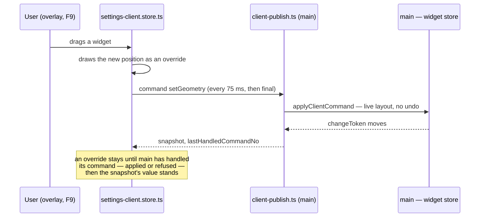
```mermaid
sequenceDiagram
    participant U as User (overlay, F9)
    participant C as settings-client.store.ts
    participant P as client-publish.ts (main)
    participant S as main — widget store

    U->>C: drags a widget
    C->>C: draws the new position as an override
    C->>P: command setGeometry (every 75 ms, then final)
    P->>S: applyClientCommand — live layout, no undo
    S-->>P: changeToken moves
    P-->>C: snapshot, lastHandledCommandNo
    Note over C: an override stays until main has handled<br/>its command — applied or refused —<br/>then the snapshot's value stands
```

A client installs a snapshot and runs a signal through `client-sync.ts`, the
same two functions on a monitor and on a tablet. `applyControl` is an
exhaustive switch over `RemoteControlKind`, so a kind added in Rust without a
case there does not compile.

### Startup ordering

Main opens the overlays only after its own hydration, and registers its listener
for `hello` before the first window opens. An overlay subscribes to its snapshot
before it says `hello`. An overlay that outlived a reload of the main window
never says hello again, so main publishes to every open overlay once it is up.

## Worked example: one number, end to end

Fuel remaining, from shared memory to a pixel:

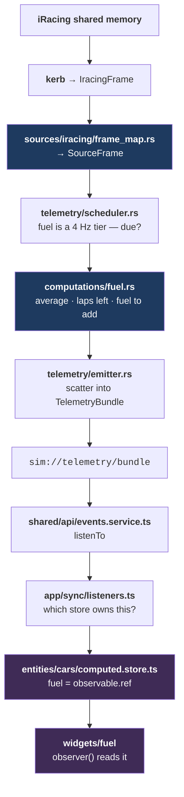
```mermaid
flowchart TB
    S["<b>iRacing shared memory</b>"]
    K["<b>kerb</b> → IracingFrame"]
    SRC["<b>sources/iracing/frame_map.rs</b><br/>→ SourceFrame"]
    SCH["<b>telemetry/scheduler.rs</b><br/>fuel is a 4 Hz tier — due?"]
    COMP["<b>computations/fuel.rs</b><br/>average · laps left · fuel to add"]
    EM["<b>telemetry/emitter.rs</b><br/>scatter into TelemetryBundle"]
    EV["<code>sim://telemetry/bundle</code>"]
    SVC["<b>shared/api/events.service.ts</b><br/>listenTo"]
    SYNC["<b>app/sync/listeners.ts</b><br/>which store owns this?"]
    DATA["<b>entities/cars/computed.store.ts</b><br/>fuel = observable.ref"]
    UI["<b>widgets/fuel</b><br/>observer() reads it"]

    S --> K --> SRC --> SCH --> COMP --> EM --> EV --> SVC --> SYNC --> DATA --> UI

    style SRC fill:#1e3a5f,color:#fff
    style COMP fill:#1e3a5f,color:#fff
    style DATA fill:#3f2b56,color:#fff
    style UI fill:#3f2b56,color:#fff
```

Every arrow is one-way. Nothing downstream calls back upstream.

---

---

# Part IV — Cross-cutting concerns

## Performance

The governing constraint: **the sim produces 60 Hz and React cannot render at
60 Hz.** The architecture absorbs that rate in four places, each one cheaper than
the layer above it.

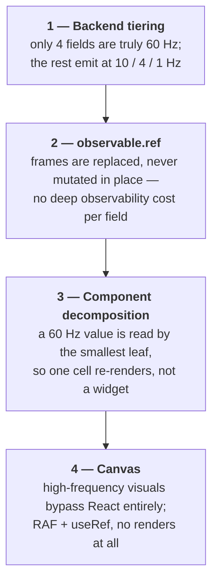
```mermaid
flowchart TB
    L1["<b>1 — Backend tiering</b><br/>only 4 fields are truly 60 Hz;<br/>the rest emit at 10 / 4 / 1 Hz"]
    L2["<b>2 — observable.ref</b><br/>frames are replaced, never mutated in place —<br/>no deep observability cost per field"]
    L3["<b>3 — Component decomposition</b><br/>a 60 Hz value is read by the smallest leaf,<br/>so one cell re-renders, not a widget"]
    L4["<b>4 — Canvas</b><br/>high-frequency visuals bypass React entirely;<br/>RAF + useRef, no renders at all"]

    L1 --> L2 --> L3 --> L4
```

| Technique                                            | Where                                                   | The failure it prevents                                                                                                                 |
| ---------------------------------------------------- | ------------------------------------------------------- | --------------------------------------------------------------------------------------------------------------------------------------- |
| Rate tiers                                           | `telemetry/scheduler.rs`                                | sending standings 60 times a second when it changes 10 times                                                                            |
| Demand gating (`telemetryEvents`)                    | widget manifests → `telemetry/emitter.rs`               | shipping the whole driver table to every window and remote screen when nothing on screen shows it                                       |
| Quantization + repeat suppression                    | `telemetry/quantize.rs`, `telemetry/publications.rs`    | resending a frame whose only change is in a decimal no widget prints                                                                    |
| `observable.ref` on frame buffers                    | `entities/cars/cars.store.ts`, `computed.store.ts`      | MobX walking every field of every car on every frame — frames are swapped wholesale, so reference equality is all the reactivity needed |
| Split computeds                                      | `entities/cars/computed.store.ts` and the widget stores | one changed field invalidating an unrelated derived value                                                                               |
| `observer()` on every component                      | every `.tsx` above `shared/`                            | a parent re-render cascading into leaves that did not change                                                                            |
| Reading the store in the leaf, not passing props     | every `.tsx` above `shared/`                            | dereferencing in the parent, which makes the parent the subscriber and re-renders the whole subtree                                     |
| Root widgets never read 60 Hz fields                 | all widget roots                                        | a whole widget re-rendering at 60 Hz for one number                                                                                     |
| Canvas + `useRef` + RAF                              | `shared/hooks/useReactiveCanvasLoop`, canvas widgets    | 60 Hz React renders for something that is just pixels                                                                                   |
| `changeToken`                                        | `entities/layout/`                                      | `JSON.stringify` of the settings tree on every keystroke                                                                                |
| Coalesced overlay commands (75 ms drag, 50 ms popup) | `settings-client.store.ts`                              | a command and a snapshot per mouse-move during a drag                                                                                   |

> [!WARNING]
> **Never integrate 60 Hz values using the telemetry `sessionTime`.** It stalls,
> jumps and rewinds. Use `performance.now()` on the frontend.

## Settings and persistence

`settings.json` carries an integer `schemaVersion` at its top level, unrelated to
the app's semantic version. Format changes go through the migration chain in
`src/shared/settings-schema/`, which runs on the **raw blob** — between reading
the file and hydrating the stores.

```mermaid
flowchart LR
    FILE["settings.json<br/>on disk"]
    CHAIN["<b>settings-schema/</b><br/>migration chain<br/><i>pure functions, raw blob</i>"]
    MERGE["mergeWithDefaults<br/><i>fills defaults in every layout copy</i>"]
    STORES["settings stores"]

    FILE --> CHAIN --> MERGE --> STORES
    STORES -->|"persistence-sync.ts<br/>(main window only)"| FILE

    style FILE fill:#1e3a5f,color:#fff
```

Three rules, each of which exists because breaking it corrupts real users' files:

| Rule                                                                                                                                | Why                                                                                                                                  |
| ----------------------------------------------------------------------------------------------------------------------------------- | ------------------------------------------------------------------------------------------------------------------------------------ |
| A migration is a **pure function** and must **never import live types, defaults or registries** — freeze what it needs as a literal | otherwise a step written today silently rewrites history by next year's rules                                                        |
| A widget stores only the settings that differ from its manifest; reading back merges them over the shipped defaults                 | a new setting with a default needs no migration; rewriting a value that is already there is still the chain's job, in every instance |
| A file this build cannot migrate **locks settings against every write**                                                             | better a read-only session than a repaired-or-deleted file                                                                           |

### The active layout owns the widgets

The widgets a driver sees live in the layout and nowhere else — on disk under
each monitor (`layouts[].monitors[].widgets[]`), in memory as the layout's flat
`widgets[]`, each record naming its monitor (`app/sync/settings-file.ts`
converts between the two).
`LiveWidgetsStore.widgets` is a **projection** of the active layout's own
objects — the same objects, not a copy — so every edit the overlay or the editor
makes lands in the layout record directly. There is nothing to commit afterwards,
which is why the old `commitActiveLayout` and its 500 ms debounce (and the forced
flush on window close that existed only to beat that timer) are gone. Saving is
still debounced; nothing is lost when it does not fire, because there is no
second copy to lose.

Two rules keep the projection honest:

- **A layout with no monitors is not an owner.** Removing a layout's last screen
  leaves its widgets in the record but gives it no area to draw on, so both the
  projection and the install fall back to a detached map rather than saving a
  blank starter set over the saved arrangement.
- **A starter set is written to the layout that asked for it,** never to whatever
  is active by the time the monitor resolves — the resolution is asynchronous,
  and the driver may have selected another layout meanwhile.

`widgetTemplates` in the file is the catalogue a new instance and a first
layout's starter set are built from, not what is on screen.

Most changes need no migration at all. Full guide:
[`docs/settings-schema.md`](./settings-schema.md).

## Content Security Policy

Every page the app shows runs under a policy that allows only what it uses.
Two kinds of page, three places a policy is set:

| page                                  | policy from                             | reaches the page as                 |
| ------------------------------------- | --------------------------------------- | ----------------------------------- |
| app windows (`main/overlay/hud.html`) | `app.security.csp` in `tauri.conf.json` | header, from Tauri's asset protocol |
| the same, in `tauri:dev`              | `app.security.devCsp`                   | `<meta>`, injected by `vite.csp.ts` |
| remote page, server's own pages       | `src-tauri/src/remote/csp.rs`           | header, from the remote server      |

On desktop Tauri injects its policy only into pages it serves itself, and a
dev window loads straight from Vite — without `vite.csp.ts` a violation would
first appear in a release build.

What is allowed beyond `'self'`, and why:

- **`style-src 'unsafe-inline'`** in the app windows — Ant Design's CSS-in-JS
  (`@ant-design/cssinjs`) writes `<style>` tags at runtime.
  `dangerousDisableAssetCspModification: ["style-src"]` keeps Tauri from adding
  a nonce there, which would make browsers ignore `'unsafe-inline'`. The
  remote page carries no Ant Design and allows no inline style.
- **`script-src 'unsafe-inline'`** in development only — React Refresh's
  preamble from `@vitejs/plugin-react` is an inline script — and in the
  `tauri:build:dev` build, whose `tauri.dev.conf.json` patches the policy for
  `tauri-plugin-mcp-bridge`: the bridge injects inline `<script>` tags, and
  without them every `webview_*` tool fails ("Resolve-ref helper was not
  available"). That file also turns Tauri's nonce injection off entirely,
  because a nonce in `script-src` makes browsers ignore `'unsafe-inline'`. No
  build has `unsafe-eval`, and a test in `remote/csp.rs` fails if the release
  policy gains either.
- **`img-src`**: `data:` (Vite inlines small images, flag sprites among them;
  companion app icons arrive as data URLs), `http://asset.localhost` (layout
  backgrounds), and the chat image hosts. Those are `CHAT_IMAGE_SOURCES` in
  `chat/mod.rs`; the remote policy is built from that list and a test pins both
  `tauri.conf.json` policies to it. **A new chat source with images on another
  host is one line there plus the two lists in the config** — miss it and its
  emotes render as broken images, nothing else complains.
- **`connect-src`**: `http://ipc.localhost` (Tauri IPC); on the remote page
  `ws://<host>` back to the server it came from; in development the Vite HMR
  socket.

The remote server adds its policy to any HTML response that does not carry one
(`csp::apply`, a middleware), so a new route serving HTML is covered without
remembering to.

## Testing

| Kind             | Tool                            | Notes                                                                                                                                                |
| ---------------- | ------------------------------- | ---------------------------------------------------------------------------------------------------------------------------------------------------- |
| Unit             | `vitest` (`npm test`)           | also runs on commit via lefthook                                                                                                                     |
| Rust unit        | `cargo test`                    | `computations/` and `car_classes.rs` are the well-covered parts                                                                                      |
| Widget isolation | Storybook (`npm run storybook`) | stories only; seed stores via `runInAction` in decorators, always include a background decorator                                                     |
| Live UI          | Tauri MCP Bridge                | `driver_session` on port 9223 with the app in dev mode, then `webview_screenshot`, `webview_find_element`, `webview_interact`, `ipc_execute_command` |

Frontend tests **mock services, not Tauri** — that is what the `shared/api/`
seam is for.

> [!WARNING]
> **Never test the UI in a plain browser.** The overlay depends on window geometry,
> transparency and Tauri APIs that no browser provides.

Storybook conventions: named `const` PascalCase exports, no default exports, no
anonymous functions.

## Where does my code go?

```mermaid
flowchart TB
    Q1{"Does it start a window,<br/>build a root or wire transport to stores?"}
    Q2{"Is it a main-window tab<br/>that renders widgets?"}
    Q3{"Is it an overlay widget?"}
    Q4{"Is it something the user does<br/>(a store with actions, its UI)?"}
    Q5{"Is it sim data or the app's model?"}

    A["<b>app/</b>"]
    P["<b>pages/</b>"]
    W["<b>widgets/&lt;name&gt;/</b>"]
    F["<b>features/&lt;name&gt;/</b>"]
    E["<b>entities/&lt;name&gt;/</b>"]
    S["<b>shared/</b><br/>api · contracts · lib · ui · hooks"]

    Q1 -->|yes| A
    Q1 -->|no| Q2
    Q2 -->|yes| P
    Q2 -->|no| Q3
    Q3 -->|yes| W
    Q3 -->|no| Q4
    Q4 -->|yes| F
    Q4 -->|no| Q5
    Q5 -->|yes| E
    Q5 -->|no| S
```

And within the answer, next to its lowest consumer — see
[Where a file lives](#where-a-file-lives).

| I want to…                         | Do this                                                                                       |
| ---------------------------------- | --------------------------------------------------------------------------------------------- |
| add a field to a backend payload   | edit the struct in `model/`, run `npm run tauri:dev` to regenerate `bindings.ts`              |
| add a new computed telemetry value | add or extend a processor in `computations/`, scatter its output in `emitter.rs`              |
| support a sim quirk                | fix it in `sources/` — never let it reach `computations/`                                     |
| add a widget                       | follow the [checklist](#adding-a-widget--checklist)                                           |
| add a keyboard shortcut            | one entry in `HOTKEY_ACTIONS`, one key in `main-app.json`                                     |
| add a widget setting               | one field in the slice's `settings-schema.ts`, its strings in `locales/*/widgets.json`        |
| call a new backend command         | a function in the matching `shared/api/*.service.ts`                                          |
| share a value between the windows  | a reaction in `main-sync.ts`, a listener in `listeners.ts`, an emitter in `events.service.ts` |
| change the settings file format    | a migration in `shared/settings-schema/`                                                      |
| draw something at 60 Hz            | a canvas widget — see [Canvas widgets](#canvas-widgets)                                       |

## Commands

```bash
npm run tauri:dev          # run the app in dev mode (also regenerates bindings.ts)
npm run tauri:build:dev    # dev build, unsigned
npm run tauri:build:release

npm test                   # vitest run (also runs on commit via lefthook)
npm run typecheck          # tsc --noEmit
npm run lint               # oxlint --type-aware — this is what enforces the layers
npm run lint:fix
npm run format             # oxfmt write
npm run storybook          # isolated widget stories on :6006

cd src-tauri && cargo fmt
RUST_LOG=marble_trace_lib=debug npm run tauri:dev   # verbose backend logs
MARBLE_TRACE_RECORD=<dir> npm run tauri:dev         # record live sessions as tapes (dev feature)
MARBLE_TRACE_REPLAY=<tape> npm run tauri:dev        # play a tape instead of the sim (dev feature)
```

Every environment variable is listed in `CONTRIBUTING.md` → Environment variables.
