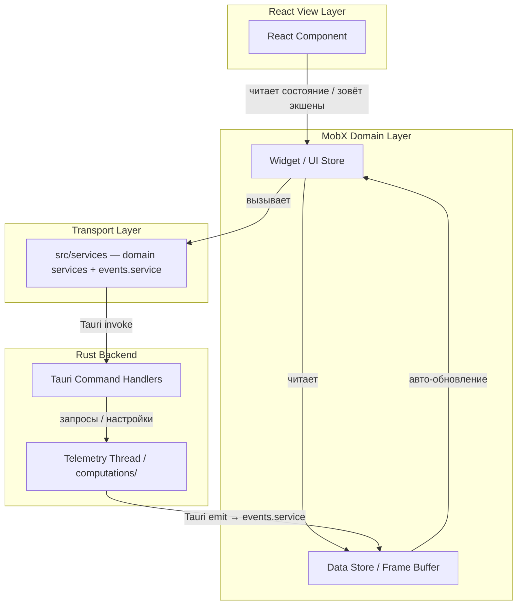

# План архитектурного рефакторинга: слоистая модель (Service Layer + Store Boundaries) + перформанс hot path

> **Ветка:** `refactor/layered-architecture`
> **Статус выполнения:** отмечать выполненные пункты `[x]` прямо в этом файле.
> **Правило коммитов:** каждый шаг — отдельный коммит (Conventional Commits), тесты/typecheck/lint зелёные перед коммитом.

---

## 0. Фактическое состояние кодовой базы (аудит от 2026-08-13)

Часть целей эпика **уже достигнута** — план учитывает только реальные пробелы:

| Цель эпика                    | Состояние                                                                                                                                                                                    |
| ----------------------------- | -------------------------------------------------------------------------------------------------------------------------------------------------------------------------------------------- |
| RootStore + DI через контекст | ✅ Уже есть: `src/store/root-store.ts`, `src/store/root-store-context.ts`, сторы получают `root` через конструктор, синглтонов нет                                                           |
| Типизация ответов Rust        | ✅ Уже есть: specta → `src/types/bindings.ts`                                                                                                                                                |
| Переиспользуемый UI           | ✅ Частично: `src/components/shared/` (WidgetPanel, WidgetLabel, WidgetValue, бейджи и т.д.)                                                                                                 |
| Изоляция Tauri IPC            | ❌ **Нет.** 21 прямой `invoke` в 10 файлах; `listen`/`emit` в 9+ файлах                                                                                                                      |
| Разделение smart/dumb         | ⚠️ Частично: правило observer-everywhere соблюдается, но 2 компонента вызывают `invoke` напрямую                                                                                             |
| God-файлы                     | ❌ `widget-settings.store.ts` — 1122 строки; `sync-init.ts` — 663 строки                                                                                                                     |
| Фундамент мульти-сима (kerb)  | ✅ Уже есть на бэкенде: `sources/` — единственный слой с `use kerb`, маппинг `IracingFrame → SourceFrame`. Отдельный аудит утечек iRacing-специфики в `model/`/`computations/` — см. Шаг 4.4 |

### Проблемные участки (полный список прямых `invoke`)

| Файл                                                                | Вызовы                                                                                                                                           | Слой                   |
| ------------------------------------------------------------------- | ------------------------------------------------------------------------------------------------------------------------------------------------ | ---------------------- |
| `src/store/sim/sim.store.ts`                                        | `get_reference_lap`, `set_active_events`, `start/stop_telemetry_stream`, `get_connection_status`, `get_last_session_info`, `get_track_shape` (7) | store                  |
| `src/store/settings/widget-settings.store.ts`                       | `set_pit_warning_laps`, `set_fuel_avg_window`, `set_car_length` (6, дублируются в двух местах!)                                                  | store                  |
| `src/store/settings/twitch-auth.store.ts`                           | `twitch_*` (5)                                                                                                                                   | store                  |
| `src/store/sync/persistence.ts`                                     | `settings_file_exists`, `backup_settings_file`, `log_settings_snapshot` (3)                                                                      | sync                   |
| `src/store/sync/sync-init.ts`                                       | `start_chat_stream`, `stop_chat_stream` (2)                                                                                                      | sync                   |
| `src/store/widgets/pit-service.widget.ts`                           | `send_pit_order` (1)                                                                                                                             | widget store           |
| `src/store/settings/app-settings.store.ts`                          | `delete_settings_file` (1)                                                                                                                       | store                  |
| `src/store/hotkeys/device-input.store.ts`                           | `resolve_input_devices`, `set_input_polling_enabled` (2)                                                                                         | store                  |
| `src/widgets/TrackMapWidget/TrackMapContent/TrackMapContent.tsx`    | `delete_track_shape` (1)                                                                                                                         | ❌ **React-компонент** |
| `src/app/main/components/SettingsPage/sections/TrackMapSection.tsx` | `reset_pit_lane_pct`, `delete_reference_lap` (2)                                                                                                 | ❌ **React-компонент** |

Прямой доступ к `@tauri-apps/api/event` (`listen`/`emit`): `sync-init.ts`, `events.ts`, `sim.store.ts`, `widget-settings.store.ts`, `OverlayCanvas.tsx`, `TrackMapSection.tsx`, `TrackMapContent.tsx`, `bindings-sync.ts`, `chat.store.ts`.

Прочие импортёры `@tauri-apps/api/core`, **не** являющиеся проблемой, но влияющие на проверки:

- `src/utils/widget/layout-background.ts` — импортирует `convertFileSrc` (не `invoke`). Легитимный транспортный хелпер; явно разрешается в grep-проверке 1.8 и lint-барьере 1.9.
- 3 тест-файла (`pit-service.widget.test.ts`, `widget-layout-gate.test.ts`, `input-trace.widget.test.ts`) мокают `invoke`. После миграции стора на сервис мок переписывается на мок сервис-модуля — входит в объём шагов 1.2–1.6.

---

## Шаг 1. Сервисный слой Tauri IPC — `src/services/`

**Цель:** единственная точка входа во `invoke`; сторы и компоненты не знают про `@tauri-apps/api/core`.
**Ожидаемый результат:** `grep "@tauri-apps/api/core" src` находит только `src/services/**`; каждая команда бэкенда имеет одну типизированную обёртку.

Структура — по доменам бэкенда, не по сторам (функции-обёртки, не классы — в проекте arrow-function стиль):

```
src/services/
  telemetry.service.ts   // start/stop_telemetry_stream, get_connection_status,
                         // get_last_session_info, set_active_events
  track.service.ts       // get_track_shape, delete_track_shape, reset_pit_lane_pct,
                         // get_reference_lap, delete_reference_lap
  settings.service.ts    // settings_file_exists, backup_settings_file,
                         // log_settings_snapshot, delete_settings_file,
                         // set_pit_warning_laps, set_fuel_avg_window, set_car_length
  twitch.service.ts      // twitch_* (5 команд) + start/stop_chat_stream
  input.service.ts       // resolve_input_devices, set_input_polling_enabled
  pit.service.ts         // send_pit_order
```

Требования:

- Типы параметров/ответов — **только** из `bindings.ts` (не дублировать вручную).
- Сигнатура: `export const getReferenceLap = async (trackId: number, carPath: string): Promise<ReferenceLapData | null> => invoke('get_reference_lap', { trackId, carPath })`.
- Никаких импортов сторов внутри `services/` (анти-паттерн «Service → Store»).
- Никакого состояния и MobX внутри сервисов — чистый транспорт.

**Политика ошибок:** сервисы **не ловят** ошибки — `invoke` пробрасывает reject как есть (никаких `Result<T, E>`-обёрток: это чужой для кодовой базы паттерн и лишний слой). Перехват — только на уровне стора, который меняет UI-состояние (`error`-поле, тост, лог). Действующие сторы уже так работают (`twitch-auth`, `sim.store` оборачивают вызовы в try/catch) — сервисный слой это не меняет. Единственное добавление: сервис логирует имя упавшей команды через существующий логгер перед re-throw **только** если стор заведомо глотает ошибку молча (fire-and-forget `void`-вызовы — `set_active_events`, `set_pit_warning_laps` и т.п.) — для них в сервисе вариант `...Silent` с `catch + console.error`.

Чек-лист:

- [x] 1.1 Создать `src/services/` и шесть сервис-файлов с обёртками всех 21 команды
- [x] 1.2 Мигрировать `sim.store.ts` на `telemetry.service` + `track.service`
- [x] 1.3 Мигрировать `widget-settings.store.ts` на `settings.service` — **попутно устранить дублирование трёх вызовов** (вынести общий метод, вызываемый и из сеттеров, и из гидратации)
- [x] 1.4 Мигрировать `twitch-auth.store.ts` + `sync-init.ts` (chat stream) на `twitch.service`
- [x] 1.5 Мигрировать `persistence.ts`, `app-settings.store.ts` на `settings.service`
- [x] 1.6 Мигрировать `device-input.store.ts` на `input.service`, `pit-service.widget.ts` на `pit.service`
- В шагах 1.2–1.6 вместе со стором обновляются его тесты: моки `invoke` заменяются на моки соответствующего сервис-модуля (`vi.mock('src/services/...')`)
- [x] 1.7 Убрать `invoke` из компонентов: `TrackMapContent.tsx` и `TrackMapSection.tsx` — логика уходит в стор (см. Шаг 3), стор зовёт `track.service`
- [x] 1.8 Финальная проверка: `grep -r "@tauri-apps/api/core" src --include="*.ts*" -l` → только `src/services/` + разрешённое исключение `layout-background.ts` (`convertFileSrc`)
- [x] 1.9 Добавить lint-барьер: импорт `@tauri-apps/api/core`, `@tauri-apps/api/event` и `@tauri-apps/plugin-store` разрешён только в `src/services/**` (+ `convertFileSrc` в `layout-background.ts`; `plugin-store` дополнительно разрешён в `sync-init.ts`/сторе, куда уедет персистентность из 3.1). **Scope барьера ограничен этими тремя модулями намеренно:** оконные API (`api/window`, `webviewWindow`, `dpi`, `app`, `path`) остаются как есть — они сосредоточены в `sync/` и компонентах-оболочках окон (`OverlayWindow.tsx`, `WindowControls.tsx`) и являются легитимным «DOM-подобным» слоем, `window.service` не заводим. Сначала проверить, что oxlint текущей версии реально поддерживает `no-restricted-imports`; если нет — правило в AGENTS.md + grep-проверка в CI/pre-commit

---

## Шаг 2. Изоляция событийного транспорта (`listen`/`emit`)

**Цель:** второй канал IPC (события) тоже проходит через один модуль.
**Ожидаемый результат:** `@tauri-apps/api/event` импортируется только в `src/services/events.service.ts` (перенос текущего `src/store/sync/events.ts`); имена событий — только константы из `sim-events.ts` / `sync`-констант.

- [x] 2.1 Перенести/расширить `src/store/sync/events.ts` → `src/services/events.service.ts`: типизированные `listenTo<T>(event, handler)` и `emitToOverlays(event, payload)`. **Hot-path требование:** это тонкий typed-passthrough — никаких промежуточных объектов, копирований payload'а и логирования на каждый вызов; путь `sim://telemetry/bundle` → data store не должен получить лишних аллокаций на кадр. Бэкенд шлёт поля тирами (60/10/4/1 Hz, см. AGENTS.md), при этом быстрый тир **не гарантирует** стабильные 60 кадров — код не должен опираться на фиксированный интервал между кадрами (правило из AGENTS.md: интеграция по `performance.now()`, не по `sessionTime`)
- [x] 2.2 Мигрировать прямые `listen`: `sim.store.ts`, `chat.store.ts`, `bindings-sync.ts`, `OverlayCanvas.tsx`, `TrackMapContent.tsx`, `TrackMapSection.tsx`, `widget-settings.store.ts`, `sync-init.ts`. Из компонентов (`OverlayCanvas.tsx`, `TrackMap*`) подписки уходят **в стор** (см. Шаг 3), не заменяются на прямой импорт `events.service` — иначе конфликт с правилом 3.4
- [x] 2.3 Проверка: `grep -r "@tauri-apps/api/event" src -l` → только `src/services/`

---

## Шаг 3. Очистка компонентов от бизнес-логики (Smart & Dumb)

**Цель:** компоненты только рендерят и зовут методы сторов.
**Ожидаемый результат:** в `src/widgets/**` и `src/app/**` нет ни `invoke`, ни `listen`, ни асинхронной оркестрации.

- [x] 3.1 `TrackMapContent.tsx`: перенести удаление трека + связанный listen в `track-map`-стор (метод `deleteTrackShape(trackId)`), компонент вызывает метод. **Плюс:** компонент трижды импортирует `@tauri-apps/plugin-store` (строки ~36/57/80 — сохранение/загрузка угла поворота карты) — эту персистентность тоже унести в `TrackMapWidgetStore`; grep-барьеры 1.8/2.3 её не ловят (проверяют только `api/core`/`api/event`), поэтому `plugin-store` включается в проверку 1.9 отдельно
- [x] 3.2 `TrackMapSection.tsx`: перенести `reset_pit_lane_pct` / `delete_reference_lap` + listen в соответствующий стор (`sim.store` или новый `track.store`)
- [x] 3.3 Аудит `src/app/main/components/**` на прочую логику в компонентах (fetch-подобные эффекты, таймеры не-DOM) — вынести найденное в сторы. Заодно проверить правило «root-виджет не читает 60 Hz поля (`carDynamics`, `carInputs`)» по всем виджетам
- [x] 3.4 Зафиксировать правило в AGENTS.md: компоненты не импортируют ничего из `@tauri-apps/*` и `src/services/*`

Примечание: полная классификация smart/dumb по всем виджетам **не делается** — действующее правило «každый компонент observer + читает стор напрямую» уже даёт нужную реактивность; ломать его ради props-drilling («dumb» из эпика) — регресс для MobX. Dumb-компоненты остаются точечно в `src/components/shared/`.

---

## Шаг 4. Разгрузка god-файлов

**Цель:** high cohesion внутри модулей.
**Ожидаемый результат:** ни один файл стора > ~500 строк; у каждого файла одна зона ответственности.

- [x] 4.1 `widget-settings.store.ts` (1422 строки): продолжить начатое в Э6 — довести миграцию call-site'ов на четыре узких стора, фасад оставить тонким (или удалить, если call-site'ов не осталось)
- [x] 4.2 `sync-init.ts` (712 строк): разбить на `main-sync.ts` / `overlay-sync.ts` / `persistence-sync.ts` по признаку окна; реакции группировать по домену
  - ⚠️ **Порядок инициализации — главный риск распила.** Перед разбиением зафиксировать текущую последовательность запуска (реакции регистрируются до/после гидратации настроек; listen-подписки оверлея должны стоять раньше первого `emit` из main). Правила: (а) разбиение **не меняет** относительный порядок вызовов — новые файлы вызываются из одной композиционной функции `initMainSync`/`initOverlaySync` в том же порядке, что строки исходника; (б) каждая новая функция документирует свои временные предусловия («требует гидратированный settings-store»); (в) после распила — smoke-тест в live-приложении: перезапуск main-окна, проверка что оверлей получает `widget-settings-updated` и стартовые значения, а не дефолты
- [x] 4.3 Проверить перекрёстные ссылки сторов (408 обращений `this.root.*`): допустимы только «widget store → data/settings store»; найденные обратные зависимости (data → widget) устранить
- [x] 4.4 Аудит утечек iRacing-специфики за пределы `sources/` (фундамент мульти-сима): в `model/` и `computations/` не должно быть iRacing-имён полей, допущений про pit-flow, `CarClassID`-логики и т.п. Найденное — либо перенести в `sources/iracing/`, либо обобщить в `SourceFrame`. Kerb — источник истины по именам телеметрии, под проект не подгоняется

---

## Шаг 5. UI-Kit — только аудит и точечное дедуплицирование

**Цель эпика** («5 вариаций кнопок») в этом проекте неактуальна: main-окно — Ant Design, overlay — виджеты со своим токен-набором. Полноценный `shared/ui` не нужен.

- [x] 5.1 Аудит `src/widgets/**` на дубли разметки (бейджи, ячейки таблиц Standings/Relative, плейсхолдеры) — список кандидатов в `src/components/shared/`
- [x] 5.2 Вынести подтверждённые дубли (каждый — отдельный маленький PR-коммит); внутри `components/shared/` — запрет на сторы и бизнес-логику (уже де-факто соблюдается — зафиксировать в AGENTS.md)

**Результат аудита (2026-08-13).** Просмотрены 120 компонентов в `src/widgets/**`.

Вынесено (подтверждённые дубли):

- `playerRowStyle()` → `src/utils/widget/player-row-style.ts`. Блок совпадал в
  Standings и Relative дословно, вместе с трёхстрочным комментарием.
- `<DriverStatusBadges>` → `src/components/shared/DriverStatusBadge/`. Оба
  виджета разрешали одни и те же пять состояний (dq / tow / out / off-track /
  pit) в одном порядке и с одинаковым приоритетом; расхождения выражены двумя
  пропсами: `isFinished` (только Standings) и `showPit` (только Relative).

Проверено и **не** вынесено:

- Плейсхолдеры пустых состояний (`FlatFlags`, `InputTrace`, `StreamChat`) — не
  дубли: разные шрифты (`$font-mono` против `$font-widget`), размеры, цвета и
  центрирование. Общий `NoDataPlaceholder` захардкожен на «NO DATA» и их текст
  выразить не может; сведение изменило бы вид трёх виджетов.
- Ячейки номера машины и имени пилота — разметка похожа, но оформление живёт в
  CSS-модулях каждого виджета; вынос потребовал бы прокидывать className и связал
  бы стили двух виджетов ради пары строк.

Проверка: DOM-сравнение до/после на стори `relativewidget--with-pit-badges` —
17 строк, тот же паттерн бейджей, тот же HTML первого бейджа; все три состояния
пита (`PIT IN` / `PIT` / `PIT OUT`) рендерятся.

---

## Шаг 6. Перформанс hot path телеметрии

**Цель:** поток `sim://telemetry/bundle` → data stores → виджеты не тратит лишнего на быстрых тирах. Бэкенд шлёт поля тирами 60/10/4/1 Hz, быстрый тир нестабилен — оптимизируем аллокации и реактивность на кадр, а не «под 60 Hz».

- [x] 6.1 **Замер до:** зафиксировать базовую линию — React DevTools Profiler / Performance-трейс оверлея на живой сессии (или реплей-данных): сколько компонентов ререндерится на кадр быстрого тира, есть ли GC-пилообразность в Memory-таймлайне
- [x] 6.2 Аудит data stores на аллокации в сеттерах кадра: сеттеры быстрых тиров должны мутировать существующие структуры/буферы, а не создавать новые объекты и массивы на кадр (`observable.ref`/shallow там, где глубокая наблюдаемость полей не нужна)
- [x] 6.3 Проверить, что обработчик бандла оборачивает запись всех тиров в **одну** `runInAction`/`action` на событие — не по действию на поле
- [x] 6.4 Аудит `computed`-геттеров, зависящих от 60 Hz полей: не пересчитывают ли тяжёлое на каждый кадр ради редких изменений (при необходимости — `computed.struct` или перенос на более медленный тир)
- [x] 6.5 Проверить canvas-виджеты по правилам AGENTS.md: per-frame state в `useRef`, отрисовка через RAF (а не реакция на каждый кадр телеметрии), отмена на cleanup
- [x] 6.6 **Замер после:** повторить 6.1, сравнить с базовой линией; результат — короткая заметка в этом файле (что улучшилось, что не трогали и почему)

### Результат замеров (2026-08-13, живая сессия iRacing, Summit Point)

Замер снят в оверлее: окно 20 с, 13 видимых виджетов, поток бандлов 57.5/с
(тиры совпали с документированными: 57.5 / 9.6 / 3.8 / 0.9). Оба прогона — на
стоящей машине, чтобы нагрузка была сопоставимой.

| Метрика                     | До                 | После               | Δ                           |
| --------------------------- | ------------------ | ------------------- | --------------------------- |
| Аллокации, МБ/с             | 29.9               | 23.2                | **−22 %**                   |
| Кадр p95, мс                | 18.3               | 11.3                | **−38 %**                   |
| Кадр p99, мс                | 24.9               | 17.3                | **−31 %**                   |
| Кадр max, мс                | 29.5               | 26.0                | −12 %                       |
| RAF, к/с                    | 146                | 154                 | +5 %                        |
| GC за 20 с                  | 1 сборка на 818 МБ | 30 сборок на 151 МБ | мелкие вместо одной большой |
| Пропущенных кадров (>32 мс) | 0                  | 0                   | —                           |
| Long tasks (>50 мс)         | 0                  | 0                   | —                           |

Контрольный прогон **в движении** (15 с, машина едет, газ и обороты меняются):
аллокации 24.0 МБ/с, p95 14.4 мс, p99 20.4 мс, 25 мелких GC, пропущенных кадров
и long tasks — ноль. То есть под реальной нагрузкой картина та же.

**Что сделано.** Все телеметрические кадры переведены на `observable.ref`
(`player`, `cars`, `backendComputed`, `session`, `environment`): кадр всегда
заменяется целиком и нигде не мутируется на месте, а глубокая наблюдаемость
пересобирала прокси на каждый тик — для `car_idx` это ~15 массивов по 64
элемента 10 раз в секунду. Плюс `isPaceCarOnTrack` разделён на два computed'а:
список пейс-каров выводится из `sessionInfo` (1 Гц) и кэшируется, а горячая
часть только индексируется в `car_positions` — раньше `.filter()` аллоцировал
массив до 60 раз в секунду.

**Что проверено и не потребовало правок.** Обработчик бандла уже оборачивает
запись всех тиров в одну `runInAction` (6.3). Все canvas-виджеты, завязанные на
быстрый тир (`SpeedTrace`, `GMeterTrace`, `CanvasTrace`), рисуются через общий
хук `useReactiveCanvasLoop`: autorun читает observable, отрисовка схлопывается в
один RAF с отменой предыдущего и отменяется на cleanup (6.5). `FuelChart` и
`GMeterRings` в RAF не нуждаются — они питаются 4 Гц историей и геометрией.

**Чего не трогали.** Оставшиеся ~23 МБ/с — это десериализация payload'а мостом
Tauri: она происходит до того, как отработает наш код, и из слоя сторов
недоступна. Бэкендовые тиры и эмиттер вне рамок шага по условию плана.

**Проверка корректности после перехода на `observable.ref`.** Реактивность
подтверждена на живой сессии по всем тирам: таблица позиций (10 Гц)
обновляется, точки машин на карте трассы (60 Гц `car_positions`) двигаются, а в
движении перерисовываются оба canvas'а (60 Гц `car_inputs` / `car_dynamics`).
На стоящей машине canvas статичны закономерно — скорость ≈ 0 и разброс газа 0.

**Оговорка к замерам.** Прогоны «до» и «после» разделяет около часа живой
сессии, трафик на трассе между ними менялся — это не контролируемый A/B.
Направление и величина изменений устойчивы, но точные проценты воспроизводить
не стоит.

Ограничение: шаг только про фронтовый hot path. Бэкендовые тиры/эмиттер не трогаем — они уже устроены по тирам и вне рамок этого рефакторинга.

---

## Итоговые правила потока данных (внести в AGENTS.md на последнем шаге)

```
Component (observer) → Store (MobX) → Service (src/services) → invoke/emit → Rust
```

Целевая схема (внести в AGENTS.md вместе с правилами на шаге 7.1):



Перф-работа по hot path — Шаг 6; сквозное охранное правило для шагов 1–2: слои services/events не добавляют аллокаций и обёрток на кадр.

Запрещено:

- ❌ `@tauri-apps/api/core|event` вне `src/services/` (исключение: `convertFileSrc` в `layout-background.ts`; моки в `*.test.ts` мокают сервис-модули, не `invoke`)
- ❌ импорт сторов в `src/services/`
- ❌ бизнес-логика/async-оркестрация в компонентах
- ❌ ручные дубли типов из `bindings.ts`

- [ ] 7.1 Обновить AGENTS.md (раздел «Frontend Rules»): слой `services/`, запрещённые связи
- [ ] 7.2 Финальная проверка: `npm test`, `npm run typecheck`, `npm run lint`

---

## Порядок выполнения и оценка

| Шаг            | Риск                                                         | Зависимости                        |
| -------------- | ------------------------------------------------------------ | ---------------------------------- |
| 1 (services)   | низкий — механическая замена                                 | —                                  |
| 2 (events)     | низкий                                                       | после 1                            |
| 3 (компоненты) | средний — трогает TrackMap-флоу, проверить в live-приложении | после 1–2                          |
| 4 (god-файлы)  | средний — много call-site'ов, покрыто тестами Э6             | независим                          |
| 5 (UI-аудит)   | низкий                                                       | независим                          |
| 6 (перформанс) | средний — трогает hot path, нужен замер до/после             | после 1–2 (чтобы не мерить дважды) |

Каждый шаг завершается зелёными `npm test` + `npm run typecheck`; а также комитом всего шага шаг 3 дополнительно — одна проверка в live-приложении (скриншот TrackMap-секции + лог бэкенда).
z ljk;ty ddtcnb gfhjkm
